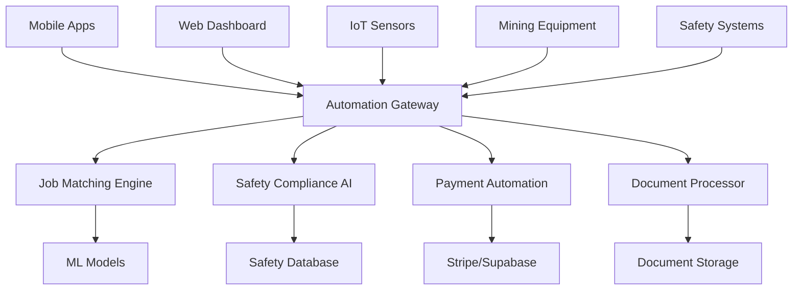

# Automation Server

🤖 **AI-Powered Mining Operations Automation Platform**


## 📱 Mobile-First Automation

### Intelligent Job Matching
- **AI-Powered Matching**: Machine learning algorithms match workers to jobs based on skills, location, and safety ratings
- **Real-Time Mobile Updates**: Instant job recommendations pushed to mobile apps
- **Location-Based Matching**: GPS-aware job suggestions for nearby mining sites
- **Skills Assessment**: Automated evaluation of worker capabilities for optimal job placement

### Safety Automation
- **Automated Compliance Checking**: Real-time verification of worker certifications and safety requirements
- **Risk Assessment**: AI-driven risk analysis for job assignments and site conditions  
- **Emergency Response**: Automated safety incident response and evacuation protocols
- **Mobile Safety Alerts**: Instant safety notifications to mobile devices in danger zones

## 🏗️ Architecture



## 🔧 Core Automation Features

### AI Job Matching Engine
- **Machine Learning Models**: TensorFlow/PyTorch models for intelligent job-worker matching
- **Real-Time Processing**: Sub-second job matching with mobile push notifications
- **Contextual Awareness**: Location, weather, equipment, and shift patterns consideration
- **Continuous Learning**: ML models improve with hiring success/failure feedback

### Automated Safety Compliance
- **Certification Verification**: Automated checking of worker safety certifications
- **Equipment Compatibility**: Verification of worker equipment certifications for specific jobs
- **Risk Scoring**: AI-calculated risk scores for job assignments
- **Compliance Reporting**: Automated generation of safety compliance reports

### Payment Processing Automation
- **B2B SaaS Billing**: Automated subscription management and billing
- **NGO Revenue Sharing**: Automatic distribution of revenue to community organizations
- **Payroll Integration**: Automated worker payment processing
- **Financial Reporting**: Real-time revenue and payment analytics

## 📊 Performance Metrics

### Mobile Automation Performance
- **Job Match Speed**: < 100ms for AI-powered job recommendations
- **Mobile Push Latency**: < 2 seconds for job notifications
- **Offline Capability**: Local job matching algorithms for offline scenarios
- **Battery Optimization**: Efficient background processing to minimize battery drain

### Enterprise Automation SLA
- **Uptime**: 99.99% availability for critical safety automation
- **Processing Throughput**: 100,000+ automated decisions per hour
- **Compliance Accuracy**: 99.9% accuracy in safety compliance verification
- **Revenue Processing**: Real-time financial transaction processing

## 🚀 Quick Start

### Prerequisites
```bash
# AI/ML Dependencies
python >= 3.9
tensorflow >= 2.13
pytorch >= 2.0
scikit-learn >= 1.3

# Infrastructure
redis >= 6.0
postgresql >= 14.0
elasticsearch >= 8.0
docker >= 20.0
```

### Development Setup
```bash
# Clone repository
git clone https://github.com/yourusername/tiation-rigger-workspace.git
cd AutomationServer

# Python environment setup
python -m venv venv
source venv/bin/activate  # On Windows: venv\Scripts\activate
pip install -r requirements.txt

# Install Node.js dependencies
npm install

# Database and ML model setup
npm run setup:database
python scripts/setup_ml_models.py

# Start automation server
npm run dev

# Run automation tests
npm run test:automation
python -m pytest tests/ml_tests/
```

### Docker Deployment
```bash
# Build automation server
docker build -t rigger-automation-server .

# Deploy with ML models
docker run -p 8084:8084 \
  -e ML_MODELS_PATH=/app/models \
  -e REDIS_URL=redis://redis:6379 \
  -e DATABASE_URL=postgresql://user:pass@db:5432/rigger \
  -e STRIPE_SECRET_KEY=${STRIPE_SECRET_KEY} \
  rigger-automation-server

# Health check
curl http://localhost:8084/health/automation
```

## 📱 Mobile Integration

### React Native Automation Client
```javascript
import { RiggerAutomation } from '@rigger/automation-mobile';

// Initialize automation client
const automation = new RiggerAutomation({
  apiUrl: 'https://automation.rigger.com',
  enableOfflineMatching: true,
  enableSafetyAlerts: true,
  theme: 'dark-neon'
});

// Job matching with location awareness
const jobMatching = {
  startLocationBasedMatching: async () => {
    const location = await getCurrentLocation();
    const userProfile = await getUserProfile();
    
    // Subscribe to real-time job matches
    automation.subscribeToJobMatches({
      location,
      skills: userProfile.skills,
      safetyLevel: userProfile.safetyLevel,
      availableHours: userProfile.availability,
      onJobMatch: (job) => {
        showJobNotification(job, {
          theme: 'dark-neon',
          priority: job.urgency,
          actions: ['view', 'apply', 'dismiss']
        });
      }
    });
  },

  // AI-powered job recommendations
  getPersonalizedJobs: async () => {
    const recommendations = await automation.getAIRecommendations({
      userId: await getCurrentUserId(),
      location: await getCurrentLocation(),
      preferences: await getUserPreferences(),
      limit: 20
    });

    return recommendations.map(job => ({
      ...job,
      matchScore: job.aiScore,
      matchReasons: job.matchingFactors,
      safetyRisk: job.riskAssessment,
      theme: 'dark-neon'
    }));
  }
};

// Safety automation integration
const safetyAutomation = {
  enableAutomaticSafetyChecks: async () => {
    // Subscribe to safety status updates
    automation.subscribeToSafetyAlerts({
      userId: await getCurrentUserId(),
      location: await getCurrentLocation(),
      onSafetyAlert: async (alert) => {
        await showCriticalAlert(alert, {
          title: alert.title,
          message: alert.message,
          priority: 'critical',
          color: '#FF4500',
          glowEffect: true,
          vibration: [0, 1000, 500, 1000],
          actions: [
            { id: 'acknowledge', title: 'ACKNOWLEDGE', required: true },
            { id: 'emergency', title: 'EMERGENCY', color: '#FF3366' }
          ]
        });
      },
      onComplianceUpdate: async (update) => {
        await updateComplianceStatus(update);
      }
    });
  },

  checkAutomaticCompliance: async (jobId) => {
    const complianceCheck = await automation.verifyJobCompliance({
      jobId,
      workerId: await getCurrentUserId(),
      checkCertifications: true,
      checkEquipment: true,
      checkLocation: true
    });

    return {
      isCompliant: complianceCheck.passed,
      issues: complianceCheck.violations,
      recommendations: complianceCheck.suggestions,
      expiringCertifications: complianceCheck.expiringSoon
    };
  }
};

// Automated payment tracking
const paymentAutomation = {
  trackAutomatedPayments: async () => {
    const paymentStatus = await automation.getPaymentStatus({
      workerId: await getCurrentUserId(),
      period: 'current_month'
    });

    return {
      totalEarnings: paymentStatus.totalAmount,
      paidJobs: paymentStatus.completedJobs,
      pendingPayments: paymentStatus.pendingAmount,
      ngoContribution: paymentStatus.ngoShare,
      nextPaymentDate: paymentStatus.nextPayout
    };
  }
};
```

### iOS Swift Automation Integration
```swift
import RiggerAutomationSDK
import CoreLocation
import UserNotifications

class AutomationManager: NSObject, CLLocationManagerDelegate {
    private let automation = RiggerAutomation(
        apiURL: "https://automation.rigger.com",
        theme: .darkNeon,
        offlineEnabled: true
    )
    
    private let locationManager = CLLocationManager()
    
    override init() {
        super.init()
        setupLocationServices()
        setupAutomation()
    }
    
    func setupAutomation() {
        // Job matching automation
        automation.startJobMatching { [weak self] job in
            self?.showJobMatch(job)
        }
        
        // Safety automation
        automation.enableSafetyMonitoring { [weak self] alert in
            self?.handleSafetyAlert(alert)
        }
        
        // Compliance automation
        automation.enableComplianceChecking { [weak self] status in
            self?.updateComplianceUI(status)
        }
    }
    
    private func showJobMatch(_ job: JobMatch) {
        let notification = UNMutableNotificationContent()
        notification.title = "New Job Match"
        notification.body = "\(job.title) at \(job.company) - \(job.matchScore)% match"
        notification.sound = UNNotificationSound(named: UNNotificationSoundName("job_match.wav"))
        notification.userInfo = [
            "jobId": job.id,
            "matchScore": job.matchScore,
            "theme": "dark-neon"
        ]
        
        // Custom notification appearance
        let request = UNNotificationRequest(
            identifier: "job-match-\(job.id)",
            content: notification,
            trigger: UNTimeIntervalNotificationTrigger(timeInterval: 0.1, repeats: false)
        )
        
        UNUserNotificationCenter.current().add(request)
    }
    
    private func handleSafetyAlert(_ alert: SafetyAlert) {
        DispatchQueue.main.async {
            let alertController = UIAlertController(
                title: "SAFETY ALERT",
                message: alert.message,
                preferredStyle: .alert
            )
            
            // Apply dark neon theme
            alertController.view.backgroundColor = UIColor(hex: "#1A1A1A")
            alertController.view.layer.borderWidth = 3
            alertController.view.layer.borderColor = UIColor(hex: "#FF4500").cgColor
            
            let acknowledgeAction = UIAlertAction(title: "ACKNOWLEDGE", style: .default) { _ in
                self.automation.acknowledgeSafetyAlert(alert.id)
            }
            acknowledgeAction.setValue(UIColor(hex: "#00FFFF"), forKey: "titleTextColor")
            
            alertController.addAction(acknowledgeAction)
            
            // Present with priority
            if let topController = UIApplication.shared.topViewController() {
                topController.present(alertController, animated: true) {
                    alertController.view.addGlowEffect(color: UIColor(hex: "#FF4500"))
                    
                    // Vibration for critical alerts
                    AudioServicesPlaySystemSound(kSystemSoundID_Vibrate)
                }
            }
        }
    }
}
```

## 🎨 Dark Neon Theme Integration

### Automation UI Themes
```json
{
  "automationThemes": {
    "dark-neon": {
      "colors": {
        "background": "#0A0A0A",
        "surface": "#1A1A1A",
        "primary": "#00FFFF",
        "secondary": "#FF00FF",
        "accent": "#00FF00",
        "success": "#00FF88",
        "warning": "#FFAA00",
        "error": "#FF3366",
        "safety": "#FFD700",
        "hazard": "#FF4500"
      },
      "automationIndicators": {
        "active": {
          "color": "#00FF88",
          "glowEffect": true,
          "pulseAnimation": true
        },
        "processing": {
          "color": "#00FFFF",
          "spinnerColor": "#FF00FF",
          "gradientAnimation": ["#00FFFF", "#FF00FF"]
        },
        "error": {
          "color": "#FF3366",
          "flashEffect": true,
          "borderColor": "#FF4500"
        }
      },
      "jobMatchCards": {
        "background": "linear-gradient(135deg, #1A1A1A, #2A2A2A)",
        "border": "1px solid #00FFFF",
        "glowShadow": "0 0 20px rgba(0, 255, 255, 0.3)",
        "hoverEffect": "0 0 30px rgba(255, 0, 255, 0.5)"
      },
      "safetyAlerts": {
        "critical": {
          "background": "#2A0A0A",
          "border": "3px solid #FF4500",
          "glow": "0 0 40px rgba(255, 69, 0, 0.8)",
          "animation": "pulse"
        },
        "warning": {
          "background": "#2A2000",
          "border": "2px solid #FFAA00",
          "glow": "0 0 20px rgba(255, 170, 0, 0.6)"
        }
      }
    }
  }
}
```

## 🧠 AI/ML Components

### Job Matching Machine Learning
```python
# AI Job Matching Engine
import tensorflow as tf
import numpy as np
from sklearn.feature_extraction.text import TfidfVectorizer
from sklearn.metrics.pairwise import cosine_similarity

class JobMatchingAI:
    def __init__(self, model_path="./models/job_matching_v2.h5"):
        self.model = tf.keras.models.load_model(model_path)
        self.skill_vectorizer = TfidfVectorizer(max_features=1000)
        self.location_encoder = self.load_location_encoder()
        
    def match_jobs_to_worker(self, worker_profile, available_jobs, top_k=10):
        """
        AI-powered job matching with mobile optimization
        """
        worker_features = self.extract_worker_features(worker_profile)
        job_features = [self.extract_job_features(job) for job in available_jobs]
        
        # Generate match scores using neural network
        match_scores = self.model.predict([
            np.array([worker_features] * len(job_features)),
            np.array(job_features)
        ])
        
        # Rank jobs by match score
        job_scores = list(zip(available_jobs, match_scores.flatten()))
        job_scores.sort(key=lambda x: x[1], reverse=True)
        
        # Mobile-optimized response
        matches = []
        for job, score in job_scores[:top_k]:
            matches.append({
                'job': self.compress_job_for_mobile(job),
                'matchScore': float(score * 100),  # Convert to percentage
                'matchingFactors': self.explain_match(worker_profile, job, score),
                'safetyRisk': self.calculate_safety_risk(worker_profile, job),
                'estimatedEarnings': self.estimate_earnings(job, worker_profile),
                'travelTime': self.estimate_travel_time(worker_profile['location'], job['location'])
            })
            
        return matches
    
    def extract_worker_features(self, worker_profile):
        """Extract features for worker profile"""
        features = []
        
        # Skills encoding (TF-IDF)
        skills_text = ' '.join(worker_profile.get('skills', []))
        skills_vector = self.skill_vectorizer.transform([skills_text]).toarray()[0]
        features.extend(skills_vector)
        
        # Experience level
        features.append(worker_profile.get('experienceYears', 0) / 20)  # Normalize
        
        # Safety rating
        features.append(worker_profile.get('safetyRating', 0) / 5)  # Normalize to 0-1
        
        # Location features
        location_features = self.encode_location(worker_profile.get('location'))
        features.extend(location_features)
        
        # Availability score
        availability_score = len(worker_profile.get('availableShifts', [])) / 7
        features.append(availability_score)
        
        # Equipment certifications
        equipment_score = len(worker_profile.get('equipmentCertified', [])) / 10
        features.append(equipment_score)
        
        return np.array(features)
    
    def calculate_safety_risk(self, worker_profile, job):
        """Calculate safety risk for job assignment"""
        risk_factors = []
        
        # Experience vs job difficulty
        experience_gap = max(0, job.get('requiredExperience', 0) - worker_profile.get('experienceYears', 0))
        risk_factors.append(experience_gap * 0.2)
        
        # Equipment familiarity
        required_equipment = set(job.get('equipmentRequired', []))
        certified_equipment = set(worker_profile.get('equipmentCertified', []))
        equipment_gap = len(required_equipment - certified_equipment)
        risk_factors.append(equipment_gap * 0.3)
        
        # Location hazard level
        location_risk = job.get('hazardLevel', 1) / 5  # Normalize
        risk_factors.append(location_risk * 0.3)
        
        # Worker safety history
        safety_history = 1 - (worker_profile.get('safetyRating', 5) / 5)
        risk_factors.append(safety_history * 0.2)
        
        total_risk = sum(risk_factors)
        return min(1.0, total_risk)  # Cap at 1.0
    
    def compress_job_for_mobile(self, job):
        """Compress job data for mobile transmission"""
        return {
            'id': job['id'],
            'title': job['title'][:50],  # Truncate for mobile
            'company': job['company'],
            'location': job['locationName'],
            'salary': job['salaryRange'],
            'urgency': job.get('urgency', 'normal'),
            'safetyLevel': job.get('safetyLevel', 3),
            'shiftType': job.get('shiftType', 'day'),
            'duration': job.get('estimatedDuration', 'unknown')
        }

# Safety Compliance AI
class SafetyComplianceAI:
    def __init__(self):
        self.compliance_model = self.load_compliance_model()
        self.risk_assessment_model = self.load_risk_model()
        
    def verify_worker_compliance(self, worker_id, job_requirements):
        """Automated compliance verification"""
        worker_data = self.get_worker_data(worker_id)
        compliance_score = self.compliance_model.predict([
            self.encode_worker_certifications(worker_data),
            self.encode_job_requirements(job_requirements)
        ])[0]
        
        violations = self.identify_violations(worker_data, job_requirements)
        
        return {
            'isCompliant': compliance_score > 0.8,
            'complianceScore': float(compliance_score),
            'violations': violations,
            'recommendations': self.generate_compliance_recommendations(violations),
            'riskAssessment': self.assess_assignment_risk(worker_data, job_requirements)
        }
    
    def monitor_real_time_safety(self, location_data, worker_ids):
        """Real-time safety monitoring for mobile workers"""
        safety_alerts = []
        
        for worker_id in worker_ids:
            worker_location = location_data.get(worker_id)
            if not worker_location:
                continue
                
            # Check for hazard zones
            nearby_hazards = self.check_hazard_zones(worker_location)
            if nearby_hazards:
                safety_alerts.append({
                    'workerId': worker_id,
                    'type': 'hazard_proximity',
                    'severity': 'high',
                    'message': f"Approaching hazard zone: {nearby_hazards[0]['type']}",
                    'location': worker_location,
                    'recommendedAction': 'stop_and_assess'
                })
            
            # Check equipment status
            equipment_status = self.check_equipment_status(worker_id)
            if equipment_status['issues']:
                safety_alerts.append({
                    'workerId': worker_id,
                    'type': 'equipment_malfunction',
                    'severity': 'medium',
                    'message': f"Equipment issue detected: {equipment_status['issues'][0]}",
                    'recommendedAction': 'equipment_check'
                })
        
        return safety_alerts

# Payment Automation Engine  
class PaymentAutomationEngine:
    def __init__(self):
        self.stripe_client = self.init_stripe()
        self.supabase_client = self.init_supabase()
        
    def process_automated_billing(self, subscription_data):
        """Automated B2B SaaS billing with NGO revenue sharing"""
        billing_results = []
        
        for subscription in subscription_data:
            try:
                # Calculate billing amount
                billing_amount = self.calculate_billing_amount(subscription)
                ngo_share = billing_amount * subscription.get('ngoPercentage', 0.1)
                
                # Process main payment
                payment = self.stripe_client.charges.create(
                    amount=int(billing_amount * 100),  # Stripe uses cents
                    currency='aud',
                    customer=subscription['customerId'],
                    description=f"Rigger Platform Subscription - {subscription['period']}",
                    metadata={
                        'subscription_id': subscription['id'],
                        'ngo_share': str(ngo_share),
                        'mining_industry': 'true'
                    }
                )
                
                # Distribute NGO revenue
                if ngo_share > 0:
                    ngo_distribution = self.distribute_ngo_revenue(
                        ngo_share, 
                        subscription['ngoPartners']
                    )
                
                billing_results.append({
                    'subscriptionId': subscription['id'],
                    'status': 'success',
                    'amountCharged': billing_amount,
                    'ngoShare': ngo_share,
                    'paymentId': payment.id
                })
                
            except Exception as e:
                billing_results.append({
                    'subscriptionId': subscription['id'],
                    'status': 'failed',
                    'error': str(e)
                })
        
        return billing_results
```

## 🔄 Real-Time Processing

### WebSocket Integration for Mobile
```javascript
// Real-time automation updates
const automationWebSocket = {
  setupRealtimeAutomation: () => {
    const io = require('socket.io')(server, {
      cors: {
        origin: ["http://localhost:3000", "https://rigger.com"],
        methods: ["GET", "POST"]
      }
    });

    io.on('connection', (socket) => {
      console.log('Automation client connected:', socket.id);

      // Join user-specific room for personalized automation
      socket.on('join_automation', async (userData) => {
        socket.join(`user_${userData.userId}`);
        socket.join(`location_${userData.locationId}`);
        
        // Send initial automation status
        const automationStatus = await getAutomationStatus(userData.userId);
        socket.emit('automation_status', automationStatus);
      });

      // Real-time job matching
      socket.on('request_job_matches', async (criteria) => {
        const matches = await jobMatchingAI.match_jobs_to_worker(
          criteria.workerProfile,
          criteria.availableJobs,
          10
        );
        
        socket.emit('job_matches_update', {
          matches,
          timestamp: new Date(),
          theme: 'dark-neon'
        });
      });

      // Safety automation updates
      socket.on('safety_status_update', async (locationData) => {
        const safetyAlerts = await safetyComplianceAI.monitor_real_time_safety(
          locationData,
          [socket.userId]
        );
        
        if (safetyAlerts.length > 0) {
          socket.emit('safety_alerts', safetyAlerts);
          
          // Broadcast to nearby workers
          safetyAlerts.forEach(alert => {
            socket.to(`location_${locationData.locationId}`)
                  .emit('area_safety_alert', alert);
          });
        }
      });
    });

    // Automated job matching broadcast
    setInterval(async () => {
      const activeUsers = await getActiveUsers();
      
      for (const user of activeUsers) {
        const newMatches = await findNewJobMatches(user.id);
        
        if (newMatches.length > 0) {
          io.to(`user_${user.id}`).emit('new_job_matches', {
            matches: newMatches,
            timestamp: new Date(),
            theme: 'dark-neon'
          });
        }
      }
    }, 30000); // Every 30 seconds

    return io;
  }
};
```

## 📊 Analytics & Monitoring

### Automation Performance Analytics
```javascript
const automationAnalytics = {
  trackJobMatchingPerformance: async () => {
    return await db.query(`
      SELECT 
        DATE_TRUNC('hour', created_at) as hour,
        COUNT(*) as matches_generated,
        COUNT(CASE WHEN applied = true THEN 1 END) as applications,
        COUNT(CASE WHEN hired = true THEN 1 END) as successful_hires,
        ROUND(
          COUNT(CASE WHEN hired = true THEN 1 END) * 100.0 / 
          NULLIF(COUNT(*), 0), 2
        ) as success_rate,
        AVG(match_score) as avg_match_quality,
        AVG(processing_time_ms) as avg_processing_time
      FROM job_matches 
      WHERE created_at >= NOW() - INTERVAL '24 hours'
      GROUP BY hour
      ORDER BY hour DESC
    `);
  },

  getSafetyAutomationMetrics: async () => {
    return await db.query(`
      SELECT 
        alert_type,
        COUNT(*) as alerts_generated,
        COUNT(CASE WHEN acknowledged THEN 1 END) as acknowledged,
        AVG(response_time_seconds) as avg_response_time,
        COUNT(CASE WHEN prevented_incident = true THEN 1 END) as incidents_prevented
      FROM safety_automation_log 
      WHERE created_at >= NOW() - INTERVAL '7 days'
      GROUP BY alert_type
      ORDER BY alerts_generated DESC
    `);
  },

  getPaymentAutomationStats: async () => {
    return await db.query(`
      SELECT 
        DATE_TRUNC('day', processed_at) as date,
        COUNT(*) as payments_processed,
        SUM(amount) as total_amount,
        SUM(ngo_share) as ngo_revenue_distributed,
        COUNT(CASE WHEN status = 'failed' THEN 1 END) as failed_payments,
        ROUND(
          COUNT(CASE WHEN status = 'success' THEN 1 END) * 100.0 / 
          COUNT(*), 2
        ) as success_rate
      FROM automated_payments 
      WHERE processed_at >= NOW() - INTERVAL '30 days'
      GROUP BY date
      ORDER BY date DESC
    `);
  }
};
```

## 🤝 Contributing

See [CONTRIBUTING.md](./CONTRIBUTING.md) for automation server contribution guidelines.

## 📄 License

MIT License - see [LICENSE.md](./LICENSE.md) for details.

## 📞 Support

- 📧 **Automation Support**: tiatheone@protonmail.com
- 🤖 **AI/ML Issues**: ml-team@rigger.com
- 🐙 **GitHub Issues**: [Automation Issues](https://github.com/yourusername/tiation-rigger-workspace/issues)

---

**Automating Western Australia's mining industry with AI-powered intelligence**

*Smart matching, automated safety, seamless payments*
