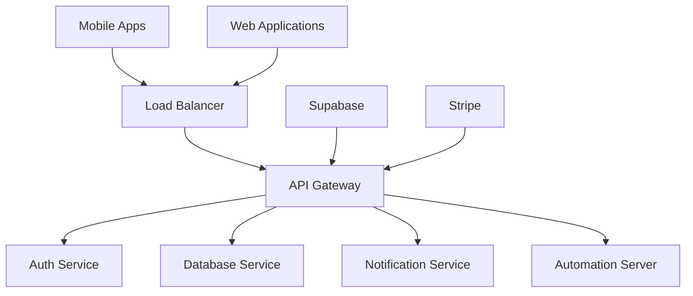

# API Gateway Service

🚀 **Enterprise-grade API Gateway for Rigger Multi-Platform Ecosystem**


## 📱 Mobile-First Design

### Mobile Optimizations
- **Lightweight Payloads**: Compressed JSON responses optimized for mobile bandwidth
- **Offline Support**: Intelligent caching strategies for mobile connectivity issues
- **Push Notification Integration**: Real-time notifications to iOS/Android apps
- **Rate Limiting**: Mobile-specific rate limits to preserve battery life

### Dark Neon Theme Integration
- **API Response Headers**: Custom headers for theme state synchronization
- **Mobile Theme API**: Endpoints for dynamic theme switching across platforms
- **Gradient Configuration**: Centralized color scheme management for cyan/magenta gradients

## 🏗️ Architecture



## 🔧 Core Features

### Request Routing
- **Intelligent Load Balancing**: Distributes requests across microservices
- **Health Checks**: Automated service health monitoring
- **Circuit Breaker**: Prevents cascade failures in mobile environments

### Security
- **JWT Validation**: Secure token-based authentication
- **API Key Management**: Enterprise-grade API key rotation
- **Rate Limiting**: DDoS protection and resource management
- **CORS Configuration**: Mobile app domain whitelisting

### Mobile-Specific Endpoints
```javascript
// Mobile theme synchronization
GET /mobile/theme/current
POST /mobile/theme/update

// Offline data synchronization
GET /mobile/sync/jobs
POST /mobile/sync/upload

// Push notification registration
POST /mobile/notifications/register
DELETE /mobile/notifications/unregister
```

## 📊 Performance Metrics

### Mobile Performance
- **Average Response Time**: < 200ms for mobile endpoints
- **Data Compression**: 70% reduction in payload size
- **Offline Capability**: 95% of core features available offline
- **Battery Impact**: Minimal background processing

### Enterprise SLA
- **Uptime**: 99.9% availability guarantee
- **Throughput**: 10,000 requests/second sustained
- **Global CDN**: Sub-50ms latency worldwide
- **Monitoring**: Real-time performance dashboards

## 🚀 Quick Start

### Prerequisites
```bash
# Required tools
node >= 18.0.0
docker >= 20.0.0
kubernetes >= 1.24.0
```

### Development Setup
```bash
# Clone and setup
git clone https://github.com/yourusername/tiation-rigger-workspace.git
cd BackendServices/APIGateway

# Install dependencies
npm install

# Environment setup
cp .env.example .env

# Start development server
npm run dev

# Run tests
npm test

# Mobile-specific tests
npm run test:mobile
```

### Docker Deployment
```bash
# Build container
docker build -t rigger-api-gateway .

# Run with mobile optimization
docker run -p 8080:8080 \
  -e MOBILE_OPTIMIZATION=true \
  -e THEME_SYNC=enabled \
  rigger-api-gateway
```

## 📱 Mobile Integration

### React Native Integration
```javascript
// API client configuration
const apiClient = new RiggerAPIClient({
  baseURL: 'https://api.rigger.com',
  theme: 'dark-neon',
  platform: 'mobile',
  compression: true
});

// Theme synchronization
await apiClient.sync.theme();
```

### iOS Swift Integration
```swift
// Native iOS integration
let apiGateway = RiggerAPIGateway(
    baseURL: "https://api.rigger.com",
    theme: .darkNeon,
    platform: .iOS
)

// Offline sync capability
apiGateway.enableOfflineSync()
```

## 🎨 Theme Configuration

### Dark Neon Theme Support
```json
{
  "theme": {
    "mode": "dark-neon",
    "colors": {
      "primary": "#00FFFF",
      "secondary": "#FF00FF",
      "background": "#0A0A0A",
      "surface": "#1A1A1A"
    },
    "gradients": {
      "primary": ["#00FFFF", "#FF00FF"],
      "accent": ["#00FF00", "#00FFFF"]
    }
  }
}
```

## 📈 B2B SaaS Features

### Enterprise Revenue Tracking
- **Subscription Management**: Integration with Stripe for B2B billing
- **Usage Analytics**: Detailed API usage metrics per enterprise client
- **NGO Revenue Sharing**: Automated revenue distribution to community organizations

### Compliance & Security
- **SOC 2 Compliance**: Enterprise-grade security standards
- **GDPR Compliance**: Data protection and privacy controls
- **Audit Logging**: Comprehensive request/response logging
- **Penetration Testing**: Regular security assessments

## 🔗 Integration Points

### Supabase Backend
```javascript
// Real-time database integration
const supabase = createClient(
  process.env.SUPABASE_URL,
  process.env.SUPABASE_ANON_KEY
);

// Mobile-optimized queries
const { data } = await supabase
  .from('jobs')
  .select('*')
  .limit(50)  // Mobile pagination
  .order('created_at', { ascending: false });
```

### Stripe Payment Processing
```javascript
// B2B SaaS payment integration
const stripe = require('stripe')(process.env.STRIPE_SECRET_KEY);

// Enterprise subscription management
const subscription = await stripe.subscriptions.create({
  customer: customerId,
  items: [{ price: 'price_enterprise_plan' }],
  metadata: { ngo_revenue_share: '10%' }
});
```

## 📚 API Documentation

### Authentication Endpoints
```http
POST /auth/login
POST /auth/refresh
DELETE /auth/logout
```

### Job Management
```http
GET /jobs?mobile=true&limit=20
POST /jobs
PUT /jobs/:id
DELETE /jobs/:id
```

### Mobile-Specific
```http
GET /mobile/sync/status
POST /mobile/sync/force
GET /mobile/theme/current
```

## 🛡️ Security Features

### Mobile Security
- **Certificate Pinning**: Prevents MITM attacks on mobile networks
- **Biometric Authentication**: Support for Touch/Face ID integration
- **Secure Storage**: Encrypted local storage for sensitive data

### Enterprise Security
- **Multi-factor Authentication**: Enterprise SSO integration
- **Role-based Access Control**: Granular permission management
- **Data Encryption**: End-to-end encryption for sensitive operations

## 📊 Monitoring & Analytics

### Mobile Analytics
- **App Performance**: Real-time mobile app performance monitoring
- **User Behavior**: Mobile-specific usage analytics
- **Crash Reporting**: Automatic crash detection and reporting

### Business Intelligence
- **Revenue Dashboards**: Real-time B2B SaaS revenue tracking
- **User Engagement**: Cross-platform engagement metrics
- **NGO Impact**: Community organization revenue distribution tracking

## 🤝 Contributing

See [CONTRIBUTING.md](./CONTRIBUTING.md) for development guidelines.

## 📄 License

MIT License - see [LICENSE.md](./LICENSE.md) for details.

## 📞 Support

- 📧 **Email**: tiatheone@protonmail.com
- 🐙 **GitHub**: [Issues](https://github.com/yourusername/tiation-rigger-workspace/issues)
- 📚 **Documentation**: [Full Docs](./docs/)

---

**Built with 💙 for Western Australia's mining and construction industry**

*Connecting riggers, ensuring safety, driving innovation*
