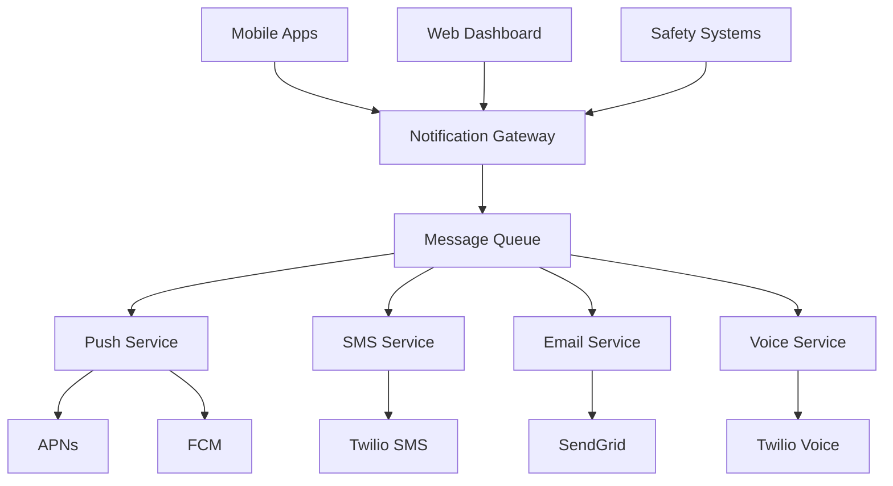

# Notification Service

📢 **Real-time Communications for Mining & Construction Safety**


## 📱 Mobile-First Notifications

### Multi-Platform Push Notifications
- **iOS APNs Integration**: Native push notifications with custom sounds for mining alerts
- **Android FCM**: Firebase Cloud Messaging with priority routing for safety notifications
- **Web Push**: Browser notifications for desktop dashboard users
- **SMS/Voice Backup**: Redundant communication for critical safety alerts in remote areas

### Dark Neon Theme Notifications
- **Themed Push UI**: Dark neon notification styles with cyan/magenta accents
- **Visual Priority Indicators**: Color-coded notification levels (safety, job alerts, system updates)
- **Accessibility Optimized**: High contrast notifications for mining helmet displays
- **Custom Sounds**: Mining-specific alert sounds optimized for noisy environments

## 🏗️ Architecture



## 🔧 Core Features

### Real-Time Safety Alerts
- **Emergency Notifications**: Instant push for safety incidents, evacuations, and hazards
- **Location-Based Alerts**: Geo-targeted notifications for specific mining site areas
- **Escalation Protocols**: Multi-channel escalation for critical safety communications
- **Compliance Tracking**: Delivery confirmation and read receipts for safety alerts

### Job Matching Notifications
- **Instant Job Alerts**: Real-time notifications for matching job opportunities
- **Application Updates**: Status updates for job applications and interviews
- **Certification Reminders**: Proactive alerts for expiring safety certifications
- **Skill-Based Matching**: Intelligent notifications based on worker profiles

## 📊 Performance Metrics

### Mobile Notification Performance
- **Delivery Speed**: < 2 seconds for push notifications
- **Delivery Rate**: 99.9% success rate for critical safety alerts
- **Battery Impact**: < 0.5% battery drain per day for background notifications
- **Offline Resilience**: Queued delivery when connectivity returns

### Enterprise Communication SLA
- **Safety Alert Response**: < 5 seconds end-to-end delivery
- **Multi-Channel Backup**: SMS/voice backup within 30 seconds of push failure
- **Global Reach**: Multi-region delivery infrastructure
- **Compliance Reporting**: Comprehensive delivery and engagement analytics

## 🚀 Quick Start

### Prerequisites
```bash
# Required services
redis >= 6.0
firebase-admin-sdk
twilio-sdk
sendgrid
apple-push-notification-service
```

### Development Setup
```bash
# Clone repository
git clone https://github.com/yourusername/tiation-rigger-workspace.git
cd BackendServices/NotificationService

# Install dependencies
npm install

# Configure push certificates
cp certs/example/* certs/
cp .env.example .env
# Configure APNs certificates, FCM keys, Twilio credentials

# Start notification service
npm run dev

# Test notification delivery
npm run test:notifications
npm run test:safety-alerts
```

### Docker Deployment
```bash
# Build notification service
docker build -t rigger-notification-service .

# Run with message queue
docker run -p 8083:8083 \
  -e REDIS_URL=redis://redis:6379 \
  -e FIREBASE_PROJECT_ID=rigger-mining \
  -e MINING_SAFETY_MODE=enabled \
  rigger-notification-service
```

## 📱 Mobile Integration

### React Native Push Setup
```javascript
import { RiggerNotifications } from '@rigger/notifications-mobile';
import PushNotificationIOS from '@react-native-push-notification/ios';
import messaging from '@react-native-firebase/messaging';

// Initialize notification system
const notifications = new RiggerNotifications({
  theme: 'dark-neon',
  soundsEnabled: true,
  vibrationsEnabled: true,
  safetyPriorityMode: true
});

// Setup push notifications
const setupPushNotifications = async () => {
  // Request permissions
  const authStatus = await messaging().requestPermission({
    alert: true,
    badge: true,
    sound: true,
    carPlay: false,
    criticalAlert: true, // For safety alerts
    providesAppNotificationSettings: true
  });

  // Register device token
  const token = await messaging().getToken();
  await notifications.registerDevice({
    token,
    platform: Platform.OS,
    userId: await getCurrentUserId(),
    safetyLevel: await getUserSafetyLevel(),
    location: await getCurrentLocation(),
    theme: 'dark-neon'
  });

  // Handle background notifications
  messaging().setBackgroundMessageHandler(async (remoteMessage) => {
    if (remoteMessage.data.type === 'safety_alert') {
      await handleSafetyAlert(remoteMessage.data);
    } else if (remoteMessage.data.type === 'job_match') {
      await handleJobNotification(remoteMessage.data);
    }
  });

  // Handle foreground notifications
  messaging().onMessage(async (remoteMessage) => {
    await showInAppNotification(remoteMessage, {
      theme: 'dark-neon',
      glowEffect: true,
      priority: remoteMessage.data.priority || 'normal'
    });
  });
};

// Safety alert handler
const handleSafetyAlert = async (alertData) => {
  const alert = {
    title: alertData.title,
    message: alertData.message,
    priority: 'critical',
    sound: 'mining_emergency.wav',
    vibrate: [0, 250, 250, 250],
    color: '#FF4500', // Hazard orange
    actions: [
      { id: 'acknowledge', title: 'ACKNOWLEDGE', color: '#00FFFF' },
      { id: 'evacuate', title: 'EVACUATE NOW', color: '#FF3366' }
    ]
  };

  await notifications.showSafetyAlert(alert);
  
  // Track acknowledgment for compliance
  await notifications.trackSafetyResponse(alertData.id, 'delivered');
};

// Job notification with neon theme
const showJobNotification = async (jobData) => {
  const notification = {
    id: jobData.jobId,
    title: `New Job Match: ${jobData.title}`,
    message: `${jobData.company} - ${jobData.location}`,
    data: jobData,
    style: {
      backgroundColor: '#1A1A1A',
      titleColor: '#00FFFF',
      textColor: '#FFFFFF',
      accentColor: '#FF00FF',
      glowEffect: true
    },
    actions: [
      { id: 'view', title: 'VIEW JOB', color: '#00FFFF' },
      { id: 'apply', title: 'APPLY NOW', color: '#00FF88' }
    ]
  };

  await notifications.show(notification);
};
```

### iOS Swift Push Integration
```swift
import UserNotifications
import RiggerNotificationSDK

class NotificationManager: NSObject, UNUserNotificationCenterDelegate {
    
    override init() {
        super.init()
        setupNotifications()
    }
    
    func setupNotifications() {
        UNUserNotificationCenter.current().delegate = self
        
        // Request permissions with critical alerts for safety
        let options: UNAuthorizationOptions = [
            .alert, .sound, .badge, .criticalAlert
        ]
        
        UNUserNotificationCenter.current().requestAuthorization(options: options) { granted, error in
            if granted {
                DispatchQueue.main.async {
                    UIApplication.shared.registerForRemoteNotifications()
                }
            }
        }
    }
    
    // Handle notification presentation with dark neon theme
    func userNotificationCenter(
        _ center: UNUserNotificationCenter,
        willPresent notification: UNNotification,
        withCompletionHandler completionHandler: @escaping (UNNotificationPresentationOptions) -> Void
    ) {
        let userInfo = notification.request.content.userInfo
        
        if let alertType = userInfo["type"] as? String, alertType == "safety_alert" {
            // Critical safety alert - show immediately with custom UI
            showSafetyAlert(notification: notification)
            completionHandler([.alert, .sound, .badge])
        } else {
            // Regular notification with neon theme
            showThemedNotification(notification: notification)
            completionHandler([.alert, .sound])
        }
    }
    
    private func showSafetyAlert(notification: UNNotification) {
        let alertController = UIAlertController(
            title: notification.request.content.title,
            message: notification.request.content.body,
            preferredStyle: .alert
        )
        
        // Apply dark neon theme
        alertController.setValue(RiggerTheme.darkNeonAttributedTitle(notification.request.content.title), forKey: "attributedTitle")
        alertController.setValue(RiggerTheme.darkNeonAttributedMessage(notification.request.content.body), forKey: "attributedMessage")
        alertController.view.backgroundColor = UIColor(hex: "#1A1A1A")
        alertController.view.layer.borderWidth = 2
        alertController.view.layer.borderColor = UIColor(hex: "#FF4500").cgColor
        
        let acknowledgeAction = UIAlertAction(title: "ACKNOWLEDGE", style: .default) { _ in
            self.acknowledgeAlert(notification: notification)
        }
        acknowledgeAction.setValue(UIColor(hex: "#00FFFF"), forKey: "titleTextColor")
        
        alertController.addAction(acknowledgeAction)
        
        // Present with glow effect
        if let topController = UIApplication.shared.topViewController() {
            topController.present(alertController, animated: true) {
                alertController.view.addGlowEffect(color: UIColor(hex: "#FF4500"))
            }
        }
    }
    
    private func acknowledgeAlert(notification: UNNotification) {
        guard let alertId = notification.request.content.userInfo["alert_id"] as? String else { return }
        
        // Send acknowledgment to server
        Task {
            await RiggerAPI.acknowledgeSafetyAlert(alertId: alertId)
        }
    }
}

// Custom notification content extension
class SafetyNotificationViewController: UIViewController, UNNotificationContentExtension {
    
    @IBOutlet weak var titleLabel: UILabel!
    @IBOutlet weak var messageLabel: UILabel!
    @IBOutlet weak var actionButton: UIButton!
    
    func didReceive(_ notification: UNNotification) {
        let content = notification.request.content
        
        // Apply dark neon theme
        view.backgroundColor = UIColor(hex: "#0A0A0A")
        
        titleLabel.text = content.title
        titleLabel.textColor = UIColor(hex: "#00FFFF")
        titleLabel.addGlowEffect(color: UIColor(hex: "#00FFFF"))
        
        messageLabel.text = content.body
        messageLabel.textColor = UIColor(hex: "#FFFFFF")
        
        actionButton.backgroundColor = UIColor(hex: "#FF00FF")
        actionButton.setTitleColor(UIColor(hex: "#FFFFFF"), for: .normal)
        actionButton.layer.borderWidth = 1
        actionButton.layer.borderColor = UIColor(hex: "#FF00FF").cgColor
        actionButton.addGlowEffect(color: UIColor(hex: "#FF00FF"))
    }
}
```

## 🎨 Theme Integration

### Dark Neon Notification Styles
```json
{
  "notificationThemes": {
    "dark-neon": {
      "colors": {
        "background": "#1A1A1A",
        "surface": "#2A2A2A",
        "primary": "#00FFFF",
        "secondary": "#FF00FF",
        "accent": "#00FF00",
        "text": "#FFFFFF",
        "textSecondary": "#CCCCCC"
      },
      "effects": {
        "glow": {
          "enabled": true,
          "intensity": 0.8,
          "blurRadius": 8
        },
        "gradients": {
          "background": ["#0A0A0A", "#1A1A1A"],
          "button": ["#00FFFF", "#0088FF"],
          "accent": ["#FF00FF", "#8000FF"]
        }
      },
      "typography": {
        "title": {
          "fontSize": 18,
          "fontWeight": "bold",
          "color": "#00FFFF",
          "glowColor": "#00FFFF"
        },
        "body": {
          "fontSize": 14,
          "fontWeight": "normal",
          "color": "#FFFFFF",
          "lineHeight": 1.4
        }
      },
      "safetyAlerts": {
        "critical": {
          "borderColor": "#FF4500",
          "backgroundColor": "#2A0A0A",
          "titleColor": "#FF4500",
          "glowColor": "#FF4500"
        },
        "warning": {
          "borderColor": "#FFAA00",
          "backgroundColor": "#2A2000",
          "titleColor": "#FFAA00",
          "glowColor": "#FFAA00"
        }
      }
    }
  }
}
```

## 🔔 Notification Types & Templates

### Safety Alert Templates
```javascript
const safetyAlertTemplates = {
  evacuation: {
    title: "EVACUATION ALERT",
    message: "Immediate evacuation required from {location}. Proceed to {assemblyPoint}.",
    priority: "critical",
    sound: "evacuation_alarm.wav",
    vibration: [0, 1000, 500, 1000],
    color: "#FF3366",
    actions: [
      { id: "acknowledge", title: "ACKNOWLEDGED", required: true },
      { id: "safe", title: "I'M SAFE", color: "#00FF88" },
      { id: "help", title: "NEED HELP", color: "#FF4500" }
    ]
  },
  
  hazard: {
    title: "HAZARD WARNING",
    message: "Hazard detected at {location}: {hazardType}. Exercise caution.",
    priority: "high",
    sound: "hazard_warning.wav",
    vibration: [0, 500, 200, 500],
    color: "#FFAA00",
    actions: [
      { id: "acknowledge", title: "ACKNOWLEDGED", required: true },
      { id: "report", title: "REPORT STATUS", color: "#00FFFF" }
    ]
  },
  
  certification_expiry: {
    title: "Certification Expiring",
    message: "Your {certification} expires in {days} days. Renew to continue working.",
    priority: "medium",
    sound: "reminder.wav",
    color: "#FF00FF",
    actions: [
      { id: "renew", title: "RENEW NOW", color: "#00FF88" },
      { id: "later", title: "REMIND LATER", color: "#888888" }
    ]
  }
};

const jobNotificationTemplates = {
  new_match: {
    title: "New Job Match",
    message: "We found a job that matches your skills: {jobTitle} at {company}",
    priority: "medium",
    sound: "job_notification.wav",
    color: "#00FFFF",
    actions: [
      { id: "view", title: "VIEW JOB", color: "#00FFFF" },
      { id: "apply", title: "APPLY NOW", color: "#00FF88" }
    ]
  },
  
  application_update: {
    title: "Application Update",
    message: "Your application for {jobTitle} has been {status}",
    priority: "medium",
    sound: "update.wav",
    color: "#FF00FF",
    actions: [
      { id: "view", title: "VIEW DETAILS", color: "#00FFFF" }
    ]
  }
};
```

## 🚨 Emergency Communication

### Critical Safety Integration
```javascript
// Emergency notification system
const emergencyNotifications = {
  broadcastEmergency: async (emergency) => {
    const affectedUsers = await getUsersInRadius(
      emergency.location, 
      emergency.radius || 10000 // 10km default
    );

    const notification = {
      id: `emergency_${emergency.id}`,
      type: 'safety_alert',
      priority: 'critical',
      title: emergency.title,
      message: emergency.message,
      data: {
        emergencyId: emergency.id,
        location: emergency.location,
        severity: emergency.severity,
        evacuationPoint: emergency.evacuationPoint
      }
    };

    // Parallel delivery across all channels
    const deliveryPromises = affectedUsers.map(user => [
      sendPushNotification(user, notification),
      sendSMSBackup(user, notification),
      sendEmailAlert(user, notification)
    ]).flat();

    const results = await Promise.allSettled(deliveryPromises);
    
    // Track delivery status for compliance
    await trackEmergencyDelivery(emergency.id, results);
    
    return results;
  },

  trackAcknowledgment: async (userId, emergencyId) => {
    await redis.set(
      `emergency_ack:${emergencyId}:${userId}`,
      JSON.stringify({
        acknowledgedAt: new Date(),
        userId,
        emergencyId
      }),
      'EX', 86400 // 24 hour expiry
    );

    // Update emergency status
    await updateEmergencyStatus(emergencyId);
  },

  getEmergencyStatus: async (emergencyId) => {
    const totalUsers = await getAffectedUsersCount(emergencyId);
    const acknowledgedUsers = await redis.keys(`emergency_ack:${emergencyId}:*`);
    
    return {
      totalUsers,
      acknowledgedCount: acknowledgedUsers.length,
      acknowledgmentRate: (acknowledgedUsers.length / totalUsers) * 100,
      pendingUsers: totalUsers - acknowledgedUsers.length
    };
  }
};
```

## 📊 Analytics & Reporting

### Notification Analytics
```javascript
const notificationAnalytics = {
  trackDelivery: async (notificationId, userId, status, channel) => {
    await db.query(`
      INSERT INTO notification_delivery_log (
        notification_id, user_id, status, channel, 
        delivered_at, device_info, location
      ) VALUES ($1, $2, $3, $4, NOW(), $5, $6)
    `, [notificationId, userId, status, channel, req.deviceInfo, req.location]);
  },

  trackEngagement: async (notificationId, userId, action) => {
    await db.query(`
      INSERT INTO notification_engagement (
        notification_id, user_id, action, 
        engaged_at, response_time
      ) VALUES ($1, $2, $3, NOW(), $4)
    `, [notificationId, userId, action, calculateResponseTime(notificationId, userId)]);
  },

  generateDeliveryReport: async (timeframe) => {
    return await db.query(`
      SELECT 
        channel,
        COUNT(*) as total_sent,
        COUNT(CASE WHEN status = 'delivered' THEN 1 END) as delivered,
        COUNT(CASE WHEN status = 'failed' THEN 1 END) as failed,
        ROUND(
          COUNT(CASE WHEN status = 'delivered' THEN 1 END) * 100.0 / 
          COUNT(*), 2
        ) as delivery_rate,
        AVG(
          EXTRACT(EPOCH FROM (delivered_at - created_at))
        ) as avg_delivery_time
      FROM notification_delivery_log 
      WHERE delivered_at >= NOW() - INTERVAL '$1 days'
      GROUP BY channel
      ORDER BY total_sent DESC
    `, [timeframe]);
  },

  getSafetyComplianceReport: async () => {
    return await db.query(`
      SELECT 
        emergency_id,
        COUNT(DISTINCT user_id) as total_recipients,
        COUNT(CASE WHEN acknowledged THEN 1 END) as acknowledged,
        AVG(response_time_seconds) as avg_response_time,
        MIN(response_time_seconds) as fastest_response,
        MAX(response_time_seconds) as slowest_response
      FROM safety_alert_responses 
      WHERE created_at >= NOW() - INTERVAL '30 days'
      GROUP BY emergency_id
      ORDER BY created_at DESC
    `);
  }
};
```

## 🔧 Advanced Configuration

### Message Queue Processing
```javascript
// Redis-based message queue for high throughput
const messageQueue = {
  processors: {
    'safety_alert': {
      concurrency: 100,
      priority: 1,
      processor: async (job) => {
        const { alert, users } = job.data;
        await emergencyNotifications.broadcastEmergency(alert);
      }
    },
    
    'job_notification': {
      concurrency: 50,
      priority: 2,
      processor: async (job) => {
        const { jobMatch, user } = job.data;
        await sendJobNotification(user, jobMatch);
      }
    },
    
    'bulk_notification': {
      concurrency: 20,
      priority: 3,
      processor: async (job) => {
        const { notification, userGroups } = job.data;
        await sendBulkNotification(notification, userGroups);
      }
    }
  },

  addJob: async (queueName, data, options = {}) => {
    const job = {
      id: generateJobId(),
      type: queueName,
      data,
      priority: options.priority || 5,
      attempts: options.attempts || 3,
      delay: options.delay || 0,
      createdAt: new Date()
    };

    await redis.zadd(
      `queue:${queueName}`,
      job.priority,
      JSON.stringify(job)
    );

    return job.id;
  }
};
```

## 🤝 Contributing

See [CONTRIBUTING.md](./CONTRIBUTING.md) for notification service contribution guidelines.

## 📄 License

MIT License - see [LICENSE.md](./LICENSE.md) for details.

## 📞 Support

- 📧 **Notification Support**: tiatheone@protonmail.com
- 🚨 **Emergency Contact**: emergency@rigger.com
- 🐙 **GitHub Issues**: [Notification Issues](https://github.com/yourusername/tiation-rigger-workspace/issues)

---

**Keeping Western Australia's mining workforce safe and connected**

*Real-time communication, safety first, always reachable*
