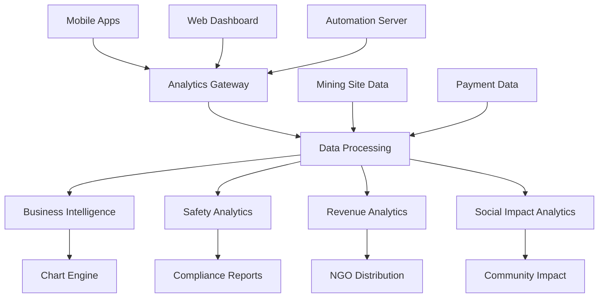

# Metrics Dashboard

📊 **Enterprise Business Intelligence & Analytics Platform**


## 📱 Mobile-Optimized Analytics

### Real-Time Mobile Metrics
- **Progressive Web App**: Native app-like experience on mobile devices
- **Touch-Friendly Charts**: Gesture-based chart interaction and exploration
- **Responsive Design**: Adaptive layouts for all screen sizes and orientations
- **Offline Analytics**: Cached metrics data for offline dashboard access

### Dark Neon Theme Analytics
- **Neon Data Visualization**: Cyan/magenta gradient charts with glow effects
- **High-Contrast Metrics**: Mining-optimized color schemes for outdoor visibility
- **Interactive Dashboards**: Touch-responsive charts with dark neon styling
- **Theme-Aware Exports**: PDF/PNG exports maintaining dark neon aesthetics

## 🏗️ Architecture



## 🔧 Core Analytics Features

### Business Intelligence Dashboard
- **Revenue Analytics**: Real-time B2B SaaS revenue tracking and forecasting
- **User Engagement**: Cross-platform user behavior and retention analytics
- **Mining Industry KPIs**: Industry-specific performance indicators
- **Predictive Analytics**: AI-powered business forecasting and trend analysis

### Safety & Compliance Metrics
- **Real-Time Safety Monitoring**: Live safety incident tracking and prevention
- **Compliance Scoring**: Automated compliance rating and improvement tracking
- **Risk Assessment**: Predictive risk analysis for mining operations
- **Incident Analytics**: Comprehensive safety incident analysis and reporting

### Social Impact Tracking
- **NGO Revenue Distribution**: Transparent community revenue sharing analytics
- **Community Impact Metrics**: Quantified positive outcomes in local communities
- **Workforce Development**: Skills training and career progression analytics
- **Environmental Impact**: Mining site environmental monitoring and reporting

## 📊 Performance Metrics

### Mobile Analytics Performance
- **Chart Rendering**: < 500ms for complex visualizations on mobile
- **Data Refresh**: Real-time updates every 30 seconds
- **Offline Capability**: 24 hours of cached analytics data
- **Battery Optimization**: Efficient rendering to preserve mobile battery

### Enterprise Analytics SLA
- **Data Processing**: < 5 minutes for real-time business metrics
- **Report Generation**: < 30 seconds for comprehensive reports
- **Uptime**: 99.9% availability for critical business dashboards
- **Data Accuracy**: 99.99% accuracy in financial and safety metrics

## 🚀 Quick Start

### Prerequisites
```bash
# Analytics Stack
node >= 18.0.0
python >= 3.9
elasticsearch >= 8.0
redis >= 6.0

# Visualization Libraries  
d3.js >= 7.0
chart.js >= 4.0
plotly.js >= 2.0
apache-echarts >= 5.0
```

### Development Setup
```bash
# Clone repository
git clone https://github.com/yourusername/tiation-rigger-workspace.git
cd MetricsDashboard

# Install dependencies
npm install
pip install -r requirements.txt

# Environment setup
cp .env.example .env
# Configure analytics data sources

# Start analytics server
npm run dev

# Start Python analytics engine
python -m uvicorn analytics_engine:app --reload

# Run analytics tests
npm run test:analytics
pytest tests/analytics_tests/
```

### Docker Deployment
```bash
# Build metrics dashboard
docker build -t rigger-metrics-dashboard .

# Deploy with analytics stack
docker-compose up -d analytics-cluster

# Health check
curl http://localhost:3002/health/analytics
```

## 📱 Mobile Dashboard Integration

### React Native Analytics Components
```javascript
import { RiggerAnalytics } from '@rigger/analytics-mobile';
import { LineChart, BarChart, PieChart } from '@rigger/charts-mobile';

// Initialize analytics dashboard
const analytics = new RiggerAnalytics({
  apiUrl: 'https://analytics.rigger.com',
  theme: 'dark-neon',
  enableOfflineCharts: true,
  compressionEnabled: true
});

// Mobile dashboard components
const MobileDashboard = () => {
  const [metrics, setMetrics] = useState({});
  const [safetyData, setSafetyData] = useState({});
  const [revenueData, setRevenueData] = useState({});

  useEffect(() => {
    // Load analytics data
    loadDashboardData();
    
    // Setup real-time updates
    analytics.subscribeToUpdates({
      onBusinessMetrics: (data) => setMetrics(data),
      onSafetyMetrics: (data) => setSafetyData(data),
      onRevenueMetrics: (data) => setRevenueData(data)
    });
  }, []);

  const loadDashboardData = async () => {
    const [business, safety, revenue] = await Promise.all([
      analytics.getBusinessMetrics({ period: '30d' }),
      analytics.getSafetyMetrics({ period: '7d' }),
      analytics.getRevenueMetrics({ period: '30d' })
    ]);

    setMetrics(business);
    setSafetyData(safety);
    setRevenueData(revenue);
  };

  return (
    <ScrollView style={styles.dashboard}>
      {/* Revenue Overview Card */}
      <DashboardCard 
        title="Revenue Overview" 
        theme="dark-neon"
        glowEffect={true}
      >
        <LineChart
          data={revenueData.dailyRevenue}
          theme="dark-neon"
          colors={['#00FFFF', '#FF00FF']}
          gradient={true}
          touchEnabled={true}
          style={styles.chart}
        />
        <MetricsSummary
          totalRevenue={revenueData.total}
          ngoShare={revenueData.ngoDistribution}
          growth={revenueData.growthRate}
          theme="dark-neon"
        />
      </DashboardCard>

      {/* Safety Metrics Card */}
      <DashboardCard 
        title="Safety Metrics" 
        theme="dark-neon"
        priority="high"
      >
        <SafetyGaugeChart
          currentScore={safetyData.overallScore}
          target={100}
          theme="dark-neon"
          dangerColor="#FF4500"
          safeColor="#00FF88"
          glowEffect={true}
        />
        <SafetyTrendChart
          data={safetyData.weeklyTrends}
          incidents={safetyData.incidents}
          theme="dark-neon"
        />
      </DashboardCard>

      {/* Job Matching Performance */}
      <DashboardCard 
        title="Job Matching AI" 
        theme="dark-neon"
      >
        <BarChart
          data={metrics.jobMatchingStats}
          categories={['Success Rate', 'Response Time', 'User Satisfaction']}
          colors={['#00FFFF', '#FF00FF', '#00FF88']}
          theme="dark-neon"
          animated={true}
        />
      </DashboardCard>

      {/* Community Impact */}
      <DashboardCard 
        title="Community Impact" 
        theme="dark-neon"
      >
        <PieChart
          data={metrics.communityImpact}
          colors={['#00FFFF', '#FF00FF', '#00FF88', '#FFAA00']}
          theme="dark-neon"
          glowEffect={true}
          legend={true}
        />
        <ImpactMetrics
          ngoSupported={metrics.ngoCount}
          communityJobs={metrics.communityJobs}
          skillsTraining={metrics.trainingPrograms}
        />
      </DashboardCard>
    </ScrollView>
  );
};

// Custom dashboard card component
const DashboardCard = ({ title, children, theme, priority, glowEffect }) => {
  const cardStyle = {
    backgroundColor: theme === 'dark-neon' ? '#1A1A1A' : '#FFFFFF',
    borderRadius: 12,
    padding: 16,
    marginBottom: 16,
    borderWidth: priority === 'high' ? 2 : 1,
    borderColor: priority === 'high' ? '#FF4500' : '#00FFFF',
    shadowColor: '#00FFFF',
    shadowOffset: { width: 0, height: 0 },
    shadowOpacity: glowEffect ? 0.3 : 0,
    shadowRadius: glowEffect ? 10 : 0,
    elevation: glowEffect ? 8 : 4
  };

  return (
    <View style={cardStyle}>
      <Text style={[styles.cardTitle, { color: '#00FFFF' }]}>
        {title}
      </Text>
      {children}
    </View>
  );
};
```

### iOS SwiftUI Analytics Dashboard
```swift
import SwiftUI
import Charts
import RiggerAnalyticsSDK

struct AnalyticsDashboardView: View {
    @StateObject private var analytics = RiggerAnalytics(theme: .darkNeon)
    @State private var businessMetrics: BusinessMetrics?
    @State private var safetyData: SafetyMetrics?
    @State private var revenueData: RevenueMetrics?
    
    var body: some View {
        NavigationView {
            ScrollView {
                LazyVStack(spacing: 16) {
                    // Revenue Analytics Card
                    DashboardCard(
                        title: "Revenue Analytics",
                        theme: .darkNeon,
                        glowEffect: true
                    ) {
                        if let revenue = revenueData {
                            RevenueChart(data: revenue)
                                .frame(height: 200)
                            
                            HStack {
                                MetricTile(
                                    title: "Total Revenue",
                                    value: revenue.totalFormatted,
                                    color: .cyan
                                )
                                MetricTile(
                                    title: "NGO Share",
                                    value: revenue.ngoShareFormatted,
                                    color: .magenta
                                )
                                MetricTile(
                                    title: "Growth",
                                    value: revenue.growthRateFormatted,
                                    color: .green
                                )
                            }
                        }
                    }
                    
                    // Safety Metrics Card
                    DashboardCard(
                        title: "Safety Overview",
                        theme: .darkNeon,
                        priority: .high
                    ) {
                        if let safety = safetyData {
                            SafetyGaugeView(
                                score: safety.overallScore,
                                target: 100,
                                theme: .darkNeon
                            )
                            .frame(height: 150)
                            
                            SafetyTrendChart(data: safety.weeklyTrends)
                                .frame(height: 120)
                        }
                    }
                    
                    // Job Matching Performance
                    DashboardCard(
                        title: "AI Job Matching",
                        theme: .darkNeon
                    ) {
                        if let metrics = businessMetrics {
                            Chart(metrics.jobMatchingStats, id: \\.category) { stat in
                                BarMark(
                                    x: .value("Category", stat.category),
                                    y: .value("Value", stat.value)
                                )
                                .foregroundStyle(
                                    LinearGradient(
                                        colors: [.cyan, .magenta],
                                        startPoint: .bottom,
                                        endPoint: .top
                                    )
                                )
                            }
                            .chartForegroundStyleScale([
                                "Success Rate": Color.cyan,
                                "Response Time": Color.magenta,
                                "Satisfaction": Color.green
                            ])
                            .frame(height: 200)
                        }
                    }
                    
                    // Community Impact
                    DashboardCard(
                        title: "Community Impact",
                        theme: .darkNeon
                    ) {
                        if let metrics = businessMetrics {
                            CommunityImpactChart(data: metrics.communityImpact)
                                .frame(height: 200)
                            
                            VStack(alignment: .leading, spacing: 8) {
                                ImpactMetricRow(
                                    title: "NGOs Supported",
                                    value: "\\(metrics.ngoCount)",
                                    icon: "heart.fill",
                                    color: .magenta
                                )
                                ImpactMetricRow(
                                    title: "Community Jobs",
                                    value: "\\(metrics.communityJobs)",
                                    icon: "person.3.fill",
                                    color: .cyan
                                )
                                ImpactMetricRow(
                                    title: "Skills Training",
                                    value: "\\(metrics.trainingPrograms)",
                                    icon: "graduationcap.fill",
                                    color: .green
                                )
                            }
                        }
                    }
                }
                .padding()
            }
            .background(Color.black)
            .navigationTitle("Analytics")
            .navigationBarTitleDisplayMode(.large)
            .preferredColorScheme(.dark)
        }
        .onAppear {
            loadAnalyticsData()
            setupRealTimeUpdates()
        }
    }
    
    private func loadAnalyticsData() {
        Task {
            async let business = analytics.getBusinessMetrics(period: .thirtyDays)
            async let safety = analytics.getSafetyMetrics(period: .sevenDays)  
            async let revenue = analytics.getRevenueMetrics(period: .thirtyDays)
            
            self.businessMetrics = try await business
            self.safetyData = try await safety
            self.revenueData = try await revenue
        }
    }
    
    private func setupRealTimeUpdates() {
        analytics.subscribeToUpdates { update in
            DispatchQueue.main.async {
                switch update.type {
                case .businessMetrics:
                    self.businessMetrics = update.businessData
                case .safetyMetrics:
                    self.safetyData = update.safetyData
                case .revenueMetrics:
                    self.revenueData = update.revenueData
                }
            }
        }
    }
}

// Custom dashboard card component
struct DashboardCard<Content: View>: View {
    let title: String
    let theme: RiggerTheme
    let priority: Priority
    let glowEffect: Bool
    let content: Content
    
    enum Priority {
        case normal, high
    }
    
    init(
        title: String,
        theme: RiggerTheme = .darkNeon,
        priority: Priority = .normal,
        glowEffect: Bool = false,
        @ViewBuilder content: () -> Content
    ) {
        self.title = title
        self.theme = theme
        self.priority = priority
        self.glowEffect = glowEffect
        self.content = content()
    }
    
    var body: some View {
        VStack(alignment: .leading, spacing: 12) {
            Text(title)
                .font(.headline)
                .foregroundColor(.cyan)
                .shadow(color: glowEffect ? .cyan : .clear, radius: 8)
            
            content
        }
        .padding()
        .background(
            RoundedRectangle(cornerRadius: 12)
                .fill(Color(.systemGray6))
                .overlay(
                    RoundedRectangle(cornerRadius: 12)
                        .stroke(
                            priority == .high ? Color.orange : Color.cyan,
                            lineWidth: priority == .high ? 2 : 1
                        )
                )
        )
        .shadow(
            color: glowEffect ? .cyan.opacity(0.3) : .clear,
            radius: glowEffect ? 10 : 0
        )
    }
}
```

## 🎨 Dark Neon Theme Visualization

### Chart Theme Configuration
```json
{
  "analyticsThemes": {
    "dark-neon": {
      "colors": {
        "background": "#0A0A0A",
        "cardBackground": "#1A1A1A",
        "surface": "#2A2A2A",
        "primary": "#00FFFF",
        "secondary": "#FF00FF",
        "accent": "#00FF88",
        "warning": "#FFAA00",
        "danger": "#FF4500",
        "text": "#FFFFFF",
        "textSecondary": "#CCCCCC"
      },
      "charts": {
        "lineChart": {
          "strokeColors": ["#00FFFF", "#FF00FF", "#00FF88"],
          "fillGradients": [
            ["#00FFFF", "rgba(0, 255, 255, 0.2)"],
            ["#FF00FF", "rgba(255, 0, 255, 0.2)"],
            ["#00FF88", "rgba(0, 255, 136, 0.2)"]
          ],
          "gridColor": "rgba(255, 255, 255, 0.1)",
          "glowEffect": true
        },
        "barChart": {
          "colors": ["#00FFFF", "#FF00FF", "#00FF88", "#FFAA00"],
          "gradientFill": true,
          "borderRadius": 4,
          "glowIntensity": 0.6
        },
        "pieChart": {
          "colors": ["#00FFFF", "#FF00FF", "#00FF88", "#FFAA00", "#8000FF"],
          "strokeWidth": 2,
          "strokeColor": "#FFFFFF",
          "glowEffect": true,
          "hoverGlow": true
        },
        "gaugeChart": {
          "trackColor": "#2A2A2A",
          "progressColors": {
            "safe": "#00FF88",
            "warning": "#FFAA00", 
            "danger": "#FF4500"
          },
          "glowEffect": true,
          "needleColor": "#FFFFFF"
        }
      },
      "dashboard": {
        "cardGlow": "0 0 20px rgba(0, 255, 255, 0.3)",
        "highlightGlow": "0 0 30px rgba(255, 0, 255, 0.5)",
        "criticalGlow": "0 0 40px rgba(255, 69, 0, 0.8)",
        "animationDuration": 300,
        "hoverEffects": true
      }
    }
  }
}
```

## 📈 Advanced Analytics Components

### Business Intelligence Engine
```python
# Advanced Analytics Engine
import pandas as pd
import numpy as np
from sklearn.preprocessing import StandardScaler
from sklearn.ensemble import RandomForestRegressor
import plotly.graph_objects as go
import plotly.express as px

class BusinessIntelligenceEngine:
    def __init__(self):
        self.revenue_model = None
        self.safety_model = None
        self.engagement_model = None
        
    def generate_revenue_analytics(self, data, period='30d'):
        """Generate comprehensive revenue analytics"""
        
        # Process revenue data
        df = pd.DataFrame(data)
        df['date'] = pd.to_datetime(df['date'])
        df = df.set_index('date').resample('D').sum().fillna(0)
        
        # Calculate key metrics
        total_revenue = df['amount'].sum()
        ngo_revenue = df['ngo_share'].sum()
        avg_daily_revenue = df['amount'].mean()
        growth_rate = self.calculate_growth_rate(df['amount'])
        
        # Revenue forecasting
        forecast = self.forecast_revenue(df['amount'], days=30)
        
        # Mobile-optimized response
        analytics_data = {
            'summary': {
                'totalRevenue': float(total_revenue),
                'ngoDistribution': float(ngo_revenue),
                'avgDailyRevenue': float(avg_daily_revenue),
                'growthRate': float(growth_rate),
                'currency': 'AUD'
            },
            'dailyRevenue': [
                {
                    'date': date.strftime('%Y-%m-%d'),
                    'amount': float(amount),
                    'ngoShare': float(ngo_share)
                }
                for date, amount, ngo_share in zip(
                    df.index, df['amount'], df['ngo_share']
                )
            ],
            'forecast': [
                {
                    'date': (df.index[-1] + pd.Timedelta(days=i)).strftime('%Y-%m-%d'),
                    'predicted': float(value),
                    'confidence': float(confidence)
                }
                for i, (value, confidence) in enumerate(forecast, 1)
            ],
            'insights': self.generate_revenue_insights(df),
            'theme': 'dark-neon'
        }
        
        return analytics_data
    
    def generate_safety_analytics(self, safety_data, incident_data):
        """Generate comprehensive safety analytics"""
        
        # Process safety metrics
        safety_df = pd.DataFrame(safety_data)
        incident_df = pd.DataFrame(incident_data)
        
        # Calculate safety scores
        overall_score = self.calculate_safety_score(safety_df, incident_df)
        risk_assessment = self.assess_safety_risks(incident_df)
        compliance_rate = self.calculate_compliance_rate(safety_df)
        
        # Trend analysis
        weekly_trends = self.calculate_safety_trends(safety_df, incident_df)
        
        # Predictive risk modeling
        risk_forecast = self.forecast_safety_risks(incident_df)
        
        return {
            'overallScore': float(overall_score),
            'complianceRate': float(compliance_rate),
            'riskLevel': risk_assessment['level'],
            'weeklyTrends': weekly_trends,
            'riskForecast': risk_forecast,
            'incidents': {
                'total': len(incident_df),
                'byType': incident_df.groupby('type').size().to_dict(),
                'bySeverity': incident_df.groupby('severity').size().to_dict()
            },
            'recommendations': self.generate_safety_recommendations(
                overall_score, risk_assessment, compliance_rate
            ),
            'theme': 'dark-neon'
        }
    
    def generate_job_matching_analytics(self, matching_data):
        """Analyze AI job matching performance"""
        
        df = pd.DataFrame(matching_data)
        
        # Key performance indicators
        success_rate = (df['hired'] == True).mean() * 100
        avg_match_score = df['match_score'].mean()
        avg_response_time = df['response_time_ms'].mean()
        user_satisfaction = df['satisfaction_score'].mean()
        
        # Performance by categories
        performance_by_skill = df.groupby('primary_skill').agg({
            'hired': lambda x: (x == True).mean() * 100,
            'match_score': 'mean',
            'satisfaction_score': 'mean'
        }).round(2)
        
        # Time series analysis
        daily_stats = df.groupby(df['created_at'].dt.date).agg({
            'match_score': 'mean',
            'hired': lambda x: (x == True).mean() * 100,
            'response_time_ms': 'mean'
        })
        
        return {
            'summary': {
                'successRate': float(success_rate),
                'avgMatchScore': float(avg_match_score),
                'avgResponseTime': float(avg_response_time),
                'userSatisfaction': float(user_satisfaction)
            },
            'jobMatchingStats': [
                {'category': 'Success Rate', 'value': success_rate},
                {'category': 'Response Time', 'value': avg_response_time},
                {'category': 'User Satisfaction', 'value': user_satisfaction * 20}  # Scale to 100
            ],
            'performanceBySkill': performance_by_skill.to_dict('index'),
            'dailyTrends': [
                {
                    'date': date.strftime('%Y-%m-%d'),
                    'matchScore': float(stats['match_score']),
                    'successRate': float(stats['hired']),
                    'responseTime': float(stats['response_time_ms'])
                }
                for date, stats in daily_stats.iterrows()
            ],
            'mlModelMetrics': self.get_ml_model_performance(),
            'theme': 'dark-neon'
        }
    
    def generate_community_impact_analytics(self, impact_data):
        """Analyze social and community impact"""
        
        df = pd.DataFrame(impact_data)
        
        # Community metrics
        ngo_count = df['ngo_partner_id'].nunique()
        community_jobs = df[df['community_focused'] == True]['job_count'].sum()
        training_programs = df['training_program_id'].nunique()
        skills_developed = df['skills_trained'].str.split(',').explode().nunique()
        
        # Geographic impact
        regional_impact = df.groupby('region').agg({
            'job_count': 'sum',
            'worker_count': 'sum',
            'ngo_revenue': 'sum'
        }).to_dict('index')
        
        # Impact over time
        monthly_impact = df.groupby(df['date'].dt.to_period('M')).agg({
            'job_count': 'sum',
            'worker_count': 'sum',
            'ngo_revenue': 'sum',
            'community_satisfaction': 'mean'
        })
        
        return {
            'summary': {
                'ngoCount': int(ngo_count),
                'communityJobs': int(community_jobs),
                'trainingPrograms': int(training_programs),
                'skillsDeveloped': int(skills_developed)
            },
            'communityImpact': [
                {'category': 'Job Creation', 'value': community_jobs},
                {'category': 'Skills Training', 'value': training_programs},
                {'category': 'NGO Support', 'value': ngo_count},
                {'category': 'Worker Development', 'value': skills_developed}
            ],
            'regionalBreakdown': regional_impact,
            'monthlyTrends': [
                {
                    'month': str(period),
                    'jobs': int(data['job_count']),
                    'workers': int(data['worker_count']),
                    'ngoRevenue': float(data['ngo_revenue']),
                    'satisfaction': float(data['community_satisfaction'])
                }
                for period, data in monthly_impact.iterrows()
            ],
            'impactStories': self.generate_impact_stories(df),
            'theme': 'dark-neon'
        }

# Real-time Analytics WebSocket Handler
class RealtimeAnalytics:
    def __init__(self, socket_io):
        self.io = socket_io
        self.bi_engine = BusinessIntelligenceEngine()
        
    def setup_realtime_analytics(self):
        """Setup real-time analytics broadcasting"""
        
        @self.io.on('subscribe_analytics')
        def handle_analytics_subscription(data):
            user_id = data.get('userId')
            dashboard_type = data.get('dashboardType', 'business')
            
            # Join analytics room
            join_room(f"analytics_{dashboard_type}")
            
            # Send initial data
            if dashboard_type == 'business':
                initial_data = self.get_business_dashboard_data()
                emit('analytics_update', initial_data)
            elif dashboard_type == 'safety':
                initial_data = self.get_safety_dashboard_data()
                emit('safety_analytics_update', initial_data)
            elif dashboard_type == 'revenue':
                initial_data = self.get_revenue_dashboard_data()
                emit('revenue_analytics_update', initial_data)
        
        # Periodic analytics updates
        def broadcast_analytics_updates():
            """Broadcast real-time analytics updates"""
            
            # Business metrics update
            business_data = self.get_business_dashboard_data()
            self.io.emit('analytics_update', business_data, room='analytics_business')
            
            # Safety metrics update  
            safety_data = self.get_safety_dashboard_data()
            self.io.emit('safety_analytics_update', safety_data, room='analytics_safety')
            
            # Revenue metrics update
            revenue_data = self.get_revenue_dashboard_data()
            self.io.emit('revenue_analytics_update', revenue_data, room='analytics_revenue')
        
        # Schedule periodic updates
        import threading
        def periodic_updates():
            import time
            while True:
                time.sleep(30)  # Update every 30 seconds
                broadcast_analytics_updates()
        
        threading.Thread(target=periodic_updates, daemon=True).start()
```

## 📊 Interactive Chart Components

### Custom Chart Library Integration
```javascript
// Advanced chart components for mobile analytics
const AnalyticsCharts = {
  
  // Revenue trend chart with neon theme
  RevenueChart: ({ data, theme = 'dark-neon' }) => {
    const chartOptions = {
      responsive: true,
      maintainAspectRatio: false,
      plugins: {
        legend: {
          labels: {
            color: theme === 'dark-neon' ? '#FFFFFF' : '#000000',
            font: { family: 'Inter', weight: '500' }
          }
        },
        tooltip: {
          backgroundColor: theme === 'dark-neon' ? '#1A1A1A' : '#FFFFFF',
          titleColor: '#00FFFF',
          bodyColor: '#FFFFFF',
          borderColor: '#00FFFF',
          borderWidth: 1
        }
      },
      scales: {
        x: {
          grid: { 
            color: 'rgba(255, 255, 255, 0.1)',
            borderColor: '#00FFFF'
          },
          ticks: { color: '#FFFFFF' }
        },
        y: {
          grid: { 
            color: 'rgba(255, 255, 255, 0.1)',
            borderColor: '#00FFFF'
          },
          ticks: { color: '#FFFFFF' }
        }
      },
      elements: {
        point: {
          backgroundColor: '#00FFFF',
          borderColor: '#FF00FF',
          borderWidth: 2,
          radius: 6,
          hoverRadius: 8
        },
        line: {
          borderWidth: 3,
          tension: 0.4,
          borderColor: 'rgba(0, 255, 255, 0.8)',
          backgroundColor: 'rgba(0, 255, 255, 0.1)',
          fill: true
        }
      }
    };

    return (
      <Line 
        data={{
          labels: data.map(d => d.date),
          datasets: [{
            label: 'Daily Revenue',
            data: data.map(d => d.amount),
            borderColor: '#00FFFF',
            backgroundColor: 'rgba(0, 255, 255, 0.2)',
            pointBorderColor: '#FF00FF',
            pointBackgroundColor: '#00FFFF'
          }]
        }}
        options={chartOptions}
        plugins={[{
          id: 'neonGlow',
          beforeDraw: (chart) => {
            const ctx = chart.ctx;
            ctx.save();
            ctx.shadowColor = '#00FFFF';
            ctx.shadowBlur = 10;
            ctx.shadowOffsetX = 0;
            ctx.shadowOffsetY = 0;
          },
          afterDraw: (chart) => {
            chart.ctx.restore();
          }
        }]}
      />
    );
  },

  // Safety gauge chart
  SafetyGaugeChart: ({ currentScore, target, theme = 'dark-neon' }) => {
    const gaugeData = {
      datasets: [{
        data: [currentScore, target - currentScore],
        backgroundColor: [
          currentScore >= 80 ? '#00FF88' : currentScore >= 60 ? '#FFAA00' : '#FF4500',
          'rgba(255, 255, 255, 0.1)'
        ],
        borderColor: ['#FFFFFF', 'rgba(255, 255, 255, 0.2)'],
        borderWidth: 2,
        circumference: 180,
        rotation: -90,
        cutout: '75%'
      }]
    };

    const gaugeOptions = {
      responsive: true,
      maintainAspectRatio: false,
      plugins: {
        legend: { display: false },
        tooltip: { enabled: false },
        datalabels: {
          display: true,
          color: '#FFFFFF',
          font: { size: 24, weight: 'bold' },
          formatter: () => `${currentScore}%`
        }
      }
    };

    return (
      <div style={{ position: 'relative' }}>
        <Doughnut data={gaugeData} options={gaugeOptions} />
        <div style={{
          position: 'absolute',
          bottom: '10%',
          left: '50%',
          transform: 'translateX(-50%)',
          color: '#00FFFF',
          fontSize: '18px',
          fontWeight: 'bold',
          textShadow: '0 0 10px #00FFFF'
        }}>
          Safety Score
        </div>
      </div>
    );
  },

  // Interactive job matching performance chart
  JobMatchingChart: ({ data, theme = 'dark-neon' }) => {
    return (
      <Bar
        data={{
          labels: data.map(d => d.category),
          datasets: [{
            label: 'Performance',
            data: data.map(d => d.value),
            backgroundColor: data.map((_, index) => {
              const colors = ['#00FFFF', '#FF00FF', '#00FF88'];
              return `rgba(${colors[index % colors.length].substring(1).match(/.{2}/g).map(hex => parseInt(hex, 16)).join(', ')}, 0.8)`;
            }),
            borderColor: ['#00FFFF', '#FF00FF', '#00FF88'],
            borderWidth: 2,
            borderRadius: 8
          }]
        }}
        options={{
          responsive: true,
          plugins: {
            legend: { display: false },
            tooltip: {
              backgroundColor: '#1A1A1A',
              titleColor: '#00FFFF',
              bodyColor: '#FFFFFF'
            }
          },
          scales: {
            y: {
              beginAtZero: true,
              grid: { color: 'rgba(255, 255, 255, 0.1)' },
              ticks: { color: '#FFFFFF' }
            },
            x: {
              grid: { display: false },
              ticks: { color: '#FFFFFF' }
            }
          }
        }}
      />
    );
  }
};
```

## 🤝 Contributing

See [CONTRIBUTING.md](./CONTRIBUTING.md) for analytics dashboard contribution guidelines.

## 📄 License

MIT License - see [LICENSE.md](./LICENSE.md) for details.

## 📞 Support

- 📧 **Analytics Support**: tiatheone@protonmail.com  
- 📊 **Dashboard Issues**: dashboard-team@rigger.com
- 🐙 **GitHub Issues**: [Analytics Issues](https://github.com/yourusername/tiation-rigger-workspace/issues)

---

**Powering data-driven decisions for Western Australia's mining industry**

*Real-time insights, predictive analytics, community impact tracking*
