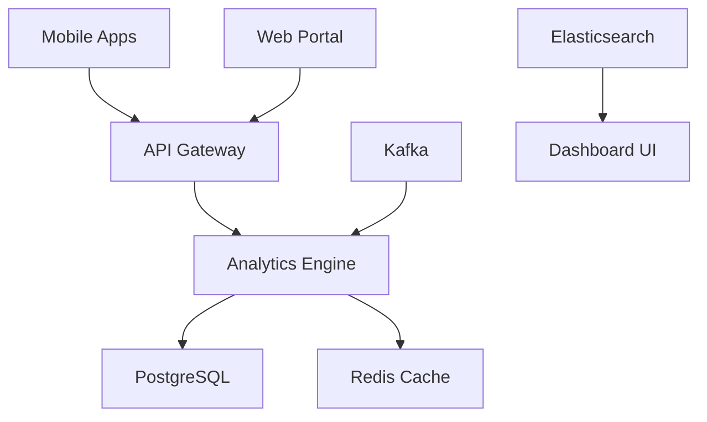

# RiggerDashboard Documentation

## Overview
RiggerDashboard is an analytics and business intelligence platform that provides real-time insights into job matching performance, worker safety metrics, and revenue optimization for B2B SaaS operations.

## Mobile Optimization
- **Progressive Web App (PWA)**: Provides native app-like experience on mobile devices.
- **Offline Capability**: Critical data remains accessible even when offline.
- **Dark/Light Mode Support**: Optimized for both day and night usage patterns.

## Key Features
### Business Intelligence
- **Revenue Tracking**: Real-time monitoring of B2B SaaS subscription revenue.
- **Performance Metrics**: Job matching success rates and automation efficiency.
- **Predictive Analytics**: AI-powered forecasting for business growth.

### Safety & Compliance
- **Worker Safety Metrics**: Comprehensive tracking of safety incidents and compliance.
- **Regulatory Reporting**: Automated generation of required safety and compliance reports.
- **Risk Assessment**: Real-time risk analysis for mining and construction operations.

### Social Impact
- **NGO Revenue Tracking**: Monitor revenue sharing with community organizations.
- **Community Impact Metrics**: Track positive outcomes in local communities.

## Tech Stack
- **Frontend**: Vue.js, Vuex, Chart.js, D3.js
- **Backend**: Python, FastAPI, Celery
- **Database**: PostgreSQL, Redis
- **Analytics**: Apache Kafka, Elasticsearch

## Screenshots
- 
- 
- 

## Interactive Demo
- **Live Demo**: [View Live Dashboard](https://demo.riggerdashboard.com)
- **Demo Video**: [Watch Demo](./demo/dashboard-walkthrough.mp4)

## Architecture Diagram

## API Integration
- **Supabase Backend**: Real-time database synchronization.
- **Stripe Integration**: Payment processing and subscription management.
- **Third-party APIs**: Integration with mining industry compliance systems.

## Mobile-First Design
- **Touch Gestures**: Swipe navigation for chart exploration.
- **Responsive Charts**: Automatically adjust to screen size and orientation.
- **Optimized Performance**: Lazy loading and efficient data visualization.
