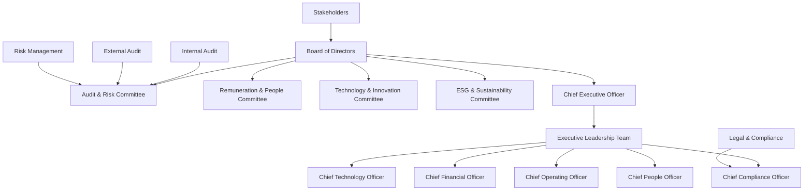

# Corporate Governance Framework
## RiggerHireApp Enterprise Platform - Western Australia

---

**Document Classification:** Enterprise Governance  
**Version:** 1.0  
**Effective Date:** January 2025  
**Review Date:** January 2026  
**Owner:** Chief Executive Officer  
**Approved By:** Board of Directors

---

## Table of Contents

1. [Executive Summary](#executive-summary)
2. [Governance Philosophy](#governance-philosophy)
3. [Board Structure and Composition](#board-structure-and-composition)
4. [Executive Management](#executive-management)
5. [Risk Management and Internal Controls](#risk-management-and-internal-controls)
6. [Ethical Business Conduct](#ethical-business-conduct)
7. [Stakeholder Engagement](#stakeholder-engagement)
8. [Financial Management](#financial-management)
9. [Regulatory Compliance](#regulatory-compliance)
10. [Performance Management](#performance-management)
11. [Transparency and Reporting](#transparency-and-reporting)
12. [Continuous Improvement](#continuous-improvement)

---

## Executive Summary

The RiggerHireApp Corporate Governance Framework establishes the foundation for responsible, transparent, and sustainable business operations in Western Australia's construction and mining industries. This framework aligns with ASX Corporate Governance Principles and Recommendations (4th Edition), Corporations Act 2001 (Cth), and Australian best practice standards for private enterprise governance.

Our governance approach emphasizes stakeholder value creation, risk management, ethical decision-making, and sustainable business practices while maintaining the operational agility necessary for technology-driven innovation in the construction workforce sector.

---

## Governance Philosophy

### 2.1 Core Governance Principles

**Principle 1: Lay Solid Foundations for Management and Oversight**
- Clear delineation of roles, responsibilities, and accountabilities
- Comprehensive board charter and committee structures
- Robust policy framework with regular review cycles

**Principle 2: Structure the Board to be Effective and Add Value**
- Diverse board composition with relevant industry expertise
- Independent directors ensuring objective oversight
- Regular board effectiveness reviews and development programs

**Principle 3: Instill a Culture of Acting Lawfully, Ethically and Responsibly**
- Strong ethical foundation embedded in organizational culture
- Comprehensive code of conduct and compliance framework
- Zero-tolerance approach to unethical behavior

**Principle 4: Safeguard the Integrity of Corporate Reports**
- Robust financial reporting and internal control systems
- Independent audit functions with direct board reporting
- Transparent disclosure of material information

**Principle 5: Make Timely and Balanced Disclosure**
- Proactive stakeholder communication and engagement
- Timely disclosure of material developments and risks
- Balanced presentation of opportunities and challenges

**Principle 6: Respect the Rights of Security Holders and Stakeholders**
- Equitable treatment of all stakeholder groups
- Clear communication channels and engagement mechanisms
- Protection of stakeholder interests and rights

**Principle 7: Recognize and Manage Risk**
- Comprehensive enterprise risk management framework
- Board-level risk oversight and monitoring
- Integration of risk considerations in strategic decision-making

**Principle 8: Remunerate Fairly and Responsibly**
- Performance-based remuneration aligned with stakeholder interests
- Transparent remuneration policies and disclosure
- Regular benchmarking against industry standards

### 2.2 Governance Operating Model



---

## Board Structure and Composition

### 3.1 Board Composition Framework

#### Optimal Board Size and Structure
- **Board Size:** 5-7 directors (optimal for effective decision-making)
- **Independence:** Majority independent directors (minimum 51%)
- **Diversity:** Gender, age, ethnicity, skills, and experience diversity
- **Tenure:** Balanced mix of tenure to ensure continuity and fresh perspectives

#### Director Competency Matrix

| Core Competency | Required Directors | Current Coverage | Gap Analysis |
|-----------------|------------------|------------------|--------------|
| **Construction Industry Experience** | 2 directors | ✓ Covered | None |
| **Technology & Digital Transformation** | 2 directors | ✓ Covered | None |
| **Financial Management & Accounting** | 1 director | ✓ Covered | None |
| **Legal & Regulatory Compliance** | 1 director | ✓ Covered | None |
| **Human Resources & Safety** | 1 director | ✓ Covered | None |
| **Marketing & Customer Experience** | 1 director | To be filled | Recruit 2025 |
| **ESG & Sustainability** | 1 director | To be filled | Recruit 2025 |

### 3.2 Board Charter and Responsibilities

#### Primary Board Responsibilities

```typescript
interface BoardResponsibilities {
  strategic: {
    strategyDevelopment: 'Approve and monitor strategic direction';
    performanceOversight: 'Monitor organizational performance against strategy';
    majorInvestments: 'Approve significant capital allocation decisions';
    mergerAcquisition: 'Oversee M&A activities and partnerships';
  };
  governance: {
    policyFramework: 'Establish governance policies and frameworks';
    riskOversight: 'Oversee enterprise risk management';
    complianceMonitoring: 'Monitor regulatory and legal compliance';
    ethicalStandards: 'Set and monitor ethical standards';
  };
  management: {
    ceoSelection: 'Recruit, evaluate, and remunerate CEO';
    successionPlanning: 'Oversee executive succession planning';
    organizationalCulture: 'Monitor and shape organizational culture';
    performanceManagement: 'Set executive performance expectations';
  };
  stakeholder: {
    shareholderInterests: 'Protect and advance shareholder interests';
    stakeholderEngagement: 'Oversee stakeholder communication';
    corporateReputation: 'Protect and enhance corporate reputation';
    socialResponsibility: 'Ensure responsible business practices';
  };
}
```

### 3.3 Board Committees

#### Audit & Risk Committee

**Charter and Responsibilities:**
- **Financial Reporting:** Oversee integrity of financial statements and reporting
- **Internal Controls:** Monitor effectiveness of internal control systems
- **Risk Management:** Oversee enterprise risk management framework
- **Audit Oversight:** Manage relationships with internal and external auditors
- **Compliance Monitoring:** Monitor compliance with legal and regulatory requirements

**Composition:**
- **Size:** 3-4 independent directors
- **Chair:** Independent director with financial expertise
- **Expertise:** Financial, risk management, and industry experience

**Meeting Frequency:** Quarterly (minimum) with additional meetings as required

#### Remuneration & People Committee

**Charter and Responsibilities:**
- **Executive Remuneration:** Design and monitor executive remuneration policies
- **Performance Management:** Oversee executive performance management systems
- **Succession Planning:** Develop and monitor succession plans for key positions
- **People Strategy:** Oversee people strategy and organizational development
- **Culture Monitoring:** Monitor organizational culture and employee engagement

#### Technology & Innovation Committee

**Charter and Responsibilities:**
- **Technology Strategy:** Oversee technology strategy and digital transformation
- **Innovation Pipeline:** Monitor innovation initiatives and R&D investments
- **Cybersecurity Oversight:** Oversee cybersecurity risk and controls
- **Data Governance:** Monitor data governance and privacy practices
- **Technology Risk:** Assess technology-related risks and opportunities

#### ESG & Sustainability Committee

**Charter and Responsibilities:**
- **ESG Strategy:** Develop and monitor ESG strategy and performance
- **Sustainability Initiatives:** Oversee sustainability programs and initiatives
- **Social Impact:** Monitor social impact programs and community engagement
- **Environmental Impact:** Oversee environmental impact management
- **Stakeholder Engagement:** Manage stakeholder engagement on ESG matters

---

## Executive Management

### 4.1 Executive Leadership Structure

#### Chief Executive Officer (CEO)

**Primary Responsibilities:**
- Strategic leadership and organizational direction
- Stakeholder relationship management
- Organizational culture and values
- Business performance and results delivery
- Risk management and compliance oversight

**Performance Framework:**
```typescript
interface CEOPerformanceFramework {
  financial: {
    revenueGrowth: 'Annual revenue growth targets';
    profitabilityMargins: 'Gross and net margin improvement';
    cashFlowManagement: 'Operating cash flow generation';
    returnOnInvestment: 'ROI on strategic investments';
  };
  operational: {
    customerSatisfaction: 'Customer satisfaction and retention metrics';
    marketShare: 'Market position and competitive advantage';
    operationalEfficiency: 'Operational KPIs and cost management';
    safetyPerformance: 'Workplace safety and compliance metrics';
  };
  strategic: {
    strategyExecution: 'Progress against strategic milestones';
    innovationMetrics: 'Innovation pipeline and digital transformation';
    stakeholderEngagement: 'Stakeholder satisfaction and engagement';
    talentDevelopment: 'Leadership development and succession planning';
  };
  governance: {
    riskManagement: 'Risk management effectiveness and compliance';
    ethicalLeadership: 'Ethical behavior and organizational culture';
    boardRelationship: 'Board relationship and governance effectiveness';
    regulatoryCompliance: 'Regulatory compliance and stakeholder relations';
  };
}
```

#### Executive Leadership Team Structure

```mermaid
graph TD
    A[Chief Executive Officer] --> B[Chief Technology Officer]
    A --> C[Chief Financial Officer]
    A --> D[Chief Operating Officer]
    A --> E[Chief People Officer]
    A --> F[Chief Compliance Officer]
    A --> G[Chief Marketing Officer]
    
    B --> H[VP Engineering]
    B --> I[VP Product Management]
    B --> J[VP Information Security]
    
    C --> K[VP Finance]
    C --> L[VP Investor Relations]
    C --> M[VP Business Development]
    
    D --> N[VP Operations]
    D --> O[VP Customer Success]
    D --> P[VP Quality Assurance]
    
    E --> Q[VP Talent Acquisition]
    E --> R[VP Learning & Development]
    E --> S[VP People Analytics]
    
    F --> T[VP Legal Affairs]
    F --> U[VP Risk Management]
    F --> V[VP Regulatory Compliance]
```



### 4.2 Executive Performance Management

#### Performance Management Framework

**Quarterly Business Reviews (QBRs):**
- Financial performance against budget and forecasts
- Operational metrics and KPI achievement
- Strategic initiative progress and milestones
- Risk assessment and mitigation progress
- Stakeholder feedback and engagement metrics

**Annual Performance Assessment:**
- Comprehensive 360-degree feedback process
- Board assessment of executive performance
- Stakeholder input and evaluation
- Goal setting for subsequent year
- Development planning and succession considerations

---

## Risk Management and Internal Controls

### 5.1 Enterprise Risk Management Framework

#### Risk Governance Structure

```python
class EnterpriseRiskGovernance:
    def __init__(self):
        self.board_oversight = BoardRiskOversight()
        self.risk_committee = AuditRiskCommittee()
        self.executive_risk_management = ExecutiveRiskManagement()
        self.operational_risk_management = OperationalRiskManagement()
        
    async def execute_risk_governance_cycle(self) -> RiskGovernanceReport:
        """Execute comprehensive enterprise risk governance cycle"""
        
        # Board-level risk oversight
        board_risk_review = await self.board_oversight.conduct_risk_review(
            review_scope=['STRATEGIC', 'OPERATIONAL', 'FINANCIAL', 'REGULATORY'],
            review_frequency='QUARTERLY',
            risk_appetite_assessment=True
        )
        
        # Risk committee deep dive
        committee_assessment = await self.risk_committee.assess_risk_framework(
            framework_effectiveness=True,
            control_testing_results=await self.get_control_testing_results(),
            regulatory_compliance_status=await self.get_compliance_status()
        )
        
        # Executive risk management
        executive_risk_actions = await self.executive_risk_management.manage_enterprise_risks(
            risk_register=await self.get_current_risk_register(),
            mitigation_strategies=await self.get_active_mitigations(),
            emerging_risks=await self.identify_emerging_risks()
        )
        
        # Operational risk management
        operational_controls = await self.operational_risk_management.assess_operational_controls(
            business_processes=await self.get_business_processes(),
            control_effectiveness=True,
            continuous_monitoring=True
        )
        
        return RiskGovernanceReport(
            governance_cycle_date=datetime.utcnow(),
            board_oversight=board_risk_review,
            committee_assessment=committee_assessment,
            executive_actions=executive_risk_actions,
            operational_controls=operational_controls,
            overall_risk_posture=await self.assess_overall_risk_posture(),
            recommendations=await self.generate_risk_recommendations(),
            next_review_date=datetime.utcnow() + timedelta(days=90)
        )
```

### 5.2 Internal Control Systems

#### Three Lines of Defense Model

**First Line of Defense: Operational Management**
- **Responsibility:** Own and manage risks as part of daily operations
- **Activities:** Risk identification, assessment, and day-to-day control execution
- **Reporting:** Regular risk reporting to second line and senior management
- **Accountability:** Direct accountability for risk management effectiveness

**Second Line of Defense: Risk Management and Compliance**
- **Responsibility:** Oversee risk management and compliance activities
- **Activities:** Policy development, risk framework design, compliance monitoring
- **Reporting:** Independent reporting to executive management and board
- **Accountability:** Challenge and support first line risk management

**Third Line of Defense: Internal Audit**
- **Responsibility:** Independent assurance on governance, risk, and control
- **Activities:** Audit planning, execution, and reporting on control effectiveness
- **Reporting:** Direct reporting to Audit & Risk Committee
- **Accountability:** Independent verification of risk management effectiveness

#### Control Framework Implementation

```typescript
interface ControlFramework {
  preventiveControls: {
    authorization: 'Approval workflows and delegation authorities';
    segregationOfDuties: 'Separation of incompatible functions';
    physicalSafeguards: 'Physical security and access controls';
    systemControls: 'IT controls and access management';
  };
  detectiveControls: {
    monitoring: 'Continuous monitoring and exception reporting';
    reconciliations: 'Financial and operational reconciliations';
    analytics: 'Data analytics and anomaly detection';
    reporting: 'Management reporting and dashboard monitoring';
  };
  correctiveControls: {
    incidentResponse: 'Incident management and resolution processes';
    errorCorrection: 'Error identification and correction procedures';
    processImprovement: 'Continuous improvement based on control deficiencies';
    rootCauseAnalysis: 'Analysis and remediation of control failures';
  };
}
```

---

## Ethical Business Conduct

### 6.1 Code of Ethics and Business Conduct

#### Ethical Foundation Framework

**Core Ethical Principles:**
1. **Integrity:** Honest, transparent, and ethical behavior in all business dealings
2. **Respect:** Dignity, fairness, and respect for all individuals and stakeholders
3. **Accountability:** Personal and organizational accountability for actions and decisions
4. **Excellence:** Commitment to quality, innovation, and continuous improvement
5. **Responsibility:** Social and environmental responsibility in business operations

#### Code of Conduct Implementation

```python
class EthicsAndConductManagement:
    def __init__(self):
        self.ethics_training = EthicsTrainingPlatform()
        self.conduct_monitoring = ConductMonitoringSystem()
        self.reporting_system = EthicsReportingSystem()
        self.investigation_service = EthicsInvestigationService()
        
    async def manage_ethics_and_conduct_program(self) -> EthicsProgramReport:
        """Comprehensive ethics and conduct program management"""
        
        # Deliver ethics training
        training_results = await self.ethics_training.deliver_comprehensive_training(
            target_audience='ALL_EMPLOYEES',
            training_modules=[
                'CODE_OF_CONDUCT',
                'ANTI_CORRUPTION',
                'CONFLICT_OF_INTEREST',
                'WORKPLACE_HARASSMENT',
                'DATA_PRIVACY',
                'SAFETY_ETHICS'
            ],
            delivery_methods=['ONLINE', 'INSTRUCTOR_LED', 'SCENARIO_BASED'],
            completion_tracking=True
        )
        
        # Monitor conduct and culture
        conduct_monitoring = await self.conduct_monitoring.monitor_organizational_conduct(
            monitoring_methods=['EMPLOYEE_SURVEYS', 'EXIT_INTERVIEWS', 'BEHAVIORAL_ANALYTICS'],
            culture_indicators=['TRUST', 'PSYCHOLOGICAL_SAFETY', 'ETHICAL_CLIMATE'],
            reporting_frequency='MONTHLY'
        )
        
        # Manage ethics reporting
        reporting_system_results = await self.reporting_system.manage_ethics_reporting(
            reporting_channels=['HOTLINE', 'ONLINE_PORTAL', 'MANAGER_REPORTING'],
            anonymity_protection=True,
            investigation_tracking=True,
            resolution_monitoring=True
        )
        
        # Conduct investigations
        investigation_results = await self.investigation_service.conduct_ethics_investigations(
            reported_concerns=reporting_system_results.reported_concerns,
            investigation_protocols=['FAIR_PROCESS', 'CONFIDENTIALITY', 'TIMELY_RESOLUTION'],
            corrective_actions=['TRAINING', 'DISCIPLINE', 'PROCESS_IMPROVEMENT'],
            prevention_measures=True
        )
        
        return EthicsProgramReport(
            program_period=timedelta(days=365),
            training_completion_rate=training_results.completion_rate,
            conduct_monitoring_results=conduct_monitoring,
            ethics_reporting_summary=reporting_system_results.summary,
            investigation_outcomes=investigation_results.outcomes,
            culture_health_indicators=conduct_monitoring.culture_metrics,
            program_effectiveness_score=await self.calculate_program_effectiveness(),
            improvement_recommendations=await self.generate_improvement_recommendations()
        )
```

### 6.2 Whistleblower Protection Program

#### Comprehensive Whistleblower Framework

**Protection Mechanisms:**
- **Anonymity Options:** Anonymous reporting channels and identity protection
- **Retaliation Prevention:** Strict anti-retaliation policies and monitoring
- **Investigation Independence:** Independent investigation processes and oversight
- **Legal Protection:** Alignment with Corporations Act whistleblower provisions

**Reporting Channels:**
- **24/7 Hotline:** Independent third-party managed ethics hotline
- **Online Portal:** Secure, encrypted online reporting system
- **Direct Reporting:** Access to senior management and board members
- **External Reporting:** Regulatory reporting channels and external agencies

---

## Stakeholder Engagement

### 7.1 Stakeholder Mapping and Engagement Strategy

#### Comprehensive Stakeholder Framework

```typescript
interface StakeholderEngagementFramework {
  primaryStakeholders: {
    shareholders: {
      engagementMethods: ['AGM', 'QUARTERLY_REPORTS', 'INVESTOR_BRIEFINGS'];
      communicationFrequency: 'QUARTERLY';
      keyInterests: ['FINANCIAL_PERFORMANCE', 'STRATEGIC_DIRECTION', 'RISK_MANAGEMENT'];
      engagementMetrics: ['SATISFACTION_SURVEYS', 'PARTICIPATION_RATES'];
    };
    employees: {
      engagementMethods: ['TOWN_HALLS', 'EMPLOYEE_SURVEYS', 'TEAM_MEETINGS'];
      communicationFrequency: 'MONTHLY';
      keyInterests: ['CAREER_DEVELOPMENT', 'WORK_ENVIRONMENT', 'COMPENSATION'];
      engagementMetrics: ['ENGAGEMENT_SCORES', 'RETENTION_RATES'];
    };
    customers: {
      engagementMethods: ['USER_FEEDBACK', 'CUSTOMER_ADVISORY', 'SUPPORT_CHANNELS'];
      communicationFrequency: 'CONTINUOUS';
      keyInterests: ['SERVICE_QUALITY', 'INNOVATION', 'VALUE_DELIVERY'];
      engagementMetrics: ['SATISFACTION_SCORES', 'NET_PROMOTER_SCORE'];
    };
  };
  secondaryStakeholders: {
    suppliers: {
      engagementMethods: ['VENDOR_SUMMITS', 'PERFORMANCE_REVIEWS', 'PARTNERSHIP_AGREEMENTS'];
      communicationFrequency: 'QUARTERLY';
      keyInterests: ['PAYMENT_TERMS', 'LONG_TERM_PARTNERSHIPS', 'CAPABILITY_DEVELOPMENT'];
    };
    regulators: {
      engagementMethods: ['COMPLIANCE_REPORTING', 'REGULATORY_MEETINGS', 'INDUSTRY_FORUMS'];
      communicationFrequency: 'AS_REQUIRED';
      keyInterests: ['REGULATORY_COMPLIANCE', 'INDUSTRY_STANDARDS', 'SAFETY_PERFORMANCE'];
    };
    communities: {
      engagementMethods: ['COMMUNITY_PROGRAMS', 'LOCAL_PARTNERSHIPS', 'SOCIAL_IMPACT_INITIATIVES'];
      communicationFrequency: 'ONGOING';
      keyInterests: ['LOCAL_EMPLOYMENT', 'COMMUNITY_INVESTMENT', 'ENVIRONMENTAL_IMPACT'];
    };
  };
}
```

### 7.2 Stakeholder Communication and Feedback

#### Multi-Channel Communication Strategy

**Communication Channels:**
- **Digital Platforms:** Website, social media, mobile applications
- **Direct Engagement:** Meetings, conferences, forums, and events
- **Formal Reporting:** Annual reports, sustainability reports, compliance filings
- **Real-time Updates:** Email newsletters, push notifications, RSS feeds

**Feedback Mechanisms:**
- **Regular Surveys:** Annual stakeholder satisfaction and engagement surveys
- **Advisory Groups:** Stakeholder advisory committees and focus groups
- **Open Forums:** Public consultation processes and community meetings
- **Digital Feedback:** Online feedback forms, review platforms, social media

---

## Financial Management

### 8.1 Financial Governance Framework

#### Financial Management Structure

```python
class FinancialGovernanceFramework:
    def __init__(self):
        self.budget_management = BudgetManagementSystem()
        self.performance_monitoring = FinancialPerformanceMonitoring()
        self.risk_management = FinancialRiskManagement()
        self.reporting_system = FinancialReportingSystem()
        
    async def execute_financial_governance_cycle(self) -> FinancialGovernanceReport:
        """Execute comprehensive financial governance cycle"""
        
        # Budget planning and monitoring
        budget_performance = await self.budget_management.monitor_budget_performance(
            monitoring_frequency='MONTHLY',
            variance_analysis=True,
            forecast_updates=True,
            corrective_action_planning=True
        )
        
        # Financial performance analysis
        performance_analysis = await self.performance_monitoring.analyze_financial_performance(
            performance_metrics=['REVENUE', 'GROSS_MARGIN', 'OPERATING_MARGIN', 'CASH_FLOW'],
            benchmarking=['INDUSTRY', 'HISTORICAL', 'BUDGET'],
            trend_analysis=True,
            ratio_analysis=True
        )
        
        # Financial risk assessment
        financial_risk_assessment = await self.risk_management.assess_financial_risks(
            risk_categories=['CREDIT', 'LIQUIDITY', 'MARKET', 'OPERATIONAL'],
            stress_testing=True,
            scenario_analysis=True,
            mitigation_strategies=True
        )
        
        # Financial reporting and disclosure
        reporting_compliance = await self.reporting_system.ensure_reporting_compliance(
            reporting_standards=['AASB', 'CORPORATIONS_ACT', 'TAXATION'],
            internal_reporting=['MANAGEMENT', 'BOARD', 'COMMITTEES'],
            external_reporting=['REGULATORS', 'STAKEHOLDERS', 'PUBLIC'],
            audit_coordination=True
        )
        
        return FinancialGovernanceReport(
            reporting_period=budget_performance.period,
            budget_performance=budget_performance,
            financial_performance=performance_analysis,
            risk_assessment=financial_risk_assessment,
            reporting_compliance=reporting_compliance,
            key_financial_indicators=await self.calculate_key_indicators(),
            board_recommendations=await self.generate_board_recommendations(),
            next_review_date=datetime.utcnow() + timedelta(days=30)
        )
```

### 8.2 Capital Allocation and Investment Governance

#### Investment Decision Framework

**Capital Allocation Principles:**
1. **Strategic Alignment:** Investments must align with strategic objectives and value creation
2. **Risk-Adjusted Returns:** Evaluate investments based on risk-adjusted return metrics
3. **Stakeholder Value:** Prioritize investments that create long-term stakeholder value
4. **Resource Optimization:** Optimize allocation of financial, human, and technological resources
5. **Performance Monitoring:** Continuous monitoring and evaluation of investment performance

**Investment Approval Hierarchy:**

| Investment Value | Approval Authority | Required Analysis | Board Involvement |
|-----------------|-------------------|------------------|------------------|
| **< $100,000** | Department Manager | Business case, ROI analysis | None |
| **$100,000 - $500,000** | Executive Team | Detailed business case, risk assessment | Information only |
| **$500,000 - $2,000,000** | CEO + CFO | Comprehensive analysis, board paper | Board notification |
| **> $2,000,000** | Board of Directors | Full due diligence, external advice | Board approval required |

---

## Regulatory Compliance

### 9.1 Compliance Management System

#### Integrated Compliance Framework

```python
class ComplianceManagementSystem:
    def __init__(self):
        self.regulation_tracker = RegulationTracker()
        self.compliance_monitor = ComplianceMonitor()
        self.risk_assessor = ComplianceRiskAssessor()
        self.training_manager = ComplianceTrainingManager()
        
    async def manage_regulatory_compliance(self) -> ComplianceManagementReport:
        """Comprehensive regulatory compliance management"""
        
        # Track regulatory changes
        regulatory_updates = await self.regulation_tracker.track_regulatory_changes(
            jurisdictions=['FEDERAL', 'WA_STATE', 'LOCAL'],
            regulatory_domains=[
                'CORPORATIONS_LAW',
                'WORKPLACE_SAFETY',
                'PRIVACY_DATA_PROTECTION',
                'EMPLOYMENT_LAW',
                'CONSUMER_PROTECTION',
                'ANTI_MONEY_LAUNDERING'
            ],
            impact_assessment=True
        )
        
        # Monitor compliance status
        compliance_status = await self.compliance_monitor.monitor_compliance_status(
            compliance_areas=regulatory_updates.applicable_regulations,
            monitoring_frequency='CONTINUOUS',
            automated_checking=True,
            exception_reporting=True
        )
        
        # Assess compliance risks
        compliance_risk_assessment = await self.risk_assessor.assess_compliance_risks(
            compliance_gaps=compliance_status.identified_gaps,
            regulatory_changes=regulatory_updates.significant_changes,
            business_impact_analysis=True,
            mitigation_planning=True
        )
        
        # Manage compliance training
        training_effectiveness = await self.training_manager.manage_compliance_training(
            training_requirements=compliance_risk_assessment.training_needs,
            target_audiences=['ALL_EMPLOYEES', 'MANAGEMENT', 'SPECIALISTS'],
            delivery_methods=['ONLINE', 'WORKSHOP', 'CERTIFICATION'],
            effectiveness_measurement=True
        )
        
        return ComplianceManagementReport(
            reporting_period=timedelta(days=30),
            regulatory_updates=regulatory_updates,
            compliance_status=compliance_status,
            risk_assessment=compliance_risk_assessment,
            training_effectiveness=training_effectiveness,
            overall_compliance_score=await self.calculate_compliance_score(),
            action_plan=await self.generate_compliance_action_plan(),
            next_assessment_date=datetime.utcnow() + timedelta(days=30)
        )
```

### 9.2 Regulatory Relationship Management

#### Proactive Regulatory Engagement

**Regulatory Engagement Strategy:**
- **Proactive Communication:** Regular engagement with key regulators and industry bodies
- **Industry Participation:** Active participation in industry associations and standards development
- **Policy Advocacy:** Constructive engagement in policy development and consultation processes
- **Compliance Excellence:** Demonstrate best practice compliance and industry leadership

**Key Regulatory Relationships:**

| Regulator | Engagement Level | Contact Frequency | Key Topics |
|-----------|-----------------|------------------|------------|
| **ASIC** | High | Quarterly | Corporate governance, financial reporting |
| **ACCC** | Medium | Bi-annual | Competition law, consumer protection |
| **OAIC** | High | Quarterly | Privacy compliance, data protection |
| **WorkSafe WA** | Critical | Monthly | Workplace safety, incident reporting |
| **Fair Work Ombudsman** | Medium | As required | Employment law, workplace relations |

---

## Performance Management

### 10.1 Organizational Performance Framework

#### Balanced Scorecard Approach

```typescript
interface OrganizationalPerformanceFramework {
  financial: {
    revenueGrowth: {
      metric: 'Year-over-year revenue growth';
      target: '25% annual growth';
      measurement: 'Monthly financial reports';
    };
    profitabilityMargin: {
      metric: 'Gross and net profit margins';
      target: 'Gross: 40%, Net: 15%';
      measurement: 'Monthly P&L analysis';
    };
    cashFlowManagement: {
      metric: 'Operating cash flow generation';
      target: 'Positive operating cash flow';
      measurement: 'Monthly cash flow statements';
    };
  };
  customer: {
    satisfaction: {
      metric: 'Customer satisfaction score';
      target: '4.5+ out of 5.0';
      measurement: 'Quarterly customer surveys';
    };
    retention: {
      metric: 'Customer retention rate';
      target: '90%+ annual retention';
      measurement: 'Monthly customer analytics';
    };
    acquisition: {
      metric: 'New customer acquisition';
      target: '100+ new customers/month';
      measurement: 'Monthly sales reports';
    };
  };
  operations: {
    platformReliability: {
      metric: 'System uptime and performance';
      target: '99.9% uptime, <200ms response';
      measurement: 'Real-time monitoring';
    };
    safetyPerformance: {
      metric: 'Safety incident rates';
      target: 'Zero serious incidents';
      measurement: 'Monthly safety reports';
    };
    qualityMetrics: {
      metric: 'Service quality indicators';
      target: 'Six Sigma quality levels';
      measurement: 'Continuous quality monitoring';
    };
  };
  innovation: {
    productDevelopment: {
      metric: 'New feature releases';
      target: 'Monthly significant releases';
      measurement: 'Product development tracking';
    };
    technologyAdvancement: {
      metric: 'Technology innovation adoption';
      target: 'Leading edge technology adoption';
      measurement: 'Technology assessment reviews';
    };
    intellectualProperty: {
      metric: 'IP development and protection';
      target: 'Strategic IP portfolio growth';
      measurement: 'IP portfolio reviews';
    };
  };
}
```

### 10.2 Key Performance Indicators (KPIs)

#### Executive Dashboard KPIs

**Financial Performance KPIs:**
- Monthly Recurring Revenue (MRR) growth
- Customer Acquisition Cost (CAC) and Lifetime Value (LTV) ratio
- Gross margins and operating leverage metrics
- Cash burn rate and runway projections
- Revenue per employee and productivity metrics

**Operational Excellence KPIs:**
- Platform availability and performance metrics
- Customer satisfaction and Net Promoter Score (NPS)
- Employee engagement and retention rates
- Safety incident frequency and severity
- Regulatory compliance scores and audit results

**Strategic Progress KPIs:**
- Market share and competitive positioning
- Innovation pipeline and R&D investment ROI
- Partnership development and ecosystem growth
- Brand recognition and reputation metrics
- ESG performance and social impact measures

---

## Transparency and Reporting

### 11.1 Corporate Reporting Framework

#### Integrated Reporting Approach

```python
class CorporateReportingFramework:
    def __init__(self):
        self.financial_reporting = FinancialReportingSystem()
        self.sustainability_reporting = SustainabilityReportingSystem()
        self.governance_reporting = GovernanceReportingSystem()
        self.stakeholder_reporting = StakeholderReportingSystem()
        
    async def generate_integrated_reports(self) -> IntegratedReportingSuite:
        """Generate comprehensive integrated reporting suite"""
        
        # Financial reporting
        financial_reports = await self.financial_reporting.generate_financial_reports(
            reporting_standards=['AASB', 'CORPORATIONS_ACT'],
            report_types=['ANNUAL_REPORT', 'INTERIM_REPORTS', 'QUARTERLY_UPDATES'],
            audit_requirements=True,
            stakeholder_customization=True
        )
        
        # Sustainability reporting
        sustainability_reports = await self.sustainability_reporting.generate_sustainability_reports(
            reporting_frameworks=['GRI', 'SASB', 'TCFD'],
            esg_metrics=['ENVIRONMENTAL', 'SOCIAL', 'GOVERNANCE'],
            impact_measurement=True,
            stakeholder_engagement_summary=True
        )
        
        # Governance reporting
        governance_reports = await self.governance_reporting.generate_governance_reports(
            governance_aspects=['BOARD_COMPOSITION', 'EXECUTIVE_REMUNERATION', 'RISK_MANAGEMENT'],
            compliance_status=['REGULATORY_COMPLIANCE', 'POLICY_ADHERENCE'],
            transparency_metrics=['DISCLOSURE_COMPLETENESS', 'TIMELINESS']
        )
        
        # Stakeholder reporting
        stakeholder_reports = await self.stakeholder_reporting.generate_stakeholder_reports(
            stakeholder_groups=['SHAREHOLDERS', 'EMPLOYEES', 'CUSTOMERS', 'COMMUNITY'],
            customized_content=True,
            engagement_feedback=True,
            performance_against_expectations=True
        )
        
        return IntegratedReportingSuite(
            reporting_period=financial_reports.reporting_period,
            financial_reports=financial_reports,
            sustainability_reports=sustainability_reports,
            governance_reports=governance_reports,
            stakeholder_reports=stakeholder_reports,
            integrated_narrative=await self.create_integrated_narrative(),
            digital_publication=await self.prepare_digital_publication(),
            distribution_plan=await self.create_distribution_plan()
        )
```

### 11.2 Public Disclosure and Communications

#### Proactive Disclosure Framework

**Disclosure Principles:**
1. **Materiality:** Disclose information that could reasonably influence stakeholder decisions
2. **Timeliness:** Provide information in a timely manner to enable informed decision-making
3. **Accuracy:** Ensure all disclosed information is accurate, complete, and not misleading
4. **Balance:** Present both positive and challenging information in a balanced manner
5. **Accessibility:** Make information accessible to all relevant stakeholder groups

**Communication Channels and Frequency:**

| Communication Type | Audience | Frequency | Channel |
|-------------------|----------|-----------|---------|
| **Financial Results** | Investors, Analysts | Quarterly | Earnings calls, Reports |
| **Strategic Updates** | All Stakeholders | Semi-annual | Public presentations |
| **Operational Performance** | Customers, Partners | Monthly | Performance dashboards |
| **Sustainability Progress** | ESG Stakeholders | Annual | Sustainability report |
| **Governance Updates** | Shareholders | Annual | Annual General Meeting |

---

## Continuous Improvement

### 12.1 Governance Effectiveness Review

#### Annual Governance Assessment

**Board Effectiveness Evaluation:**
- Individual director performance and contribution assessment
- Board dynamics, decision-making processes, and meeting effectiveness
- Committee performance and specialized expertise application
- Board composition, diversity, and skills gap analysis
- Stakeholder feedback on board performance and governance quality

**Governance Framework Review:**
- Policy framework effectiveness and currency assessment
- Risk management framework adequacy and performance
- Internal control system effectiveness and efficiency
- Compliance management system performance and coverage
- Stakeholder engagement effectiveness and satisfaction

### 12.2 Governance Innovation and Best Practices

#### Emerging Governance Trends Integration

**Digital Governance Capabilities:**
- Board portal technology for efficient information sharing
- Real-time dashboard reporting for informed decision-making
- Virtual meeting capabilities for flexible board engagement
- Digital voting and decision-making tools
- Cybersecurity governance and digital risk oversight

**ESG Integration:**
- Climate-related financial disclosure implementation
- Social impact measurement and reporting
- Diversity, equity, and inclusion governance integration
- Supply chain responsibility and ethical sourcing oversight
- Stakeholder capitalism principles adoption

---

## Implementation Timeline

### Phase 1: Foundation (Months 1-6)
- [ ] **Board Formation:** Recruit and onboard board members with required expertise
- [ ] **Governance Policies:** Develop and approve core governance policies and procedures
- [ ] **Committee Structure:** Establish board committees with defined charters and responsibilities
- [ ] **Risk Framework:** Implement enterprise risk management framework and systems

### Phase 2: Operationalization (Months 6-12)
- [ ] **Performance Systems:** Deploy performance management and KPI monitoring systems
- [ ] **Compliance Framework:** Implement comprehensive regulatory compliance management
- [ ] **Stakeholder Engagement:** Launch stakeholder engagement programs and communication channels
- [ ] **Reporting Systems:** Develop integrated reporting capabilities and disclosure processes

### Phase 3: Optimization (Months 12-18)
- [ ] **Digital Governance:** Implement digital governance tools and analytics platforms
- [ ] **ESG Integration:** Integrate ESG considerations into governance and decision-making
- [ ] **Continuous Improvement:** Establish continuous governance improvement processes
- [ ] **Industry Leadership:** Position as governance best practice leader in construction technology

---

## Document Control

**Document Information:**
- **Title:** Corporate Governance Framework
- **Document ID:** COMP-GOV-001
- **Version:** 1.0
- **Classification:** Enterprise Governance
- **Owner:** Chief Executive Officer
- **Approved By:** Board of Directors

**Review History:**
| Version | Date | Author | Changes |
|---------|------|--------|---------|
| 1.0 | January 2025 | Governance Team | Initial framework creation |

**Distribution List:**
- Board of Directors
- Executive Leadership Team
- Senior Management
- Legal Counsel
- External Auditors

**Next Review:** January 2026

---

*This document contains confidential and proprietary information. Distribution is restricted to authorized personnel only.*

**© 2025 Tiation Technology Pty Ltd. All rights reserved.**