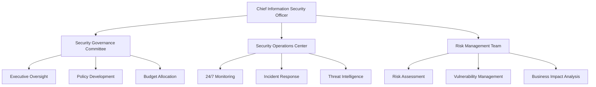

# Enterprise Cybersecurity Framework
## RiggerHireApp Platform - Western Australia

---

**Document Classification:** Enterprise Security  
**Version:** 1.0  
**Effective Date:** January 2025  
**Review Date:** January 2026  
**Owner:** Chief Information Security Officer  
**Approved By:** Executive Management Team

---

## Table of Contents

1. [Executive Summary](#executive-summary)
2. [Regulatory Framework](#regulatory-framework)
3. [Security Governance](#security-governance)
4. [Risk Management Framework](#risk-management-framework)
5. [Identity and Access Management](#identity-and-access-management)
6. [Data Protection and Encryption](#data-protection-and-encryption)
7. [Network Security](#network-security)
8. [Application Security](#application-security)
9. [Cloud Security](#cloud-security)
10. [Incident Response](#incident-response)
11. [Business Continuity](#business-continuity)
12. [Compliance and Monitoring](#compliance-and-monitoring)
13. [Security Awareness](#security-awareness)

---

## Executive Summary

The RiggerHireApp platform operates as a critical digital infrastructure for Western Australia's construction and mining industries, processing sensitive personal, financial, and safety-related information. This enterprise cybersecurity framework aligns with Australian Government Information Security Manual (ISM) requirements, NIST Cybersecurity Framework, and ISO 27001:2022 standards to ensure comprehensive protection against evolving cyber threats.

Our defense-in-depth security architecture provides multiple layers of protection, continuous monitoring, and automated threat response capabilities to maintain the confidentiality, integrity, and availability of platform services and data.

---

## Regulatory Framework

### Primary Standards and Frameworks

#### Australian Government Information Security Manual (ISM)
- **Classification:** OFFICIAL:Sensitive
- **Security Controls:** Essential Eight implementation
- **Maturity Level:** Level 3 (Advanced)
- **Review Frequency:** Annual with continuous updates

#### International Standards
- **ISO 27001:2022:** Information Security Management System
- **ISO 27017:2015:** Cloud Security Controls
- **ISO 27018:2019:** Cloud Privacy Protection
- **NIST Cybersecurity Framework 2.0:** Comprehensive security framework
- **SOC 2 Type II:** Security and availability controls

#### Industry-Specific Requirements
- **ACSC Guidelines:** Critical infrastructure protection
- **AUSTRAC Compliance:** AML/CTF cybersecurity obligations
- **WorkSafe WA:** Digital safety system protection
- **Privacy Act 1988:** Data security obligations

---

## Security Governance

### 3.1 Security Organization Structure



### 3.2 Security Governance Framework

#### Security Committee Structure

**Executive Security Committee:**
- **Chair:** Chief Executive Officer
- **Members:** CISO, CTO, CPO, Legal Counsel, Operations Manager
- **Frequency:** Monthly
- **Responsibilities:** Strategic security decisions, budget approval, risk tolerance setting

**Technical Security Committee:**
- **Chair:** Chief Information Security Officer
- **Members:** Security architects, development leads, infrastructure managers
- **Frequency:** Weekly
- **Responsibilities:** Technical security standards, implementation oversight, threat response

#### Security Policy Hierarchy

```typescript
interface SecurityPolicyFramework {
  tier1: {
    title: 'Enterprise Security Policy';
    scope: 'Organization-wide';
    approval: 'Executive Management';
    reviewCycle: 'Annual';
  };
  tier2: {
    title: 'Domain-Specific Security Standards';
    scope: 'Technology domains';
    approval: 'CISO';
    reviewCycle: 'Bi-annual';
  };
  tier3: {
    title: 'Technical Security Procedures';
    scope: 'Specific technologies/processes';
    approval: 'Security Team';
    reviewCycle: 'Quarterly';
  };
  tier4: {
    title: 'Security Work Instructions';
    scope: 'Individual tasks';
    approval: 'Technical Leads';
    reviewCycle: 'As needed';
  };
}
```

---

## Risk Management Framework

### 4.1 Cybersecurity Risk Assessment

#### Automated Risk Assessment Engine

```python
class CybersecurityRiskAssessment:
    def __init__(self):
        self.threat_intelligence = ThreatIntelligenceService()
        self.vulnerability_scanner = VulnerabilityScanner()
        self.asset_inventory = AssetInventoryService()
        self.risk_calculator = RiskCalculationEngine()
        
    async def conduct_comprehensive_risk_assessment(self) -> RiskAssessmentReport:
        """Automated comprehensive cybersecurity risk assessment"""
        
        # Discover and classify assets
        asset_inventory = await self.asset_inventory.discover_assets()
        classified_assets = await self.classify_assets_by_criticality(asset_inventory)
        
        # Identify threats
        threat_landscape = await self.threat_intelligence.get_current_threats(
            industry='CONSTRUCTION_MINING',
            geographic_focus='AUSTRALIA',
            threat_categories=['APT', 'RANSOMWARE', 'INSIDER_THREAT', 'SUPPLY_CHAIN']
        )
        
        # Assess vulnerabilities
        vulnerability_assessment = await self.vulnerability_scanner.scan_infrastructure(
            scope=classified_assets,
            scan_types=['NETWORK', 'WEB_APPLICATION', 'CONFIGURATION', 'CODE_ANALYSIS']
        )
        
        # Calculate risk scores
        risk_scenarios = await self.generate_risk_scenarios(
            assets=classified_assets,
            threats=threat_landscape,
            vulnerabilities=vulnerability_assessment
        )
        
        risk_scores = await self.risk_calculator.calculate_risk_scores(
            scenarios=risk_scenarios,
            impact_criteria=self.get_business_impact_criteria(),
            likelihood_factors=self.get_likelihood_factors()
        )
        
        # Prioritize risks and recommend controls
        risk_prioritization = await self.prioritize_risks(risk_scores)
        control_recommendations = await self.recommend_security_controls(
            prioritized_risks=risk_prioritization,
            current_controls=await self.assess_current_controls(),
            budget_constraints=await self.get_budget_constraints()
        )
        
        return RiskAssessmentReport(
            assessment_date=datetime.utcnow(),
            asset_inventory=classified_assets,
            threat_landscape=threat_landscape,
            vulnerability_summary=vulnerability_assessment.summary,
            risk_scenarios=risk_scenarios,
            risk_scores=risk_scores,
            prioritized_risks=risk_prioritization,
            control_recommendations=control_recommendations,
            executive_summary=await self.generate_executive_summary(risk_prioritization)
        )
```

### 4.2 Security Controls Framework

#### Essential Eight Implementation

**Maturity Level 3 Implementation:**

| Control | Implementation | Automation Level | Monitoring |
|---------|----------------|------------------|------------|
| **Application Control** | Approved application whitelist + ML behavioral analysis | Fully automated | Real-time + Daily reporting |
| **Patch Applications** | Automated patching within 48 hours of release | 95% automated | Continuous monitoring |
| **Configure Microsoft Office Macro Settings** | Macros disabled + sandboxed execution | Policy-enforced | Configuration monitoring |
| **User Application Hardening** | Browser hardening + plugin control | Automated deployment | Compliance scanning |
| **Restrict Administrative Privileges** | Just-in-time admin access + PAM | Workflow-automated | Access analytics |
| **Patch Operating Systems** | Automated OS patching within 14 days | 90% automated | Patch compliance dashboard |
| **Multi-factor Authentication** | Hardware tokens + biometric authentication | Integrated authentication | Authentication analytics |
| **Regular Backups** | Encrypted, immutable backups + DR testing | Fully automated | Backup integrity monitoring |

---

## Identity and Access Management

### 5.1 Zero Trust Architecture

#### Identity-Centric Security Model

```python
class ZeroTrustAccessManager:
    def __init__(self):
        self.identity_provider = EnterpriseIdentityProvider()
        self.device_manager = DeviceComplianceManager()
        self.context_analyzer = AccessContextAnalyzer()
        self.policy_engine = DynamicPolicyEngine()
        
    async def evaluate_access_request(self, request: AccessRequest) -> AccessDecision:
        """Zero Trust access evaluation"""
        
        # Verify identity with strong authentication
        identity_verification = await self.identity_provider.verify_identity(
            user=request.user,
            authentication_factors=request.auth_factors,
            required_assurance_level='HIGH'
        )
        
        # Assess device compliance
        device_compliance = await self.device_manager.assess_device_compliance(
            device=request.device,
            compliance_policies=await self.get_device_policies(request.user.role),
            real_time_assessment=True
        )
        
        # Analyze access context
        context_analysis = await self.context_analyzer.analyze_context(
            user_location=request.location,
            access_time=request.timestamp,
            requested_resource=request.resource,
            user_behavior_baseline=await self.get_user_baseline(request.user.id)
        )
        
        # Apply dynamic access policies
        access_decision = await self.policy_engine.evaluate_access(
            identity_verification=identity_verification,
            device_compliance=device_compliance,
            context_analysis=context_analysis,
            resource_classification=await self.get_resource_classification(request.resource)
        )
        
        # Log access decision for audit
        await self.log_access_decision(
            request=request,
            decision=access_decision,
            evaluation_factors={
                'identity_score': identity_verification.trust_score,
                'device_score': device_compliance.compliance_score,
                'context_score': context_analysis.risk_score
            }
        )
        
        return access_decision
```

### 5.2 Privileged Access Management

#### Dynamic Privilege Elevation

**Just-in-Time Access Framework:**

```typescript
interface PrivilegeElevationRequest {
  requester: UserIdentity;
  requestedPrivileges: Privilege[];
  businessJustification: string;
  requestedDuration: Duration;
  resourceScope: ResourceScope;
  emergencyFlag: boolean;
  approvalWorkflow: ApprovalWorkflow;
}

interface PrivilegeElevationResponse {
  requestId: string;
  status: 'APPROVED' | 'DENIED' | 'PENDING_APPROVAL';
  grantedPrivileges: Privilege[];
  expiryTime: DateTime;
  sessionId: string;
  monitoringLevel: 'STANDARD' | 'ENHANCED' | 'CONTINUOUS';
  conditions: AccessCondition[];
}
```

**Privileged Session Monitoring:**

- **Screen Recording:** All privileged sessions recorded and analyzed
- **Command Logging:** Complete audit trail of administrative actions
- **Behavioral Analysis:** ML-based anomaly detection for privileged users
- **Real-time Alerting:** Immediate alerts for suspicious privileged activity

---

## Data Protection and Encryption

### 6.1 Comprehensive Encryption Strategy

#### Data-at-Rest Encryption

```python
class DataEncryptionService:
    def __init__(self):
        self.hsm_service = HardwareSecurityModuleService()
        self.key_manager = EnterpriseKeyManager()
        self.classification_engine = DataClassificationEngine()
        
    async def encrypt_data_at_rest(self, data: SensitiveData) -> EncryptedData:
        """Encrypt data at rest with appropriate key management"""
        
        # Classify data sensitivity
        data_classification = await self.classification_engine.classify_data(data)
        
        # Select appropriate encryption algorithm and key strength
        encryption_config = self.select_encryption_config(data_classification)
        
        # Generate or retrieve encryption key
        if data_classification.level in ['CRITICAL', 'CONFIDENTIAL']:
            encryption_key = await self.hsm_service.generate_key(
                key_type=encryption_config.key_type,
                key_length=encryption_config.key_length,
                usage_policy=encryption_config.usage_policy
            )
        else:
            encryption_key = await self.key_manager.get_key(
                key_id=encryption_config.key_id,
                key_rotation_policy=encryption_config.rotation_policy
            )
        
        # Encrypt data with authenticated encryption
        encrypted_data = await self.perform_authenticated_encryption(
            plaintext=data.content,
            key=encryption_key,
            algorithm=encryption_config.algorithm,
            additional_authenticated_data=data.metadata
        )
        
        # Store encryption metadata
        await self.store_encryption_metadata(
            data_id=data.data_id,
            key_id=encryption_key.key_id,
            algorithm=encryption_config.algorithm,
            classification=data_classification,
            encryption_timestamp=datetime.utcnow()
        )
        
        return EncryptedData(
            data_id=data.data_id,
            encrypted_content=encrypted_data.ciphertext,
            authentication_tag=encrypted_data.auth_tag,
            key_reference=encryption_key.reference,
            encryption_metadata=encrypted_data.metadata
        )
```

#### Encryption Standards Matrix

| Data Classification | Algorithm | Key Length | Key Management | Rotation |
|--------------------|-----------|------------|----------------|----------|
| **Critical** | AES-256-GCM | 256 bits | HSM-managed | 90 days |
| **Confidential** | AES-256-GCM | 256 bits | HSM-managed | 180 days |
| **Internal** | AES-256-GCM | 256 bits | Software-managed | 1 year |
| **Public** | N/A | N/A | N/A | N/A |

### 6.2 Transport Layer Security

#### TLS Configuration Standards

**Minimum TLS Requirements:**
- **Protocol Version:** TLS 1.3 (preferred), TLS 1.2 (minimum)
- **Cipher Suites:** AEAD ciphers only (AES-GCM, ChaCha20-Poly1305)
- **Key Exchange:** ECDHE with P-384, DHE with 3072-bit groups
- **Certificate Validation:** Full chain validation with OCSP stapling
- **Perfect Forward Secrecy:** Required for all connections

---

## Network Security

### 7.1 Network Segmentation Architecture

#### Micro-Segmentation Implementation

```python
class NetworkMicroSegmentation:
    def __init__(self):
        self.network_mapper = NetworkTopologyMapper()
        self.traffic_analyzer = NetworkTrafficAnalyzer()
        self.policy_engine = NetworkPolicyEngine()
        self.firewall_manager = DistributedFirewallManager()
        
    async def implement_micro_segmentation(self) -> SegmentationPlan:
        """Implement zero-trust network micro-segmentation"""
        
        # Map current network topology
        network_topology = await self.network_mapper.map_network_topology()
        
        # Analyze traffic patterns
        traffic_patterns = await self.traffic_analyzer.analyze_traffic_patterns(
            timeframe=timedelta(days=30),
            include_applications=True,
            include_user_behavior=True
        )
        
        # Design micro-segments based on data flows
        segmentation_design = await self.design_micro_segments(
            topology=network_topology,
            traffic_patterns=traffic_patterns,
            security_zones=[
                'DMZ',
                'WEB_TIER',
                'APPLICATION_TIER',
                'DATABASE_TIER',
                'MANAGEMENT_TIER',
                'USER_TIER'
            ]
        )
        
        # Generate segment policies
        segment_policies = await self.policy_engine.generate_segment_policies(
            segmentation_design=segmentation_design,
            default_policy='DENY_ALL',
            application_requirements=await self.get_application_requirements()
        )
        
        # Deploy firewall rules
        deployment_result = await self.firewall_manager.deploy_segmentation_rules(
            policies=segment_policies,
            deployment_strategy='GRADUAL_ROLLOUT',
            rollback_plan=True
        )
        
        return SegmentationPlan(
            design=segmentation_design,
            policies=segment_policies,
            deployment_status=deployment_result,
            monitoring_plan=await self.generate_monitoring_plan(segmentation_design)
        )
```

### 7.2 DDoS Protection and WAF

#### Advanced Threat Protection

**DDoS Mitigation Strategy:**
- **Layer 3/4 Protection:** Volumetric and protocol attack mitigation
- **Layer 7 Protection:** Application-layer DDoS protection
- **Behavioral Analysis:** ML-based attack pattern detection
- **Geographic Filtering:** Region-based traffic filtering
- **Rate Limiting:** Dynamic rate limiting based on user behavior

**Web Application Firewall (WAF) Rules:**

```yaml
waf_configuration:
  owasp_core_rules:
    version: "4.0"
    paranoia_level: 2
    anomaly_threshold: 5
    
  custom_rules:
    - name: "Construction Industry Specific"
      rules:
        - block_malicious_file_uploads
        - protect_safety_data_endpoints
        - prevent_certification_tampering
        
  rate_limiting:
    api_endpoints:
      - path: "/api/v1/jobs"
        rate: "100 req/min"
        burst: 20
      - path: "/api/v1/auth"
        rate: "10 req/min"
        burst: 3
        
  geo_blocking:
    allowed_countries: ["AU", "NZ"]
    blocked_countries: ["CN", "RU", "KP"]
```

---

## Application Security

### 8.1 Secure Development Lifecycle

#### DevSecOps Integration

```python
class SecureDevOpsOrchestrator:
    def __init__(self):
        self.sast_scanner = StaticAnalysisScanner()
        self.dast_scanner = DynamicAnalysisScanner()
        self.dependency_checker = DependencyVulnerabilityChecker()
        self.container_scanner = ContainerSecurityScanner()
        
    async def execute_security_pipeline(self, 
                                      code_commit: CodeCommit) -> SecurityPipelineResult:
        """Execute comprehensive security testing pipeline"""
        
        # Static Application Security Testing (SAST)
        sast_results = await self.sast_scanner.scan_source_code(
            repository=code_commit.repository,
            commit_hash=code_commit.hash,
            languages=code_commit.detected_languages,
            scan_rules=['OWASP_TOP10', 'CWE_TOP25', 'CUSTOM_RULES']
        )
        
        # Dependency vulnerability scanning
        dependency_results = await self.dependency_checker.check_dependencies(
            dependency_files=code_commit.dependency_files,
            vulnerability_databases=['NVD', 'SNYK', 'GITHUB_ADVISORIES'],
            severity_threshold='MEDIUM'
        )
        
        # Container security scanning (if applicable)
        container_results = None
        if code_commit.contains_docker_files:
            container_results = await self.container_scanner.scan_container_images(
                docker_files=code_commit.docker_files,
                base_image_policies=self.get_base_image_policies(),
                scan_layers=True
            )
        
        # Build security-hardened artifacts
        if self.all_scans_passed([sast_results, dependency_results, container_results]):
            build_result = await self.build_secure_artifacts(
                code_commit=code_commit,
                security_annotations=self.generate_security_annotations(
                    sast_results, dependency_results, container_results
                )
            )
            
            # Dynamic Application Security Testing (DAST)
            if build_result.success:
                dast_results = await self.dast_scanner.scan_running_application(
                    application_url=build_result.test_deployment_url,
                    scan_types=['CRAWL', 'ATTACK', 'API_SECURITY'],
                    authentication=build_result.test_credentials
                )
            else:
                dast_results = None
        else:
            build_result = None
            dast_results = None
        
        return SecurityPipelineResult(
            commit_reference=code_commit.hash,
            sast_results=sast_results,
            dependency_results=dependency_results,
            container_results=container_results,
            dast_results=dast_results,
            overall_status=self.calculate_overall_security_status(
                [sast_results, dependency_results, container_results, dast_results]
            ),
            security_recommendations=self.generate_security_recommendations(
                sast_results, dependency_results, container_results, dast_results
            ),
            deployment_approved=self.determine_deployment_approval(
                sast_results, dependency_results, container_results, dast_results
            )
        )
```

### 8.2 API Security Framework

#### Comprehensive API Protection

**API Security Controls:**

```typescript
interface APISecurityConfiguration {
  authentication: {
    method: 'OAUTH2_PKCE' | 'JWT_BEARER' | 'MUTUAL_TLS';
    tokenValidation: TokenValidationConfig;
    sessionManagement: SessionConfig;
  };
  authorization: {
    model: 'RBAC' | 'ABAC' | 'HYBRID';
    policies: AuthorizationPolicy[];
    finegrainedPermissions: boolean;
  };
  inputValidation: {
    schemaValidation: boolean;
    sanitization: SanitizationConfig;
    sizeLimit: ByteSize;
    rateLimit: RateLimitConfig;
  };
  outputSecurity: {
    dataMinimization: boolean;
    sensitiveDataMasking: boolean;
    errorHandling: SecureErrorConfig;
  };
  monitoring: {
    requestLogging: boolean;
    anomalyDetection: boolean;
    threatIntelligence: boolean;
    realTimeAlerting: boolean;
  };
}
```

---

## Cloud Security

### 9.1 Cloud Security Architecture

#### Multi-Cloud Security Posture

```python
class CloudSecurityPostureManager:
    def __init__(self):
        self.cspm_scanner = CloudSecurityPostureScanner()
        self.compliance_checker = CloudComplianceChecker()
        self.configuration_manager = CloudConfigurationManager()
        self.threat_detector = CloudThreatDetector()
        
    async def assess_cloud_security_posture(self) -> CloudSecurityAssessment:
        """Comprehensive cloud security posture assessment"""
        
        # Discover cloud resources across all environments
        cloud_inventory = await self.discover_cloud_resources([
            'AWS', 'AZURE', 'GCP'
        ])
        
        # Assess security configurations
        configuration_assessment = await self.cspm_scanner.scan_configurations(
            resources=cloud_inventory,
            benchmarks=['CIS', 'AWS_FOUNDATIONAL', 'AZURE_SECURITY', 'GCP_CIS'],
            scan_depth='COMPREHENSIVE'
        )
        
        # Check compliance posture
        compliance_assessment = await self.compliance_checker.check_compliance(
            resources=cloud_inventory,
            frameworks=['ISO27001', 'SOC2', 'NIST_CSF'],
            regulation_requirements=['PRIVACY_ACT_1988', 'ISM']
        )
        
        # Detect security threats
        threat_assessment = await self.threat_detector.detect_cloud_threats(
            environments=cloud_inventory.environments,
            threat_categories=['MISCONFIGURATIONS', 'ANOMALOUS_ACCESS', 'DATA_EXFILTRATION'],
            intelligence_sources=['AWS_GUARDDUTY', 'AZURE_SENTINEL', 'GCP_SCC']
        )
        
        # Generate remediation recommendations
        remediation_plan = await self.generate_remediation_plan(
            configuration_issues=configuration_assessment.issues,
            compliance_gaps=compliance_assessment.gaps,
            detected_threats=threat_assessment.threats
        )
        
        return CloudSecurityAssessment(
            assessment_timestamp=datetime.utcnow(),
            cloud_inventory=cloud_inventory,
            configuration_assessment=configuration_assessment,
            compliance_assessment=compliance_assessment,
            threat_assessment=threat_assessment,
            overall_security_score=self.calculate_security_score(
                configuration_assessment, compliance_assessment, threat_assessment
            ),
            remediation_plan=remediation_plan,
            executive_summary=self.generate_executive_summary(
                configuration_assessment, compliance_assessment, threat_assessment
            )
        )
```

### 9.2 Container and Kubernetes Security

#### Container Security Pipeline

**Container Security Standards:**

| Security Layer | Implementation | Tool/Technology | Compliance Check |
|----------------|----------------|-----------------|------------------|
| **Base Image Security** | Approved base image registry | Harbor + Notary | Daily vulnerability scan |
| **Image Scanning** | Multi-layer vulnerability detection | Trivy + Snyk | Build-time blocking |
| **Runtime Security** | Behavioral monitoring | Falco + OPA Gatekeeper | Real-time monitoring |
| **Network Policies** | Micro-segmentation | Cilium + Calico | Policy compliance |
| **Secrets Management** | External secret injection | HashiCorp Vault | Rotation monitoring |

---

## Incident Response

### 10.1 Security Incident Response Framework

#### Automated Incident Response Orchestration

```python
class SecurityIncidentOrchestrator:
    def __init__(self):
        self.incident_classifier = IncidentClassifier()
        self.response_automator = ResponseAutomator()
        self.forensics_collector = ForensicsEvidenceCollector()
        self.communication_manager = IncidentCommunicationManager()
        
    async def orchestrate_incident_response(self, 
                                          security_alert: SecurityAlert) -> IncidentResponse:
        """Orchestrate comprehensive security incident response"""
        
        # Classify incident severity and type
        incident_classification = await self.incident_classifier.classify_incident(
            alert=security_alert,
            threat_intelligence=await self.get_threat_intelligence(),
            asset_criticality=await self.get_asset_criticality(security_alert.affected_assets)
        )
        
        # Execute immediate response actions
        immediate_response = await self.response_automator.execute_immediate_response(
            classification=incident_classification,
            containment_actions=[
                'ISOLATE_AFFECTED_SYSTEMS',
                'PRESERVE_EVIDENCE',
                'ACTIVATE_BACKUP_SYSTEMS',
                'NOTIFY_STAKEHOLDERS'
            ]
        )
        
        # Collect forensic evidence
        evidence_collection = await self.forensics_collector.collect_evidence(
            incident=incident_classification,
            affected_systems=immediate_response.isolated_systems,
            evidence_types=['MEMORY_DUMPS', 'DISK_IMAGES', 'NETWORK_LOGS', 'APPLICATION_LOGS'],
            chain_of_custody=True
        )
        
        # Coordinate communication
        communication_plan = await self.communication_manager.execute_communication_plan(
            incident=incident_classification,
            stakeholders=await self.identify_incident_stakeholders(incident_classification),
            regulatory_notifications=await self.assess_regulatory_notification_requirements(
                incident_classification
            )
        )
        
        # Initiate investigation workflow
        investigation = await self.initiate_investigation(
            incident=incident_classification,
            evidence=evidence_collection,
            investigation_team=await self.assemble_investigation_team(incident_classification)
        )
        
        return IncidentResponse(
            incident_id=incident_classification.incident_id,
            classification=incident_classification,
            immediate_response=immediate_response,
            evidence_collection=evidence_collection,
            communication_status=communication_plan.status,
            investigation_reference=investigation.investigation_id,
            estimated_recovery_time=investigation.estimated_recovery_time,
            lessons_learned_session_scheduled=investigation.lessons_learned_date
        )
```

### 10.2 Incident Classification Matrix

#### Severity and Response Classification

| Severity | Impact | Response Time | Escalation | Recovery Objective |
|----------|--------|---------------|------------|-------------------|
| **Critical** | Business-critical systems offline | 15 minutes | Immediate C-suite notification | 4 hours RTO |
| **High** | Significant service degradation | 1 hour | Management notification | 8 hours RTO |
| **Medium** | Limited service impact | 4 hours | Team lead notification | 24 hours RTO |
| **Low** | Minimal or no service impact | Next business day | Standard escalation | 72 hours RTO |

---

## Business Continuity

### 11.1 Cyber Resilience Framework

#### Business Continuity Planning

```python
class CyberResiliencePlanner:
    def __init__(self):
        self.bcp_analyzer = BusinessContinuityAnalyzer()
        self.disaster_recovery = DisasterRecoveryOrchestrator()
        self.backup_manager = BackupAndRecoveryManager()
        self.resilience_tester = ResilienceTestingFramework()
        
    async def develop_cyber_resilience_plan(self) -> CyberResiliencePlan:
        """Develop comprehensive cyber resilience and business continuity plan"""
        
        # Analyze business processes and dependencies
        business_analysis = await self.bcp_analyzer.analyze_business_processes(
            include_critical_functions=True,
            map_technology_dependencies=True,
            identify_single_points_of_failure=True
        )
        
        # Assess disaster recovery requirements
        dr_requirements = await self.disaster_recovery.assess_dr_requirements(
            business_functions=business_analysis.critical_functions,
            recovery_time_objectives=business_analysis.rto_requirements,
            recovery_point_objectives=business_analysis.rpo_requirements
        )
        
        # Design backup and recovery strategies
        backup_strategy = await self.backup_manager.design_backup_strategy(
            data_classification=await self.get_data_classification(),
            recovery_requirements=dr_requirements,
            backup_types=['FULL', 'INCREMENTAL', 'DIFFERENTIAL'],
            storage_locations=['ON_PREMISES', 'CLOUD_PRIMARY', 'CLOUD_SECONDARY']
        )
        
        # Create resilience testing plan
        testing_plan = await self.resilience_tester.create_testing_plan(
            scenarios=['RANSOMWARE_ATTACK', 'DATA_CENTER_OUTAGE', 'CLOUD_PROVIDER_FAILURE'],
            testing_frequency='QUARTERLY',
            testing_scope='COMPREHENSIVE'
        )
        
        return CyberResiliencePlan(
            business_analysis=business_analysis,
            disaster_recovery_plan=dr_requirements,
            backup_strategy=backup_strategy,
            testing_plan=testing_plan,
            communication_plan=await self.develop_crisis_communication_plan(),
            recovery_procedures=await self.develop_recovery_procedures(),
            plan_maintenance_schedule=await self.create_maintenance_schedule()
        )
```

### 11.2 Backup and Recovery Strategy

#### Immutable Backup Architecture

**Backup Strategy Matrix:**

| Data Type | Backup Frequency | Retention Period | Recovery Method | Testing Frequency |
|-----------|------------------|------------------|-----------------|-------------------|
| **Critical Business Data** | Continuous + Daily snapshots | 7 years | Automated failover | Monthly |
| **User Profile Data** | Hourly incremental | 3 years | Self-service restore | Quarterly |
| **System Configurations** | Daily | 1 year | Infrastructure as Code | Monthly |
| **Application Logs** | Real-time streaming | 6 months | Log analytics platform | Quarterly |
| **Security Logs** | Real-time + Daily archive | 7 years | SIEM integration | Monthly |

---

## Compliance and Monitoring

### 12.1 Continuous Security Monitoring

#### Security Operations Center (SOC)

```python
class SecurityOperationsCenter:
    def __init__(self):
        self.siem_platform = SIEMPlatform()
        self.threat_intelligence = ThreatIntelligenceAggregator()
        self.behavior_analytics = UserBehaviorAnalytics()
        self.automated_response = SecurityOrchestrationPlatform()
        
    async def monitor_security_posture(self) -> SecurityMonitoringReport:
        """Continuous security monitoring and threat detection"""
        
        # Collect security events from all sources
        security_events = await self.siem_platform.collect_events(
            sources=[
                'NETWORK_DEVICES',
                'ENDPOINTS',
                'CLOUD_SERVICES',
                'APPLICATIONS',
                'IDENTITY_PROVIDERS',
                'SECURITY_TOOLS'
            ],
            time_window=timedelta(hours=24)
        )
        
        # Enrich events with threat intelligence
        enriched_events = await self.threat_intelligence.enrich_events(
            events=security_events,
            intelligence_sources=['COMMERCIAL_FEEDS', 'GOVERNMENT_SOURCES', 'OPEN_SOURCE'],
            correlation_rules=await self.get_correlation_rules()
        )
        
        # Perform behavioral analysis
        behavioral_anomalies = await self.behavior_analytics.detect_anomalies(
            user_activities=enriched_events.user_activities,
            baseline_period=timedelta(days=30),
            anomaly_types=['ACCESS_PATTERN', 'DATA_MOVEMENT', 'PRIVILEGE_ESCALATION']
        )
        
        # Generate security incidents
        security_incidents = await self.generate_security_incidents(
            enriched_events=enriched_events,
            behavioral_anomalies=behavioral_anomalies,
            incident_thresholds=await self.get_incident_thresholds()
        )
        
        # Execute automated responses
        response_actions = await self.automated_response.execute_playbooks(
            incidents=security_incidents,
            playbook_types=['CONTAINMENT', 'INVESTIGATION', 'NOTIFICATION'],
            approval_required=lambda incident: incident.severity in ['HIGH', 'CRITICAL']
        )
        
        return SecurityMonitoringReport(
            monitoring_period=timedelta(hours=24),
            events_processed=len(security_events),
            incidents_generated=len(security_incidents),
            response_actions_executed=len(response_actions),
            key_findings=await self.generate_key_findings(enriched_events, behavioral_anomalies),
            threat_landscape_updates=await self.get_threat_landscape_updates(),
            recommendations=await self.generate_security_recommendations(
                enriched_events, behavioral_anomalies, security_incidents
            )
        )
```

### 12.2 Compliance Automation

#### Automated Compliance Monitoring

**Compliance Framework Integration:**

| Standard/Regulation | Automated Controls | Manual Reviews | Reporting Frequency |
|-------------------|------------------|----------------|-------------------|
| **ISO 27001:2022** | 85% automated | Quarterly management review | Monthly dashboard |
| **ISM Guidelines** | 90% automated | Annual assessment | Continuous monitoring |
| **Privacy Act 1988** | 80% automated | Semi-annual privacy audit | Real-time breach detection |
| **SOC 2 Type II** | 75% automated | Annual external audit | Quarterly reports |

---

## Security Awareness

### 13.1 Security Training Program

#### Comprehensive Security Education

**Role-Based Training Matrix:**

| Role | Training Hours/Year | Specialized Topics | Simulation Frequency |
|------|-------------------|-------------------|-------------------|
| **All Employees** | 8 hours | Phishing, password security, incident reporting | Monthly phishing tests |
| **Developers** | 16 hours | Secure coding, OWASP Top 10, DevSecOps | Quarterly security challenges |
| **Administrators** | 24 hours | System hardening, incident response, forensics | Bi-monthly tabletop exercises |
| **Executive Team** | 12 hours | Cyber risk, business impact, governance | Annual crisis simulation |
| **Security Team** | 40 hours | Threat hunting, forensics, compliance | Weekly threat simulations |

### 13.2 Security Culture Development

#### Behavioral Security Program

```python
class SecurityCultureProgram:
    def __init__(self):
        self.training_platform = SecurityTrainingPlatform()
        self.phishing_simulator = PhishingSimulator()
        self.awareness_campaign = SecurityAwarenessCampaign()
        self.metrics_collector = SecurityCultureMetrics()
        
    async def execute_security_culture_program(self) -> CultureProgramResults:
        """Execute comprehensive security culture development program"""
        
        # Assess current security culture
        culture_baseline = await self.assess_security_culture(
            assessment_methods=['SURVEY', 'BEHAVIORAL_ANALYSIS', 'INCIDENT_PATTERNS'],
            participant_groups=['ALL_EMPLOYEES', 'MANAGEMENT', 'TECHNICAL_STAFF']
        )
        
        # Deliver targeted training
        training_results = await self.training_platform.deliver_training(
            training_plan=await self.create_personalized_training_plan(culture_baseline),
            delivery_methods=['E_LEARNING', 'INSTRUCTOR_LED', 'MICROLEARNING'],
            tracking_enabled=True
        )
        
        # Execute phishing simulation campaigns
        phishing_results = await self.phishing_simulator.run_campaigns(
            campaign_frequency='MONTHLY',
            difficulty_progression=True,
            personalized_feedback=True,
            reporting_simulation=True
        )
        
        # Launch awareness campaigns
        awareness_results = await self.awareness_campaign.execute_campaigns(
            campaign_themes=['PASSWORD_SECURITY', 'SOCIAL_ENGINEERING', 'INCIDENT_REPORTING'],
            communication_channels=['EMAIL', 'INTRANET', 'DIGITAL_SIGNAGE'],
            gamification_enabled=True
        )
        
        # Measure culture improvement
        culture_improvement = await self.metrics_collector.measure_culture_metrics(
            baseline=culture_baseline,
            current_metrics=await self.collect_current_metrics(),
            improvement_indicators=['TRAINING_COMPLETION', 'PHISHING_RESISTANCE', 'INCIDENT_REPORTING']
        )
        
        return CultureProgramResults(
            culture_baseline=culture_baseline,
            training_effectiveness=training_results.effectiveness_score,
            phishing_resistance_improvement=phishing_results.improvement_percentage,
            awareness_campaign_engagement=awareness_results.engagement_metrics,
            overall_culture_improvement=culture_improvement.overall_score,
            recommendations=culture_improvement.improvement_recommendations,
            next_assessment_date=datetime.utcnow() + timedelta(days=180)
        )
```

---

## Implementation Roadmap

### Immediate Actions (0-3 months)
- [ ] **Security Governance:** Establish security governance structure and policies
- [ ] **Essential Eight:** Implement ISM Essential Eight controls to Maturity Level 3
- [ ] **Identity Management:** Deploy zero-trust identity and access management
- [ ] **Network Security:** Implement network segmentation and micro-segmentation

### Short-term Goals (3-6 months)
- [ ] **Application Security:** Integrate DevSecOps pipeline with automated security testing
- [ ] **Cloud Security:** Deploy cloud security posture management (CSPM)
- [ ] **Incident Response:** Establish 24/7 Security Operations Center (SOC)
- [ ] **Backup Strategy:** Implement immutable backup and disaster recovery

### Medium-term Objectives (6-12 months)
- [ ] **Threat Intelligence:** Deploy advanced threat intelligence platform
- [ ] **Behavioral Analytics:** Implement user and entity behavioral analytics (UEBA)
- [ ] **Compliance Automation:** Automate compliance monitoring and reporting
- [ ] **Security Culture:** Complete organization-wide security awareness program

### Long-term Vision (12+ months)
- [ ] **AI/ML Security:** Deploy AI-powered security analytics and response
- [ ] **Quantum-Resistant Cryptography:** Prepare for post-quantum cryptographic standards
- [ ] **Security Innovation:** Continuous security technology evaluation and adoption
- [ ] **Industry Leadership:** Establish security best practices for construction technology

---

## Document Control

**Document Information:**
- **Title:** Enterprise Cybersecurity Framework
- **Document ID:** COMP-SEC-001
- **Version:** 1.0
- **Classification:** Enterprise Security
- **Owner:** Chief Information Security Officer
- **Approved By:** Executive Management Team

**Review History:**
| Version | Date | Author | Changes |
|---------|------|--------|---------|
| 1.0 | January 2025 | Security Team | Initial framework creation |

**Distribution List:**
- Executive Management Team
- Chief Information Security Officer
- Chief Technology Officer
- Development Team Leads
- Infrastructure Team
- Compliance Team

**Next Review:** January 2026

---

*This document contains confidential and proprietary information. Distribution is restricted to authorized personnel only.*

**© 2025 Tiation Technology Pty Ltd. All rights reserved.**