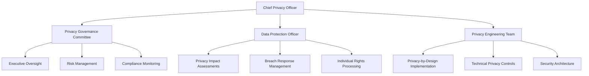

# Privacy Act 1988 (Cth) Compliance Framework
## RiggerHireApp Enterprise Platform

---

**Document Classification:** Enterprise Compliance  
**Version:** 1.0  
**Effective Date:** January 2025  
**Review Date:** January 2026  
**Owner:** Chief Privacy Officer  
**Approved By:** Executive Management Team

---

## Table of Contents

1. [Executive Summary](#executive-summary)
2. [Regulatory Framework](#regulatory-framework)
3. [Privacy Governance Structure](#privacy-governance-structure)
4. [Australian Privacy Principles Compliance](#australian-privacy-principles-compliance)
5. [Data Collection and Processing](#data-collection-and-processing)
6. [Consent Management](#consent-management)
7. [Data Security and Protection](#data-security-and-protection)
8. [Individual Rights Management](#individual-rights-management)
9. [Cross-Border Data Transfers](#cross-border-data-transfers)
10. [Incident Response and Breach Notification](#incident-response-and-breach-notification)
11. [Privacy Impact Assessments](#privacy-impact-assessments)
12. [Training and Awareness](#training-and-awareness)
13. [Monitoring and Audit](#monitoring-and-audit)

---

## Executive Summary

The RiggerHireApp platform processes significant volumes of personal information from workers, employers, and associated parties across Western Australia's construction and mining industries. This comprehensive Privacy Act 1988 (Cth) compliance framework ensures full adherence to the Australian Privacy Principles (APPs) while maintaining the operational efficiency and security requirements of our enterprise platform.

Our privacy-by-design approach integrates data protection measures into every aspect of the platform, from initial data collection through to secure disposal, ensuring individuals' privacy rights are protected while enabling legitimate business operations.

---

## Regulatory Framework

### Primary Legislation

#### Privacy Act 1988 (Commonwealth)
- **Part IIIA:** Australian Privacy Principles (APPs 1-13)
- **Part IIIC:** Notifiable Data Breaches Scheme
- **Schedule 1:** Australian Privacy Principles

#### Supporting Legislation
- **Spam Act 2003 (Cth):** Electronic communications
- **Telecommunications Act 1997 (Cth):** Communications privacy
- **Archives Act 1983 (Cth):** Government records management
- **Australian Government Information Security Manual (ISM)**

### Key Regulatory Bodies
- **Office of the Australian Information Commissioner (OAIC)**
- **Australian Cyber Security Centre (ACSC)**
- **Australian Communications and Media Authority (ACMA)**

---

## Privacy Governance Structure

### 3.1 Privacy Management Framework



### 3.2 Privacy Roles and Responsibilities

#### Chief Privacy Officer (CPO)
**Responsibilities:**
- Overall privacy strategy and governance
- Executive reporting and accountability
- Regulatory relationship management
- Privacy risk assessment and mitigation
- Cross-functional privacy coordination

#### Data Protection Officer (DPO)
**Responsibilities:**
- Day-to-day privacy operations management
- Privacy impact assessment coordination
- Individual rights request processing
- Staff privacy training delivery
- Privacy incident investigation

#### Privacy Engineering Team
**Responsibilities:**
- Technical privacy control implementation
- Privacy-by-design architecture
- Data minimization and pseudonymization
- Privacy-preserving analytics development
- Security and encryption implementation

---

## Australian Privacy Principles Compliance

### 4.1 APP 1: Open and Transparent Management of Personal Information

#### Privacy Policy Implementation

**RiggerHireApp Privacy Notice Structure:**

```typescript
interface PrivacyNotice {
  lastUpdated: Date;
  effectiveDate: Date;
  sections: {
    introduction: PersonalInformationHandling;
    collectionPurposes: CollectionPurpose[];
    informationTypes: PersonalInformationCategory[];
    disclosureArrangements: DisclosureArrangement[];
    overseasTransfers: OverseasTransfer[];
    accessAndCorrection: AccessRights;
    complaintProcess: ComplaintHandling;
    contactInformation: ContactDetails;
  };
  targetAudience: 'WORKERS' | 'EMPLOYERS' | 'GENERAL';
  readabilityLevel: number; // Flesch-Kincaid grade level
  multilingualSupport: string[]; // Language codes
}
```

**Transparency Measures:**
- Clear, concise privacy notices in plain English
- Role-specific privacy information for workers and employers
- Interactive privacy preference centers
- Regular privacy notice updates with change notifications
- Multilingual support for diverse workforce

### 4.2 APP 2: Anonymity and Pseudonymity

#### Anonymous and Pseudonymous Interaction Options

**Implementation Strategy:**

```python
class AnonymityManager:
    def __init__(self):
        self.pseudonym_service = PseudonymGenerationService()
        self.anonymization_engine = DataAnonymizationEngine()
        self.consent_manager = ConsentManager()
    
    async def enable_pseudonymous_interaction(self, user_context: UserContext) -> PseudonymousSession:
        """Enable pseudonymous platform interaction where legally permissible"""
        
        # Assess if anonymity/pseudonymity is practicable
        practicability_assessment = await self.assess_practicability(user_context)
        
        if practicability_assessment.pseudonymity_permitted:
            # Generate stable pseudonym
            pseudonym = await self.pseudonym_service.generate_pseudonym(
                user_context.user_id,
                user_context.interaction_type
            )
            
            # Configure limited data collection
            data_collection_config = self.configure_minimal_collection(
                user_context.service_requirements
            )
            
            return PseudonymousSession(
                pseudonym=pseudonym,
                data_collection_scope=data_collection_config,
                retention_period=self.calculate_minimal_retention(),
                anonymization_schedule=self.schedule_anonymization()
            )
        
        return self.create_identified_session(user_context)
```

**Anonymity/Pseudonymity Considerations:**
- Job browsing without identification requirements
- Salary benchmarking with anonymized data
- Safety incident reporting with optional anonymity
- Market research participation without identification
- Limited service access for unidentified users

### 4.3 APP 3: Collection of Solicited Personal Information

#### Data Collection Governance Framework

**Collection Limitation Principles:**

```typescript
interface CollectionLimitation {
  purpose: CollectionPurpose;
  legalBasis: LegalBasis[];
  necessityAssessment: {
    essential: boolean;
    businessJustification: string;
    alternativeConsidered: boolean;
    proportionalityCheck: boolean;
  };
  minimizationPrinciples: {
    dataTypes: PersonalInformationType[];
    retentionPeriod: string; // ISO8601 Duration
    collectionMethod: CollectionMethod;
    frequency: CollectionFrequency;
  };
  consentRequirements: ConsentRequirement;
}

enum LegalBasis {
  CONSENT = 'CONSENT',
  CONTRACT_PERFORMANCE = 'CONTRACT_PERFORMANCE',
  LEGAL_OBLIGATION = 'LEGAL_OBLIGATION',
  VITAL_INTERESTS = 'VITAL_INTERESTS',
  PUBLIC_INTEREST = 'PUBLIC_INTEREST',
  LEGITIMATE_INTERESTS = 'LEGITIMATE_INTERESTS'
}
```

**Collection Purposes Matrix:**

| Information Type | Primary Purpose | Secondary Purposes | Legal Basis | Retention |
|------------------|----------------|-------------------|-------------|-----------|
| **Identity Information** | Account creation, verification | Fraud prevention, support | Contract + Legal obligation | 7 years post-termination |
| **Employment History** | Job matching, competency verification | Performance analytics | Consent + Contract | 5 years post-engagement |
| **Safety Certifications** | Compliance verification, job eligibility | Industry reporting | Legal obligation | Perpetual (regulatory) |
| **Medical Information** | Fitness assessment, workplace accommodation | Claims management | Consent + Vital interests | 30 years (health records) |
| **Financial Information** | Payment processing, taxation | Credit assessment | Contract + Legal obligation | 7 years (ATO requirements) |
| **Location Data** | Job matching, safety monitoring | Analytics, emergency response | Consent + Vital interests | 12 months |

### 4.4 APP 4: Dealing with Unsolicited Personal Information

#### Unsolicited Information Management Protocol

```python
class UnsolicitedInformationHandler:
    def __init__(self):
        self.classification_engine = InformationClassificationEngine()
        self.disposal_service = SecureDisposalService()
        self.retention_policy = RetentionPolicyEngine()
    
    async def handle_unsolicited_information(self, information: UnsolicitedInformation) -> HandlingDecision:
        """Process unsolicited personal information according to APP 4"""
        
        # Classify information sensitivity and type
        classification = await self.classification_engine.classify(information)
        
        # Determine if information could be lawfully collected
        lawful_collection_assessment = await self.assess_lawful_collection(
            information, classification
        )
        
        if lawful_collection_assessment.permitted:
            # Information may be retained and used
            return await self.retain_information(information, classification)
        else:
            # Information must be destroyed or de-identified
            if classification.contains_personal_information:
                await self.disposal_service.secure_destroy(
                    information, 
                    destruction_timeline=timedelta(days=30)
                )
            
            return HandlingDecision(
                action='DESTROYED',
                reason='Not lawfully collectible under APP 3',
                destruction_date=datetime.utcnow() + timedelta(days=30)
            )
```

### 4.5 APP 5: Notification of Collection

#### Just-in-Time Privacy Notifications

**Dynamic Privacy Notice System:**

```javascript
class PrivacyNotificationEngine {
  constructor() {
    this.notificationTemplates = new NotificationTemplateManager();
    this.consentManager = new ConsentManager();
    this.userContext = new UserContextManager();
  }

  async provideCollectionNotification(collectionContext) {
    // Determine notification requirements
    const requirements = await this.assessNotificationRequirements(collectionContext);
    
    // Generate contextual privacy notice
    const privacyNotice = await this.generateContextualNotice({
      informationType: collectionContext.dataTypes,
      collectionPurpose: collectionContext.primaryPurpose,
      userType: collectionContext.userRole,
      collectionSource: collectionContext.source,
      retentionPeriod: collectionContext.retentionPeriod,
      disclosureArrangements: collectionContext.plannedDisclosures
    });

    // Deliver notification at optimal time
    const deliveryStrategy = this.determineOptimalDelivery(
      collectionContext.urgency,
      collectionContext.userPreferences
    );

    return await this.deliverNotification(privacyNotice, deliveryStrategy);
  }
}
```

**Notification Timing Matrix:**

| Collection Context | Notification Timing | Method | Content Detail Level |
|-------------------|-------------------|--------|-------------------|
| **Account Registration** | Before collection | Inline form notice | Comprehensive |
| **Job Application** | Point of collection | Modal dialog | Specific to job requirements |
| **Emergency Contact** | At time of use | Push notification | Essential information only |
| **Analytics Data** | First visit | Banner notification | Summary with detail link |
| **Third-party Integration** | Before data sharing | Email + in-app alert | Full disclosure details |

### 4.6 APP 6: Use or Disclosure of Personal Information

#### Purpose Limitation Engine

**Automated Purpose Checking:**

```python
class PurposeLimitationEngine:
    def __init__(self):
        self.purpose_registry = PurposeRegistry()
        self.consent_tracker = ConsentTracker()
        self.legal_basis_validator = LegalBasisValidator()
        
    async def validate_use_disclosure(self, 
                                    information: PersonalInformation, 
                                    proposed_use: ProposedUse) -> ValidationResult:
        """Validate proposed use against APP 6 requirements"""
        
        # Check primary purpose alignment
        primary_purpose_check = await self.check_primary_purpose_alignment(
            information.collection_purpose, 
            proposed_use.purpose
        )
        
        if primary_purpose_check.aligned:
            return ValidationResult(permitted=True, basis='PRIMARY_PURPOSE')
        
        # Check secondary purpose rules
        secondary_purpose_result = await self.evaluate_secondary_purpose(
            information, proposed_use
        )
        
        if secondary_purpose_result.permitted:
            return ValidationResult(
                permitted=True, 
                basis=secondary_purpose_result.legal_basis,
                conditions=secondary_purpose_result.conditions
            )
        
        # Check consent for new purposes
        consent_result = await self.check_consent_for_new_purpose(
            information.data_subject, 
            proposed_use
        )
        
        if consent_result.valid_consent:
            return ValidationResult(
                permitted=True, 
                basis='CONSENT',
                consent_record=consent_result.consent_id
            )
        
        return ValidationResult(
            permitted=False,
            reason='No valid legal basis for proposed use',
            required_actions=['Obtain specific consent', 'Modify use purpose']
        )
```

**Use and Disclosure Decision Matrix:**

| Information Category | Primary Purposes | Permitted Secondary Uses | Consent Required | Notification Required |
|---------------------|------------------|------------------------|-----------------|---------------------|
| **Identity Data** | Account management | Fraud prevention, legal compliance | No (legal obligation) | Initial collection only |
| **Employment Data** | Job matching | Performance analytics | Yes (analytics) | Each new purpose |
| **Safety Data** | Compliance verification | Industry safety research | Yes (research) | Opt-in required |
| **Location Data** | Service delivery | Emergency response | No (vital interests) | Real-time disclosure |
| **Communication Data** | Platform messaging | Quality assurance | Yes (QA purposes) | Monthly summary |

### 4.7 APP 7: Direct Marketing

#### Marketing Communication Compliance

**Direct Marketing Management System:**

```typescript
interface MarketingCompliance {
  communicationType: 'EMAIL' | 'SMS' | 'PHONE' | 'PUSH_NOTIFICATION';
  consentBasis: {
    type: 'OPT_IN' | 'OPT_OUT' | 'EXISTING_CUSTOMER' | 'INFERRED_CONSENT';
    evidenceId: string;
    consentDate: Date;
    expiryDate?: Date;
  };
  optOutMechanism: {
    method: string[];
    responseTime: string; // ISO8601 Duration
    confirmationRequired: boolean;
  };
  suppressionListIntegration: {
    doNotCallRegister: boolean;
    doNotEmailRegister: boolean;
    internalSuppressionList: boolean;
  };
  contentCompliance: {
    clearSenderIdentification: boolean;
    unsubscribeInstructions: boolean;
    relevanceToRecipient: boolean;
  };
}
```

**Marketing Automation with Privacy Controls:**

```python
class PrivacyCompliantMarketing:
    def __init__(self):
        self.consent_manager = ConsentManager()
        self.suppression_service = SuppressionListService()
        self.preference_center = PreferenceCenterService()
        
    async def send_marketing_communication(self, campaign: MarketingCampaign) -> CampaignResult:
        """Send marketing communication with full APP 7 compliance"""
        
        # Validate consent for all recipients
        validated_recipients = []
        for recipient in campaign.recipients:
            consent_check = await self.validate_marketing_consent(
                recipient, campaign.communication_type
            )
            
            if consent_check.valid:
                # Check suppression lists
                suppression_check = await self.check_suppression_status(
                    recipient, campaign.communication_type
                )
                
                if not suppression_check.suppressed:
                    validated_recipients.append(recipient)
        
        # Personalize content with privacy considerations
        personalized_campaign = await self.apply_privacy_safe_personalization(
            campaign, validated_recipients
        )
        
        # Send with mandatory privacy elements
        result = await self.send_with_privacy_controls(
            personalized_campaign, 
            include_unsubscribe=True,
            include_preference_center=True,
            track_delivery=True
        )
        
        # Record marketing activity for audit
        await self.record_marketing_activity(campaign, result)
        
        return result
```

### 4.8 APP 8: Cross-border Disclosure of Personal Information

#### International Transfer Safeguards

**Cross-Border Transfer Decision Framework:**

```python
class CrossBorderTransferManager:
    def __init__(self):
        self.adequacy_assessment = AdequacyAssessmentService()
        self.binding_rules = BindingCorporateRulesService()
        self.contract_manager = DataProcessingAgreementManager()
        
    async def assess_cross_border_transfer(self, 
                                         transfer: ProposedTransfer) -> TransferAssessment:
        """Assess cross-border transfer compliance with APP 8"""
        
        # Check if receiving country has adequate privacy protections
        adequacy_result = await self.adequacy_assessment.evaluate_country(
            transfer.destination_country
        )
        
        if adequacy_result.adequate_protection:
            return TransferAssessment(
                permitted=True,
                safeguards='Adequate country protections',
                additional_requirements=[]
            )
        
        # Check for binding corporate rules
        if transfer.intra_corporate:
            bcr_result = await self.binding_rules.validate_transfer(transfer)
            if bcr_result.valid:
                return TransferAssessment(
                    permitted=True,
                    safeguards='Binding Corporate Rules',
                    monitoring_requirements=bcr_result.monitoring_obligations
                )
        
        # Evaluate standard contractual clauses
        contractual_safeguards = await self.contract_manager.assess_safeguards(
            transfer.data_processor,
            transfer.processing_purpose
        )
        
        if contractual_safeguards.adequate:
            return TransferAssessment(
                permitted=True,
                safeguards='Standard Contractual Clauses',
                contract_requirements=contractual_safeguards.required_clauses,
                monitoring_obligations=contractual_safeguards.oversight_requirements
            )
        
        return TransferAssessment(
            permitted=False,
            reason='Inadequate safeguards for cross-border transfer',
            remedial_actions=['Implement binding corporate rules', 'Negotiate adequate contractual protections', 'Process data domestically']
        )
```

**International Data Processing Inventory:**

| Service Provider | Country | Data Types | Safeguards | Review Date |
|-----------------|---------|------------|------------|-------------|
| **AWS** | United States | All platform data | Standard Contractual Clauses + Certification | Quarterly |
| **Stripe** | United States | Payment data | PCI DSS + Contractual safeguards | Semi-annual |
| **Firebase** | United States | Analytics, messaging | Google Cloud DPA + Privacy Shield successor | Quarterly |
| **SendGrid** | United States | Email communications | Standard Contractual Clauses | Annual |

---

## Data Collection and Processing

### 5.1 Data Minimization Framework

#### Automated Data Minimization Engine

```python
class DataMinimizationEngine:
    def __init__(self):
        self.purpose_analyzer = PurposeAnalyzer()
        self.necessity_evaluator = NecessityEvaluator()
        self.alternatives_assessor = AlternativesAssessor()
        
    async def minimize_data_collection(self, 
                                     collection_request: DataCollectionRequest) -> MinimizedCollection:
        """Apply data minimization principles to collection request"""
        
        # Analyze stated purposes
        purpose_analysis = await self.purpose_analyzer.analyze_purposes(
            collection_request.purposes
        )
        
        # Evaluate necessity of each data element
        necessity_results = []
        for data_element in collection_request.data_elements:
            necessity = await self.necessity_evaluator.evaluate_necessity(
                data_element, purpose_analysis.primary_purpose
            )
            necessity_results.append(necessity)
        
        # Identify less intrusive alternatives
        alternatives = await self.alternatives_assessor.identify_alternatives(
            collection_request, necessity_results
        )
        
        # Generate minimized collection plan
        minimized_elements = [
            element for element, necessity in zip(collection_request.data_elements, necessity_results)
            if necessity.essential or necessity.strongly_justified
        ]
        
        return MinimizedCollection(
            essential_elements=minimized_elements,
            alternative_approaches=alternatives.recommended,
            privacy_impact_reduction=self.calculate_privacy_impact_reduction(
                collection_request.data_elements, minimized_elements
            ),
            recommendations=alternatives.implementation_guidance
        )
```

### 5.2 Lawful Processing Framework

#### Processing Lawfulness Validation

**Multi-basis Processing Framework:**

```typescript
interface ProcessingLawfulness {
  primaryBasis: LegalBasis;
  supportingBases: LegalBasis[];
  validationCriteria: {
    consentValidation?: ConsentValidation;
    contractualNecessity?: ContractualNecessity;
    legalObligationAssessment?: LegalObligationAssessment;
    vitalInterestsAssessment?: VitalInterestsAssessment;
    publicInterestAssessment?: PublicInterestAssessment;
    legitimateInterestsAssessment?: LegitimateInterestsAssessment;
  };
  processingLimitations: ProcessingLimitation[];
  reviewSchedule: ReviewSchedule;
}

interface LegitimateInterestsAssessment {
  legitimateInterest: string;
  necessityTest: {
    purpose: string;
    proportionality: boolean;
    leastIntrusiveMethod: boolean;
    alternativesConsidered: boolean;
  };
  balancingTest: {
    individualRights: RightsImpact;
    organisationalInterests: BusinessInterests;
    balanceOutcome: 'INDIVIDUAL_PREVAILS' | 'BALANCED' | 'ORGANISATION_PREVAILS';
    reasoning: string;
  };
  safeguards: DataProtectionSafeguard[];
}
```

---

## Consent Management

### 6.1 Dynamic Consent Platform

#### Granular Consent Management System

```python
class ConsentManagementPlatform:
    def __init__(self):
        self.consent_storage = ConsentStorageService()
        self.preference_engine = PreferenceEngine()
        self.audit_logger = ConsentAuditLogger()
        
    async def obtain_consent(self, consent_request: ConsentRequest) -> ConsentResult:
        """Obtain valid consent according to APP requirements"""
        
        # Validate consent request structure
        validation = await self.validate_consent_request(consent_request)
        if not validation.valid:
            raise InvalidConsentRequestError(validation.errors)
        
        # Present consent interface
        consent_interface = await self.generate_consent_interface(
            request=consent_request,
            user_context=consent_request.user_context,
            accessibility_requirements=consent_request.accessibility_needs
        )
        
        # Capture consent decision
        user_decision = await self.capture_consent_decision(
            consent_interface,
            require_positive_action=True,
            prevent_pre_ticking=True,
            allow_granular_choice=True
        )
        
        # Process and store consent
        if user_decision.consented:
            consent_record = await self.create_consent_record(
                request=consent_request,
                decision=user_decision,
                evidence=user_decision.evidence,
                timestamp=datetime.utcnow(),
                ip_address=consent_request.session.ip_address,
                user_agent=consent_request.session.user_agent
            )
            
            await self.consent_storage.store_consent(consent_record)
            await self.audit_logger.log_consent_obtained(consent_record)
            
            return ConsentResult(
                granted=True,
                consent_id=consent_record.consent_id,
                scope=consent_record.scope,
                expiry_date=consent_record.expiry_date
            )
        
        await self.audit_logger.log_consent_declined(consent_request, user_decision)
        return ConsentResult(granted=False, reason=user_decision.decline_reason)
```

### 6.2 Consent Interface Design

#### User-Friendly Consent Experiences

**Layered Consent Interface:**

```typescript
interface ConsentInterface {
  consentLayer: {
    primary: PrimaryConsentInterface;    // High-level purposes
    detailed: DetailedConsentInterface;  // Granular purposes
    technical: TechnicalConsentInterface; // Data processing details
  };
  presentationRules: {
    defaultLayer: 'PRIMARY' | 'DETAILED' | 'TECHNICAL';
    progressiveDisclosure: boolean;
    contextualHelp: boolean;
    visualIndicators: boolean;
  };
  accessibilityFeatures: {
    screenReaderSupport: boolean;
    keyboardNavigation: boolean;
    highContrastMode: boolean;
    simplifiedLanguage: boolean;
  };
  consentEvidence: {
    captureMethod: 'CHECKBOX' | 'SIGNATURE' | 'VOICE' | 'BIOMETRIC';
    evidenceRetention: string; // ISO8601 Duration
    verificationMethod: string;
  };
}
```

**Consent Decision Points:**

| Processing Activity | Consent Required | Granularity | Renewal Period | Withdrawal Method |
|-------------------|------------------|-------------|----------------|------------------|
| **Job Matching** | Yes | Purpose-specific | Annual | Account settings |
| **Marketing Communications** | Yes | Channel-specific | No expiry | One-click unsubscribe |
| **Profile Enhancement** | Yes | Feature-specific | 2 years | Feature toggle |
| **Analytics Processing** | Yes | Aggregated consent | Annual | Privacy dashboard |
| **Third-party Integration** | Yes | Service-specific | Integration-dependent | Individual service control |

---

## Data Security and Protection

### 7.1 Technical Privacy Controls

#### Privacy-Preserving Architecture

```python
class PrivacyPreservingDataProcessor:
    def __init__(self):
        self.encryption_service = EncryptionService()
        self.pseudonymization_engine = PseudonymizationEngine()
        self.anonymization_tools = AnonymizationTools()
        self.access_controller = AccessController()
        
    async def process_personal_data(self, 
                                  data: PersonalData, 
                                  processing_purpose: ProcessingPurpose) -> ProcessedData:
        """Process personal data with privacy-preserving techniques"""
        
        # Apply purpose-appropriate privacy controls
        privacy_controls = await self.determine_privacy_controls(
            data.sensitivity_level, 
            processing_purpose
        )
        
        # Apply encryption at rest and in transit
        encrypted_data = await self.encryption_service.encrypt_data(
            data, 
            encryption_level=privacy_controls.encryption_level
        )
        
        # Apply pseudonymization where appropriate
        if privacy_controls.pseudonymization_required:
            pseudonymized_data = await self.pseudonymization_engine.pseudonymize(
                encrypted_data,
                pseudonymization_key=processing_purpose.key_derivation,
                reversibility=privacy_controls.reversibility_required
            )
        else:
            pseudonymized_data = encrypted_data
        
        # Apply differential privacy for analytics
        if processing_purpose.type == 'ANALYTICS':
            privacy_budget = privacy_controls.differential_privacy_budget
            anonymized_data = await self.anonymization_tools.apply_differential_privacy(
                pseudonymized_data,
                epsilon=privacy_budget.epsilon,
                delta=privacy_budget.delta
            )
        else:
            anonymized_data = pseudonymized_data
        
        # Log processing activity
        await self.audit_logger.log_data_processing(
            original_data_reference=data.data_id,
            processing_purpose=processing_purpose,
            privacy_controls_applied=privacy_controls,
            processing_timestamp=datetime.utcnow()
        )
        
        return ProcessedData(
            data=anonymized_data,
            processing_metadata=privacy_controls,
            audit_trail=self.get_processing_audit_trail(data.data_id)
        )
```

### 7.2 Data Encryption Standards

#### Comprehensive Encryption Framework

**Encryption Standards Matrix:**

| Data Category | At Rest | In Transit | In Use | Key Management |
|---------------|---------|------------|--------|----------------|
| **Identity Data** | AES-256-GCM | TLS 1.3 | Application-level encryption | HSM-managed keys |
| **Financial Data** | AES-256-GCM | TLS 1.3 + Certificate pinning | Tokenization | Dedicated HSM partition |
| **Health Data** | AES-256-GCM | TLS 1.3 | Homomorphic encryption | Multi-party key escrow |
| **Biometric Data** | AES-256-GCM + Format preserving | TLS 1.3 | Template protection | Biometric key derivation |
| **Location Data** | AES-256-GCM | TLS 1.3 | Geometric noise injection | Periodic key rotation |

---

## Individual Rights Management

### 8.1 Automated Rights Processing

#### Individual Rights Fulfillment Engine

```python
class IndividualRightsProcessor:
    def __init__(self):
        self.identity_verifier = IdentityVerificationService()
        self.data_locator = PersonalDataLocator()
        self.export_generator = DataExportGenerator()
        self.deletion_service = SecureDeletionService()
        
    async def process_access_request(self, request: AccessRequest) -> AccessResponse:
        """Process individual's right to access personal information"""
        
        # Verify requestor identity
        identity_verification = await self.identity_verifier.verify_identity(
            request.identity_evidence,
            verification_level='HIGH_ASSURANCE'
        )
        
        if not identity_verification.verified:
            return AccessResponse(
                status='IDENTITY_VERIFICATION_FAILED',
                reason=identity_verification.failure_reason,
                retry_instructions=identity_verification.retry_guidance
            )
        
        # Locate all personal information
        personal_data_inventory = await self.data_locator.locate_personal_data(
            individual_id=identity_verification.verified_identity.id,
            include_derived_data=True,
            include_backup_systems=True,
            include_log_data=request.include_system_logs
        )
        
        # Assess third-party rights and exemptions
        disclosure_assessment = await self.assess_disclosure_limitations(
            personal_data_inventory,
            third_party_rights_check=True,
            legal_exemptions_check=True,
            commercial_confidentiality_check=True
        )
        
        # Generate privacy-compliant export
        data_export = await self.export_generator.generate_export(
            data_inventory=disclosure_assessment.disclosable_data,
            export_format=request.preferred_format,
            include_metadata=request.include_processing_metadata,
            apply_redactions=disclosure_assessment.required_redactions
        )
        
        # Log access request processing
        await self.audit_logger.log_access_request(
            request=request,
            verification_result=identity_verification,
            data_scope=personal_data_inventory.summary,
            disclosure_limitations=disclosure_assessment.limitations
        )
        
        return AccessResponse(
            status='COMPLETED',
            data_export=data_export,
            processing_summary=disclosure_assessment.summary,
            delivery_method=self.determine_secure_delivery_method(data_export.sensitivity)
        )
```

### 8.2 Data Correction and Deletion

#### Automated Data Lifecycle Management

```python
class DataLifecycleManager:
    def __init__(self):
        self.data_quality_engine = DataQualityEngine()
        self.deletion_orchestrator = DeletionOrchestrator()
        self.backup_manager = BackupSystemManager()
        
    async def process_correction_request(self, request: CorrectionRequest) -> CorrectionResponse:
        """Process request to correct personal information"""
        
        # Validate correction request
        validation = await self.validate_correction_request(request)
        if not validation.valid:
            return CorrectionResponse(status='INVALID_REQUEST', errors=validation.errors)
        
        # Assess impact of correction
        impact_assessment = await self.assess_correction_impact(
            original_data=request.original_data,
            proposed_correction=request.corrected_data,
            affected_systems=validation.affected_systems
        )
        
        # Apply correction with audit trail
        correction_result = await self.apply_data_correction(
            correction_plan=impact_assessment.correction_plan,
            maintain_audit_trail=True,
            cascade_to_derived_data=impact_assessment.cascade_required
        )
        
        # Update data quality metrics
        await self.data_quality_engine.update_quality_metrics(
            correction_result.quality_improvements
        )
        
        return CorrectionResponse(
            status='COMPLETED',
            corrected_systems=correction_result.updated_systems,
            quality_impact=correction_result.quality_improvements,
            verification_available=True
        )
    
    async def process_deletion_request(self, request: DeletionRequest) -> DeletionResponse:
        """Process right to erasure (deletion) request"""
        
        # Assess deletion eligibility
        eligibility = await self.assess_deletion_eligibility(
            individual_id=request.individual_id,
            deletion_scope=request.scope,
            consider_legal_obligations=True,
            consider_legitimate_interests=True
        )
        
        if not eligibility.eligible:
            return DeletionResponse(
                status='DELETION_NOT_PERMITTED',
                reason=eligibility.ineligibility_reason,
                alternative_actions=eligibility.suggested_alternatives
            )
        
        # Execute secure deletion
        deletion_result = await self.deletion_orchestrator.execute_deletion(
            deletion_plan=eligibility.deletion_plan,
            verification_required=True,
            include_backups=request.include_backup_systems
        )
        
        # Verify deletion completeness
        verification = await self.verify_deletion_completeness(
            deletion_scope=deletion_result.scope,
            verification_methods=['AUTOMATED_SCAN', 'MANUAL_VERIFICATION']
        )
        
        return DeletionResponse(
            status='COMPLETED',
            deleted_data_categories=deletion_result.deleted_categories,
            verification_report=verification,
            certificate_of_destruction=deletion_result.destruction_certificate
        )
```

---

## Cross-Border Data Transfers

### 9.1 International Transfer Governance

#### Transfer Impact Assessment Framework

```python
class TransferImpactAssessment:
    def __init__(self):
        self.country_analyzer = CountryPrivacyAnalyzer()
        self.risk_assessor = TransferRiskAssessor()
        self.safeguard_designer = SafeguardDesigner()
        
    async def conduct_transfer_assessment(self, 
                                        transfer: ProposedTransfer) -> TransferAssessment:
        """Conduct comprehensive transfer impact assessment"""
        
        # Analyze destination country privacy landscape
        country_analysis = await self.country_analyzer.analyze_privacy_protections(
            country=transfer.destination_country,
            analysis_scope=['LEGAL_FRAMEWORK', 'ENFORCEMENT_MECHANISMS', 'GOVERNMENT_ACCESS']
        )
        
        # Assess specific transfer risks
        risk_assessment = await self.risk_assessor.assess_transfer_risks(
            data_types=transfer.data_categories,
            processing_purposes=transfer.processing_purposes,
            country_analysis=country_analysis,
            data_subjects=transfer.affected_individuals
        )
        
        # Design appropriate safeguards
        safeguard_recommendations = await self.safeguard_designer.design_safeguards(
            risk_profile=risk_assessment.risk_profile,
            transfer_context=transfer.context,
            available_mechanisms=['ADEQUACY', 'BCR', 'SCC', 'CERTIFICATION']
        )
        
        return TransferAssessment(
            transfer_permitted=risk_assessment.acceptable_risk,
            required_safeguards=safeguard_recommendations.recommended_safeguards,
            residual_risks=risk_assessment.residual_risks,
            monitoring_requirements=safeguard_recommendations.monitoring_obligations,
            review_schedule=self.calculate_review_frequency(risk_assessment.risk_level)
        )
```

---

## Incident Response and Breach Notification

### 10.1 Privacy Breach Response Framework

#### Automated Breach Detection and Response

```python
class PrivacyBreachResponseSystem:
    def __init__(self):
        self.breach_detector = BreachDetectionEngine()
        self.impact_assessor = BreachImpactAssessor()
        self.notification_manager = BreachNotificationManager()
        self.containment_service = BreachContainmentService()
        
    async def handle_privacy_incident(self, incident: PrivacyIncident) -> IncidentResponse:
        """Automated privacy breach response according to Notifiable Data Breach scheme"""
        
        # Initial incident assessment
        initial_assessment = await self.assess_incident_severity(incident)
        
        # Immediate containment actions
        containment_actions = await self.containment_service.implement_containment(
            incident=incident,
            containment_level=initial_assessment.recommended_containment_level
        )
        
        # Detailed impact assessment
        detailed_assessment = await self.impact_assessor.conduct_detailed_assessment(
            incident=incident,
            containment_status=containment_actions,
            assessment_timeframe=timedelta(hours=72)  # APP timeline compliance
        )
        
        # Determine notification obligations
        notification_requirements = await self.determine_notification_obligations(
            assessment=detailed_assessment,
            affected_individuals=incident.affected_individuals,
            regulatory_thresholds=self.get_notification_thresholds()
        )
        
        # Execute notifications if required
        if notification_requirements.oaic_notification_required:
            await self.notification_manager.notify_oaic(
                breach_details=detailed_assessment,
                notification_timeline=timedelta(hours=72)
            )
        
        if notification_requirements.individual_notification_required:
            await self.notification_manager.notify_affected_individuals(
                individuals=notification_requirements.individuals_to_notify,
                notification_method=notification_requirements.notification_method,
                content_template=notification_requirements.notification_template
            )
        
        # Initiate investigation and remediation
        remediation_plan = await self.develop_remediation_plan(
            incident=incident,
            assessment=detailed_assessment,
            lessons_learned=await self.extract_lessons_learned(incident)
        )
        
        return IncidentResponse(
            incident_id=incident.incident_id,
            containment_status=containment_actions.status,
            notification_status=notification_requirements.completion_status,
            remediation_plan=remediation_plan,
            estimated_completion=remediation_plan.estimated_completion_date
        )
```

### 10.2 Breach Notification Templates

#### Regulatory and Individual Notification Templates

**OAIC Notification Template:**

```typescript
interface OAICBreachNotification {
  organisationDetails: {
    name: string;
    acn: string;
    contactPerson: ContactDetails;
  };
  incidentDetails: {
    incidentDate: Date;
    discoveryDate: Date;
    description: string;
    causation: BreachCause;
    affectedDataTypes: PersonalInformationType[];
  };
  impactAssessment: {
    individualCount: number;
    riskLevel: 'LOW' | 'MEDIUM' | 'HIGH' | 'CRITICAL';
    potentialHarms: PotentialHarm[];
    mitigatingFactors: MitigatingFactor[];
  };
  responseActions: {
    containmentMeasures: ContainmentMeasure[];
    remedialActions: RemedialAction[];
    preventativeMeasures: PreventativeMeasure[];
    individualNotifications: IndividualNotificationPlan;
  };
  timeline: {
    incidentOccurrence: Date;
    incidentDiscovery: Date;
    containmentImplemented: Date;
    notificationToOAIC: Date;
    individualNotifications: Date;
    remediation_completed: Date;
  };
}
```

---

## Privacy Impact Assessments

### 11.1 Automated PIA Framework

#### Continuous Privacy Impact Assessment

```python
class PrivacyImpactAssessmentEngine:
    def __init__(self):
        self.risk_modeler = PrivacyRiskModeler()
        self.stakeholder_analyzer = StakeholderAnalyzer()
        self.mitigation_designer = MitigationDesigner()
        
    async def conduct_pia(self, project: ProjectDetails) -> PrivacyImpactAssessment:
        """Conduct comprehensive Privacy Impact Assessment"""
        
        # Analyze project privacy implications
        privacy_analysis = await self.analyze_privacy_implications(
            project_scope=project.scope,
            data_processing_activities=project.processing_activities,
            technology_components=project.technology_stack
        )
        
        # Identify affected stakeholders
        stakeholder_analysis = await self.stakeholder_analyzer.identify_stakeholders(
            project=project,
            include_data_subjects=True,
            include_third_parties=True,
            include_regulatory_bodies=True
        )
        
        # Assess privacy risks
        risk_assessment = await self.risk_modeler.assess_privacy_risks(
            processing_activities=privacy_analysis.processing_activities,
            threat_landscape=await self.get_current_threat_landscape(),
            vulnerability_assessment=await self.assess_system_vulnerabilities(project)
        )
        
        # Design risk mitigation measures
        mitigation_plan = await self.mitigation_designer.design_mitigations(
            identified_risks=risk_assessment.risks,
            risk_tolerance=project.risk_tolerance,
            implementation_constraints=project.constraints
        )
        
        # Evaluate residual risks
        residual_risk_assessment = await self.assess_residual_risks(
            original_risks=risk_assessment.risks,
            planned_mitigations=mitigation_plan.mitigations
        )
        
        return PrivacyImpactAssessment(
            project_reference=project.project_id,
            assessment_date=datetime.utcnow(),
            privacy_risks=risk_assessment.risks,
            risk_mitigation_plan=mitigation_plan,
            residual_risks=residual_risk_assessment,
            recommendations=mitigation_plan.recommendations,
            approval_requirements=self.determine_approval_requirements(residual_risk_assessment),
            review_schedule=self.calculate_review_schedule(project.lifecycle, risk_assessment.risk_level)
        )
```

---

## Training and Awareness

### 12.1 Privacy Training Program

#### Role-Based Privacy Education

**Training Curriculum Matrix:**

| Role | Core Training Hours | Specialized Modules | Certification Required | Refresh Frequency |
|------|-------------------|-------------------|---------------------|------------------|
| **All Staff** | 2 hours | Privacy basics, incident reporting | Privacy awareness | Annual |
| **Development Team** | 8 hours | Privacy-by-design, secure coding | Privacy engineering | Bi-annual |
| **Customer Service** | 4 hours | Individual rights, breach response | Customer privacy | Annual |
| **Management** | 6 hours | Governance, compliance oversight | Privacy leadership | Annual |
| **Privacy Team** | 40 hours | Legal updates, advanced techniques | Professional certification | Quarterly updates |

---

## Monitoring and Audit

### 13.1 Continuous Privacy Monitoring

#### Automated Compliance Monitoring

```python
class PrivacyComplianceMonitor:
    def __init__(self):
        self.metrics_collector = PrivacyMetricsCollector()
        self.anomaly_detector = PrivacyAnomalyDetector()
        self.compliance_evaluator = ComplianceEvaluator()
        
    async def monitor_privacy_compliance(self) -> ComplianceReport:
        """Continuous monitoring of privacy compliance status"""
        
        # Collect privacy metrics
        current_metrics = await self.metrics_collector.collect_metrics([
            'consent_rates',
            'data_access_requests',
            'processing_purposes_alignment',
            'cross_border_transfers',
            'retention_period_compliance',
            'security_control_effectiveness'
        ])
        
        # Detect privacy anomalies
        anomalies = await self.anomaly_detector.detect_anomalies(
            current_metrics,
            baseline_period=timedelta(days=30),
            sensitivity_level='MEDIUM'
        )
        
        # Evaluate overall compliance status
        compliance_status = await self.compliance_evaluator.evaluate_compliance(
            metrics=current_metrics,
            anomalies=anomalies,
            regulatory_requirements=self.get_current_requirements()
        )
        
        return ComplianceReport(
            report_date=datetime.utcnow(),
            overall_compliance_score=compliance_status.overall_score,
            privacy_metrics=current_metrics,
            identified_anomalies=anomalies,
            compliance_gaps=compliance_status.gaps,
            recommended_actions=compliance_status.recommendations,
            next_review_date=datetime.utcnow() + timedelta(days=30)
        )
```

---

## Document Control

**Document Information:**
- **Title:** Privacy Act 1988 (Cth) Compliance Framework
- **Document ID:** COMP-PRIV-001
- **Version:** 1.0
- **Classification:** Enterprise Compliance
- **Owner:** Chief Privacy Officer
- **Approved By:** Executive Management Team

**Review History:**
| Version | Date | Author | Changes |
|---------|------|--------|---------|
| 1.0 | January 2025 | Privacy Team | Initial framework creation |

**Distribution List:**
- Executive Management Team
- Chief Privacy Officer
- Chief Technology Officer
- Legal Counsel
- Development Team Leads
- Customer Service Management

**Next Review:** January 2026

---

*This document contains confidential and proprietary information. Distribution is restricted to authorized personnel only.*

**© 2025 Tiation Technology Pty Ltd. All rights reserved.**