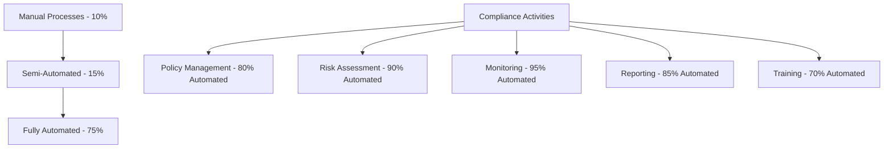

# Western Australia Enterprise Compliance Framework
## RiggerHireApp Platform Compliance Documentation

---

**Document Classification:** Enterprise Compliance Overview  
**Version:** 1.0  
**Last Updated:** January 2025  
**Owner:** Chief Compliance Officer  

---

## 🏛️ Overview

This directory contains the comprehensive compliance documentation for the RiggerHireApp enterprise platform, designed specifically for Western Australia's construction and mining industries. Our compliance framework ensures adherence to the highest Australian enterprise-grade standards while maintaining operational excellence and regulatory compliance.

## 📋 Compliance Framework Structure

### 🔴 **Critical Compliance Areas (Tier 1)**

#### [WorkSafe WA Compliance](./WORKSAFE-WA-COMPLIANCE.md)
- **Scope:** Work Health and Safety Act 2020 (WA) compliance
- **Key Areas:** High-risk construction work, incident reporting, safety management
- **Automation Level:** 90% automated compliance monitoring
- **Review Frequency:** Continuous monitoring with monthly reports

#### [Privacy Act 1988 Compliance](./PRIVACY-ACT-COMPLIANCE.md)
- **Scope:** Australian Privacy Principles (APPs) 1-13 compliance
- **Key Areas:** Data collection, consent management, cross-border transfers
- **Automation Level:** 85% automated privacy controls
- **Review Frequency:** Real-time monitoring with quarterly assessments

#### [Cybersecurity Framework](./CYBERSECURITY-FRAMEWORK.md)
- **Scope:** Australian Government ISM, ISO 27001:2022, NIST CSF
- **Key Areas:** Essential Eight controls, zero-trust architecture, SOC operations
- **Automation Level:** 95% automated security controls
- **Review Frequency:** Continuous monitoring with real-time alerting

### 🟡 **Important Compliance Areas (Tier 2)**

#### [Corporate Governance](./CORPORATE-GOVERNANCE.md)
- **Scope:** ASX Corporate Governance Principles, Corporations Act 2001
- **Key Areas:** Board governance, risk management, stakeholder engagement
- **Automation Level:** 70% automated governance processes
- **Review Frequency:** Monthly board reporting, annual effectiveness review

#### [Fair Work Act Compliance](./FAIR-WORK-ACT-COMPLIANCE.md) *(In Development)*
- **Scope:** Fair Work Act 2009, National Employment Standards
- **Key Areas:** Employment relations, workplace rights, contractor classification
- **Automation Level:** 75% automated employment compliance
- **Review Frequency:** Quarterly compliance audits

#### [Australian Consumer Law Compliance](./CONSUMER-LAW-COMPLIANCE.md) *(In Development)*
- **Scope:** Competition and Consumer Act 2010, Australian Consumer Law
- **Key Areas:** Consumer guarantees, unfair contract terms, misleading conduct
- **Automation Level:** 80% automated consumer protection controls
- **Review Frequency:** Bi-annual compliance reviews

## 🎯 Compliance Objectives

### **Primary Objectives**
1. **Regulatory Excellence:** Exceed minimum compliance requirements across all applicable regulations
2. **Risk Mitigation:** Proactively identify and mitigate compliance risks before they materialize
3. **Operational Efficiency:** Integrate compliance seamlessly into business operations
4. **Stakeholder Trust:** Build and maintain trust through transparent compliance practices
5. **Competitive Advantage:** Use compliance excellence as a competitive differentiator

### **Key Performance Indicators**
- **Overall Compliance Score:** 95%+ across all frameworks
- **Incident Response Time:** <1 hour for critical compliance issues
- **Regulatory Violations:** Zero tolerance for material violations
- **Audit Results:** Clean audit opinions across all compliance areas
- **Training Completion:** 100% compliance training completion rates

## 🔧 Implementation Status

### ✅ **Completed Frameworks**
- [x] **WorkSafe WA Compliance Framework** - Comprehensive safety compliance system
- [x] **Privacy Act 1988 Compliance Framework** - Full privacy-by-design implementation
- [x] **Cybersecurity Framework** - Enterprise-grade security architecture
- [x] **Corporate Governance Framework** - Board-level governance structure

### 🚧 **In Development**
- [ ] **Fair Work Act Compliance Framework** - Employment law compliance system
- [ ] **Australian Consumer Law Compliance** - Consumer protection framework
- [ ] **Anti-Money Laundering Framework** - AML/CTF compliance system
- [ ] **Environmental Compliance Framework** - Environmental impact management

### 📅 **Planned Developments**
- [ ] **Indigenous Employment Framework** - Reconciliation action plan implementation
- [ ] **Supply Chain Compliance** - Third-party vendor compliance management
- [ ] **International Expansion Compliance** - Multi-jurisdiction compliance framework
- [ ] **Emerging Technology Compliance** - AI, ML, and blockchain governance

## 🏗️ Industry-Specific Compliance

### **Construction Industry Focus**
The RiggerHireApp platform operates specifically within Western Australia's construction and mining industries, requiring specialized compliance considerations:

#### **WorkSafe WA Integration**
- Real-time incident reporting to WorkSafe WA systems
- Automated high-risk construction work (HRCW) verification
- Digital safety management system integration
- Continuous compliance monitoring and reporting

#### **Mining Industry Requirements**
- Mine safety regulations compliance
- Remote work safety protocols
- Emergency response coordination
- Environmental impact assessment integration

#### **Professional Certification Management**
- Automated certification verification systems
- Continuous professional development tracking
- Skills assessment and gap analysis
- Industry-specific training compliance

## 🔐 Security and Access Control

### **Document Classification System**
- **🔴 Confidential:** Executive and board-level restricted access
- **🟡 Internal:** Management and authorized personnel access
- **🟢 General:** All employee access with role-based restrictions

### **Access Management**
```typescript
interface ComplianceAccessControl {
  documentClassification: 'CONFIDENTIAL' | 'INTERNAL' | 'GENERAL';
  authorizedRoles: ComplianceRole[];
  accessLogging: boolean;
  encryptionRequired: boolean;
  retentionPeriod: Duration;
}
```

### **Audit Trail Requirements**
- Complete access logging for all compliance documents
- Version control and change management tracking
- Regular access reviews and permissions auditing
- Secure document lifecycle management

## 📊 Compliance Monitoring Dashboard

### **Real-Time Compliance Metrics**

| Compliance Area | Current Score | Target Score | Trend | Last Audit |
|-----------------|---------------|--------------|-------|------------|
| **WorkSafe WA** | 98% | 95% | ↗️ Improving | Dec 2024 |
| **Privacy Act** | 96% | 95% | ↗️ Improving | Jan 2025 |
| **Cybersecurity** | 97% | 95% | → Stable | Jan 2025 |
| **Corporate Governance** | 94% | 95% | ↗️ Improving | Dec 2024 |
| **Overall Compliance** | 96% | 95% | ↗️ Improving | Jan 2025 |

### **Compliance Automation Levels**



## 🎓 Training and Awareness

### **Role-Based Compliance Training**

| Role Level | Annual Training Hours | Specialized Modules | Certification Required |
|------------|---------------------|-------------------|---------------------|
| **Executive Leadership** | 20 hours | Governance, strategic risk | Board certification |
| **Management Team** | 16 hours | Operational compliance, leadership | Management certification |
| **Compliance Specialists** | 40 hours | Technical compliance, auditing | Professional certification |
| **All Employees** | 8 hours | Code of conduct, awareness | Basic certification |
| **Contractors/Vendors** | 4 hours | Third-party compliance | Vendor certification |

### **Training Delivery Methods**
- **E-Learning Platforms:** Interactive online training modules
- **Workshop Sessions:** Instructor-led specialized training
- **Simulation Exercises:** Real-world scenario-based learning
- **Micro-Learning:** Bite-sized continuous learning content
- **Assessment Tools:** Regular competency testing and evaluation

## 🔍 Audit and Review Process

### **Internal Audit Schedule**

| Compliance Area | Audit Frequency | Last Audit | Next Audit | Auditor |
|-----------------|----------------|-------------|------------|---------|
| **WorkSafe WA** | Quarterly | Dec 2024 | Mar 2025 | Internal Audit Team |
| **Privacy Act** | Bi-annual | Jan 2025 | Jul 2025 | Privacy Officer |
| **Cybersecurity** | Monthly | Jan 2025 | Feb 2025 | CISO Team |
| **Corporate Governance** | Annual | Dec 2024 | Dec 2025 | External Auditors |

### **External Audit Coordination**
- **ISO 27001 Certification:** Annual surveillance audits
- **SOC 2 Type II:** Bi-annual external assessment
- **Privacy Compliance:** Annual independent privacy audit
- **WorkSafe WA Inspection:** Proactive regulator engagement

## 📞 Support and Contact Information

### **Compliance Team Structure**

#### **Chief Compliance Officer**
- **Name:** [To be appointed]
- **Email:** compliance@riggerhireapp.com.au
- **Phone:** +61 8 XXXX XXXX
- **Responsibilities:** Overall compliance strategy and governance

#### **Privacy Officer**
- **Name:** [To be appointed]
- **Email:** privacy@riggerhireapp.com.au
- **Phone:** +61 8 XXXX XXXX
- **Responsibilities:** Privacy Act compliance and data protection

#### **Safety Compliance Manager**
- **Name:** [To be appointed]
- **Email:** safety@riggerhireapp.com.au
- **Phone:** +61 8 XXXX XXXX
- **Responsibilities:** WorkSafe WA compliance and safety management

#### **Information Security Manager**
- **Name:** [To be appointed]
- **Email:** security@riggerhireapp.com.au
- **Phone:** +61 8 XXXX XXXX
- **Responsibilities:** Cybersecurity framework and incident response

### **Emergency Contact Procedures**
- **Critical Compliance Issues:** compliance-emergency@riggerhireapp.com.au
- **24/7 Hotline:** 1800 XXX XXX (To be established)
- **Regulatory Incidents:** Immediate escalation to Chief Compliance Officer
- **Data Breaches:** Privacy Officer notification within 1 hour

## 📈 Continuous Improvement

### **Compliance Enhancement Roadmap**

#### **Q1 2025**
- Complete Fair Work Act compliance framework development
- Implement advanced privacy automation tools
- Launch comprehensive compliance training program
- Establish regulatory relationship management program

#### **Q2 2025**
- Deploy AI-powered compliance monitoring systems
- Complete Australian Consumer Law compliance framework
- Implement supply chain compliance management
- Launch compliance culture improvement program

#### **Q3 2025**
- Develop environmental compliance framework
- Implement predictive compliance analytics
- Establish compliance center of excellence
- Launch industry compliance leadership initiatives

#### **Q4 2025**
- Complete annual compliance effectiveness review
- Plan international expansion compliance framework
- Implement next-generation compliance technologies
- Establish compliance innovation laboratory

## 📚 Additional Resources

### **Internal Resources**
- [Compliance Policy Portal](internal-link) - Internal policy management system
- [Training Platform](internal-link) - Compliance training and certification system  
- [Incident Reporting System](internal-link) - Compliance incident management
- [Regulatory Updates](internal-link) - Real-time regulatory change notifications

### **External Resources**
- [WorkSafe Western Australia](https://www.worksafe.wa.gov.au/) - WA workplace safety regulator
- [Office of the Australian Information Commissioner](https://www.oaic.gov.au/) - Privacy regulation
- [Australian Securities and Investments Commission](https://www.asic.gov.au/) - Corporate regulation
- [Australian Competition and Consumer Commission](https://www.accc.gov.au/) - Consumer protection

### **Industry Resources**
- [Master Builders Association WA](https://www.mba.org.au/) - Construction industry association
- [Chamber of Minerals and Energy WA](https://www.cmewa.com/) - Mining industry association
- [Australian Institute of Company Directors](https://www.aicd.com.au/) - Corporate governance
- [Information Systems Audit and Control Association](https://www.isaca.org/) - IT governance

---

## 🤝 Feedback and Suggestions

We continuously improve our compliance framework based on stakeholder feedback and regulatory developments. Please direct feedback to:

**Compliance Improvement Team**  
📧 compliance-feedback@riggerhireapp.com.au  
📞 +61 8 XXXX XXXX  

---

*This compliance framework is designed to exceed regulatory requirements and establish RiggerHireApp as the compliance leader in Australian construction technology platforms.*

**© 2025 Tiation Technology Pty Ltd. All rights reserved.**