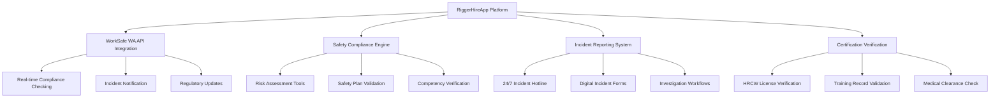

# WorkSafe WA Compliance Framework
## RiggerHireApp Enterprise Platform

---

**Document Classification:** Enterprise Compliance  
**Version:** 1.0  
**Effective Date:** January 2025  
**Review Date:** January 2026  
**Owner:** Chief Compliance Officer  
**Approved By:** Executive Management Team

---

## Table of Contents

1. [Executive Summary](#executive-summary)
2. [Regulatory Framework](#regulatory-framework)
3. [Platform Compliance Architecture](#platform-compliance-architecture)
4. [Safety Management System](#safety-management-system)
5. [Incident Reporting and Management](#incident-reporting-and-management)
6. [Worker Safety Verification](#worker-safety-verification)
7. [Employer Due Diligence](#employer-due-diligence)
8. [Compliance Monitoring](#compliance-monitoring)
9. [Training and Competency](#training-and-competency)
10. [Audit and Review](#audit-and-review)
11. [Implementation Timeline](#implementation-timeline)

---

## Executive Summary

The RiggerHireApp platform operates as a digital workforce intermediary in Western Australia's construction and mining industries, connecting certified workers with employers while maintaining strict adherence to WorkSafe WA regulations and the Work Health and Safety Act 2020 (WA).

This compliance framework ensures that all platform activities, from worker registration to job completion, meet or exceed the highest safety standards required for high-risk construction work (HRCW) in Western Australia.

---

## Regulatory Framework

### Primary Legislation

#### Work Health and Safety Act 2020 (WA)
- **Section 19:** Primary duty of care for persons conducting a business or undertaking (PCBU)
- **Section 28:** Duty of workers
- **Section 29:** Duty of other persons at the workplace
- **Division 5:** Management of risks to health and safety

#### Work Health and Safety (General) Regulations 2022 (WA)
- **Part 6.5:** High-risk construction work
- **Part 6.6:** Construction induction training
- **Part 4.1:** Managing risks to health and safety
- **Part 8.1:** Consultation, representation, and participation

#### Occupational Safety and Health Regulations 1996 (WA)
- **Regulation 3.1:** General duty of employers
- **Regulation 3.64:** Training and instruction
- **Schedule 1:** Prescribed dangerous substances

### Supporting Standards

#### Australian Standards
- **AS/NZS 1891:** Industrial fall-arrest systems and devices
- **AS 2550:** Cranes, hoists and winches
- **AS/NZS 4801:** Occupational health and safety management systems
- **AS/NZS 4024:** Safeguarding of machinery

#### WorkSafe WA Codes of Practice
- **Construction Work Code of Practice 2022**
- **Cranes Code of Practice 2020**
- **Working at Heights Code of Practice 2022**
- **Rigging Code of Practice 2021**

---

## Platform Compliance Architecture

### 3.1 Digital Safety Management Integration



### 3.2 Compliance Data Architecture

#### Worker Safety Profile
```json
{
  "worker_id": "string",
  "safety_certifications": [
    {
      "type": "HRCW_GENERAL_INDUCTION",
      "certificate_number": "string",
      "issue_date": "ISO8601",
      "expiry_date": "ISO8601",
      "issuing_authority": "RTO_CODE",
      "verification_status": "VERIFIED|PENDING|EXPIRED",
      "worksafe_verification": "boolean"
    }
  ],
  "medical_clearances": [
    {
      "type": "PRE_EMPLOYMENT_MEDICAL",
      "assessment_date": "ISO8601",
      "valid_until": "ISO8601",
      "restrictions": ["string"],
      "fitness_level": "FIT|FIT_WITH_RESTRICTIONS|UNFIT"
    }
  ],
  "safety_record": {
    "incident_count": "integer",
    "lost_time_injuries": "integer",
    "near_misses_reported": "integer",
    "safety_score": "float",
    "last_incident_date": "ISO8601"
  }
}
```

### 3.3 Job Safety Requirements Matrix

| Risk Category | Certification Required | Medical Requirements | Training Hours | Supervision Level |
|---------------|----------------------|-------------------|----------------|------------------|
| **High Risk Construction** | HRCW General Induction + Specific | Pre-employment Medical | 40+ hours | Level 3 Supervisor |
| **Crane Operations** | Crane Operator License | Medical + Vision Test | 80+ hours | Licensed Crane Supervisor |
| **Rigging Operations** | Basic/Intermediate/Advanced Rigging | Pre-employment Medical | 20-60 hours | Qualified Rigger |
| **Working at Heights** | Work Safely at Heights | Medical Clearance | 8+ hours | Competent Person |
| **Confined Spaces** | Confined Space Entry | Medical + Respiratory | 16+ hours | Entry Supervisor |

---

## Safety Management System

### 4.1 Platform Safety Policy

**RiggerHireApp Safety Commitment:**

We are committed to providing a digital platform that facilitates the highest standards of workplace health and safety in Western Australia's construction and mining industries. Our platform ensures:

1. **Zero Harm Philosophy:** No compromise on safety standards
2. **Regulatory Compliance:** Full adherence to WA safety legislation
3. **Continuous Improvement:** Regular enhancement of safety processes
4. **Worker Empowerment:** Tools and information for safe work practices
5. **Employer Support:** Resources for maintaining safe workplaces

### 4.2 Risk Management Framework

#### Platform Risk Assessment Matrix

| Risk Level | Likelihood | Consequence | Controls Required |
|------------|------------|-------------|------------------|
| **Critical** | Almost Certain | Catastrophic | Immediate platform intervention, Work suspension |
| **High** | Likely | Major | Enhanced monitoring, Additional verification |
| **Medium** | Possible | Moderate | Standard controls, Regular review |
| **Low** | Unlikely | Minor | Basic controls, Periodic review |

#### Automated Risk Controls

```typescript
interface SafetyRiskControl {
  riskCategory: 'CRITICAL' | 'HIGH' | 'MEDIUM' | 'LOW';
  autoActions: {
    blockJobPosting: boolean;
    requireAdditionalVerification: boolean;
    escalateToSupervisor: boolean;
    notifyWorksafe: boolean;
    mandatoryTraining: string[];
  };
  humanReviewRequired: boolean;
  timeframe: string; // ISO8601 Duration
}
```

### 4.3 Due Diligence Framework

#### Employer Due Diligence Verification

**Mandatory Employer Compliance Checks:**

1. **ABN and Business Registration Verification**
2. **WorkSafe WA Registration Status**
3. **Workers' Compensation Insurance**
4. **Safety Management System Documentation**
5. **Incident History Review**
6. **Principal Contractor Obligations (where applicable)**

#### Worker Due Diligence Process

**Pre-Engagement Verification Steps:**

1. **Identity Verification:** 100-point ID check
2. **Qualification Verification:** Direct RTO validation
3. **Medical Clearance Verification:** Occupational health provider confirmation
4. **Work History Verification:** Previous employer references
5. **Safety Record Review:** Incident and injury history
6. **Police Clearance:** Where required by role

---

## Incident Reporting and Management

### 5.1 Digital Incident Reporting System

#### Incident Classification Framework

```typescript
enum IncidentType {
  FATALITY = 'FATALITY',
  SERIOUS_INJURY = 'SERIOUS_INJURY', 
  DANGEROUS_OCCURRENCE = 'DANGEROUS_OCCURRENCE',
  NEAR_MISS = 'NEAR_MISS',
  PROPERTY_DAMAGE = 'PROPERTY_DAMAGE',
  ENVIRONMENTAL = 'ENVIRONMENTAL'
}

enum NotificationTimeframe {
  IMMEDIATE = 'IMMEDIATE', // Within 1 hour
  URGENT = '24_HOURS',     // Within 24 hours
  STANDARD = '48_HOURS'    // Within 48 hours
}
```

#### Automated WorkSafe WA Notification

**Integration with WorkSafe WA Incident Portal:**

```javascript
class WorkSafeIncidentReporter {
  async reportIncident(incident: IncidentData): Promise<void> {
    // Validate incident data
    const validated = await this.validateIncidentData(incident);
    
    // Determine notification requirements
    const requirements = this.getNotificationRequirements(incident.type);
    
    // Submit to WorkSafe WA
    if (requirements.worksafeNotificationRequired) {
      await this.submitToWorkSafe(validated);
    }
    
    // Internal platform notifications
    await this.notifyStakeholders(incident);
    
    // Create investigation workflow
    await this.initiateInvestigation(incident);
  }
}
```

### 5.2 Investigation Management

#### Digital Investigation Workflow

1. **Immediate Response (0-1 hour)**
   - Scene preservation instructions
   - Medical assistance coordination
   - WorkSafe WA notification (if required)
   - Initial witness identification

2. **Investigation Setup (1-24 hours)**
   - Investigation team assignment
   - Evidence collection protocols
   - Stakeholder notifications
   - Preliminary cause analysis

3. **Detailed Investigation (24-72 hours)**
   - Root cause analysis
   - Contributing factor identification
   - Corrective action development
   - Prevention measure design

4. **Resolution and Learning (3-14 days)**
   - Final report preparation
   - Action plan implementation
   - Industry lesson sharing
   - System improvement integration

---

## Worker Safety Verification

### 6.1 Automated Certification Checking

#### Real-Time Qualification Verification

```python
class CertificationVerifier:
    def __init__(self):
        self.rto_integrations = RTOIntegrationManager()
        self.worksafe_api = WorkSafeAPIClient()
        self.medical_providers = MedicalProviderNetwork()
    
    async def verify_worker_qualifications(self, worker_id: str) -> VerificationResult:
        """Comprehensive worker qualification verification"""
        
        # Check HRCW General Induction
        hrcw_status = await self.verify_hrcw_induction(worker_id)
        
        # Verify specific trade qualifications
        trade_quals = await self.verify_trade_qualifications(worker_id)
        
        # Check medical clearances
        medical_status = await self.verify_medical_clearances(worker_id)
        
        # Validate license currencies
        license_status = await self.verify_licenses(worker_id)
        
        # Calculate overall eligibility score
        eligibility_score = self.calculate_eligibility_score({
            'hrcw': hrcw_status,
            'trade': trade_quals,
            'medical': medical_status,
            'licenses': license_status
        })
        
        return VerificationResult(
            eligible=eligibility_score >= MINIMUM_ELIGIBILITY_THRESHOLD,
            score=eligibility_score,
            deficiencies=self.identify_deficiencies(),
            recommendations=self.generate_recommendations()
        )
```

### 6.2 Competency Assessment Framework

#### Skills Verification Matrix

| Competency Unit | Verification Method | Refresh Period | Risk Impact |
|-----------------|-------------------|----------------|-------------|
| **RIIMPO318E** - Conduct crane operations | Practical assessment + Log book | 3 years | Critical |
| **RIIHAN301F** - Operate elevating work platform | Practical + Written test | 5 years | High |
| **RIIMPO317F** - Conduct dogging | Skills demonstration | 5 years | High |
| **RIISAM201E** - Handle resources/materials | Competency interview | Annual | Medium |
| **RIIWHS302E** - Implement WHS requirements | Written assessment | 3 years | High |

#### Automated Competency Tracking

```typescript
interface CompetencyRecord {
  unitCode: string;
  unitTitle: string;
  achievementDate: Date;
  expiryDate: Date;
  assessorDetails: {
    name: string;
    rtoCode: string;
    assessorNumber: string;
  };
  evidencePortfolio: {
    practicalAssessment: boolean;
    writtenAssessment: boolean;
    workSamples: boolean;
    logBookHours: number;
  };
  renewalRequired: boolean;
  riskCategory: 'CRITICAL' | 'HIGH' | 'MEDIUM' | 'LOW';
}
```

---

## Employer Due Diligence

### 7.1 Principal Contractor Obligations

#### Digital PCBU Management System

**Principal Contractor Dashboard Features:**

1. **Worker Verification Status**
   - Real-time certification checking
   - Medical clearance monitoring
   - Competency gap identification
   - Training requirement alerts

2. **Site Safety Management**
   - Safety plan validation
   - Risk assessment tools
   - Method statement approval
   - Permit-to-work systems

3. **Compliance Monitoring**
   - Regulatory requirement tracking
   - Inspection scheduling
   - Non-compliance alerts
   - Corrective action management

#### Automated Due Diligence Checks

```javascript
class EmployerDueDiligenceChecker {
  async validateEmployerCompliance(employerId: string): Promise<ComplianceStatus> {
    const checks = await Promise.all([
      this.verifyBusinessRegistration(employerId),
      this.checkWorkersCompensation(employerId),
      this.validateSafetyManagementSystem(employerId),
      this.reviewIncidentHistory(employerId),
      this.checkRegulatoryNotices(employerId),
      this.validateInsuranceCover(employerId)
    ]);
    
    const overallScore = this.calculateComplianceScore(checks);
    const riskRating = this.determineRiskRating(overallScore);
    
    return {
      compliant: overallScore >= MINIMUM_COMPLIANCE_THRESHOLD,
      score: overallScore,
      riskRating: riskRating,
      deficiencies: this.identifyDeficiencies(checks),
      recommendations: this.generateRecommendations(checks),
      nextReviewDate: this.calculateNextReviewDate(riskRating)
    };
  }
}
```

### 7.2 Workplace Safety Coordination

#### Multi-Employer Worksite Management

**Coordination Requirements:**

1. **Safety Interface Management**
   - Overlapping work identification
   - Hazard interface mapping
   - Communication protocol establishment
   - Emergency response coordination

2. **Shared Facility Safety**
   - Common area risk assessment
   - Shared equipment safety
   - Emergency egress management
   - First aid facility coordination

---

## Compliance Monitoring

### 8.1 Automated Compliance Dashboard

#### Real-Time Compliance Metrics

```typescript
interface ComplianceMetrics {
  overallComplianceScore: number;
  criticalNonConformances: number;
  workerCertificationStatus: {
    current: number;
    expiring30Days: number;
    expired: number;
  };
  employerComplianceStatus: {
    fullyCompliant: number;
    minorIssues: number;
    majorIssues: number;
    suspended: number;
  };
  incidentMetrics: {
    reportedThisMonth: number;
    ltifr: number; // Lost Time Injury Frequency Rate
    trifr: number; // Total Recordable Injury Frequency Rate
  };
  regulatoryStatus: {
    activeNotices: number;
    pendingInspections: number;
    overdueActions: number;
  };
}
```

#### Predictive Compliance Analytics

**Machine Learning Risk Prediction Model:**

```python
import pandas as pd
from sklearn.ensemble import RandomForestClassifier
from sklearn.preprocessing import StandardScaler

class ComplianceRiskPredictor:
    def __init__(self):
        self.model = RandomForestClassifier(n_estimators=100, random_state=42)
        self.scaler = StandardScaler()
        self.feature_columns = [
            'worker_certification_score',
            'employer_compliance_score',
            'incident_history_score',
            'safety_training_hours',
            'site_risk_category',
            'weather_risk_factor',
            'project_complexity_score'
        ]
    
    def predict_compliance_risk(self, engagement_data: dict) -> dict:
        """Predict compliance risk for a worker-employer engagement"""
        
        features = self.extract_features(engagement_data)
        features_scaled = self.scaler.transform([features])
        
        risk_probability = self.model.predict_proba(features_scaled)[0]
        risk_level = self.model.predict(features_scaled)[0]
        
        return {
            'risk_level': risk_level,
            'risk_probability': {
                'low': risk_probability[0],
                'medium': risk_probability[1],
                'high': risk_probability[2],
                'critical': risk_probability[3]
            },
            'recommended_controls': self.generate_risk_controls(risk_level),
            'monitoring_frequency': self.determine_monitoring_frequency(risk_level)
        }
```

### 8.2 Regulatory Compliance Tracking

#### WorkSafe WA Integration Points

1. **Incident Notification System**
   - Automatic incident classification
   - Real-time WorkSafe notification
   - Investigation progress tracking
   - Outcome reporting automation

2. **Inspection Management**
   - Inspector appointment scheduling
   - Document preparation automation
   - Finding response tracking
   - Corrective action monitoring

3. **Regulatory Update Management**
   - Automatic regulation change notifications
   - Impact assessment workflows
   - Implementation planning tools
   - Compliance gap analysis

---

## Training and Competency

### 9.1 Digital Learning Management System

#### Integrated Training Platform

**Features:**

1. **Personalized Learning Paths**
   - Role-specific training requirements
   - Competency gap identification
   - Progressive skill development
   - Micro-learning modules

2. **Virtual Reality Safety Training**
   - Immersive hazard recognition
   - Emergency response simulation
   - Equipment operation training
   - Risk assessment practice

3. **Competency Assessment Tools**
   - Digital practical assessments
   - Knowledge verification tests
   - Workplace observation tools
   - Portfolio evidence collection

#### Training Compliance Tracking

```typescript
interface TrainingRecord {
  workerId: string;
  trainingProvider: {
    name: string;
    rtoCode: string;
    accreditation: string;
  };
  competencyUnits: CompetencyUnit[];
  assessmentResults: {
    practical: AssessmentResult;
    written: AssessmentResult;
    workplace: AssessmentResult;
  };
  certificationDetails: {
    certificateNumber: string;
    issueDate: Date;
    expiryDate: Date;
    renewalRequired: boolean;
  };
  continuousLearning: {
    cpdHours: number;
    refresherTraining: TrainingSession[];
    skillUpdates: SkillUpdate[];
  };
}
```

### 9.2 Continuous Professional Development

#### Mandatory CPD Requirements

| Role Category | Annual CPD Hours | Mandatory Components | Verification Method |
|---------------|------------------|---------------------|-------------------|
| **Licensed Crane Operator** | 20 hours | 8 hrs technical, 4 hrs safety, 8 hrs general | Log book + assessment |
| **High Risk Work Supervisor** | 16 hours | 8 hrs regulatory, 4 hrs leadership, 4 hrs technical | Portfolio + interview |
| **Safety Representative** | 12 hours | 8 hrs safety updates, 4 hrs consultation | Attendance + test |
| **General Construction Worker** | 8 hours | 4 hrs safety, 4 hrs skills update | Attendance verification |

---

## Audit and Review

### 10.1 Internal Audit Program

#### Compliance Audit Framework

**Audit Schedule:**
- **Monthly:** High-risk processes and critical controls
- **Quarterly:** Overall system effectiveness and regulatory compliance
- **Annually:** Comprehensive system review and improvement planning

**Audit Scope Areas:**

1. **Platform Safety Management**
   - Worker verification processes
   - Employer due diligence procedures
   - Incident reporting and investigation
   - Training and competency management

2. **Regulatory Compliance**
   - WorkSafe WA requirement adherence
   - Incident notification timeliness
   - Documentation completeness
   - Corrective action effectiveness

3. **System Reliability**
   - Automated control effectiveness
   - Data accuracy and integrity
   - User experience and accessibility
   - Performance and availability

#### Digital Audit Tools

```python
class ComplianceAuditor:
    def __init__(self):
        self.audit_templates = AuditTemplateManager()
        self.evidence_collector = DigitalEvidenceCollector()
        self.report_generator = AuditReportGenerator()
    
    async def conduct_compliance_audit(self, audit_scope: AuditScope) -> AuditReport:
        """Automated compliance audit execution"""
        
        # Initialize audit session
        audit_session = await self.initialize_audit(audit_scope)
        
        # Collect digital evidence
        evidence = await self.evidence_collector.gather_evidence(audit_scope)
        
        # Perform automated testing
        test_results = await self.execute_automated_tests(audit_scope)
        
        # Analyze compliance gaps
        gaps = await self.analyze_compliance_gaps(evidence, test_results)
        
        # Generate findings and recommendations
        findings = await self.generate_findings(gaps)
        recommendations = await self.generate_recommendations(findings)
        
        # Prepare audit report
        report = await self.report_generator.create_report({
            'audit_session': audit_session,
            'evidence': evidence,
            'findings': findings,
            'recommendations': recommendations,
            'action_plan': await self.create_action_plan(recommendations)
        })
        
        return report
```

### 10.2 External Audit and Certification

#### Third-Party Audit Requirements

**Annual External Audits:**

1. **WorkSafe WA Compliance Audit**
   - Regulatory requirement adherence
   - Incident management effectiveness
   - Safety management system evaluation

2. **Privacy and Data Security Audit**
   - Privacy Act 1988 compliance
   - Cybersecurity framework assessment
   - Data governance evaluation

3. **Quality Management System Audit**
   - ISO 9001:2015 compliance
   - Process effectiveness evaluation
   - Continuous improvement assessment

#### Certification Maintenance

**Required Certifications:**

- **AS/NZS 4801:** Occupational Health and Safety Management System
- **ISO 27001:** Information Security Management System
- **ISO 9001:** Quality Management System
- **SOC 2 Type II:** Security and Availability Controls

---

## Implementation Timeline

### 11.1 Phase 1: Foundation (Months 1-3)

**Core System Implementation:**

- [ ] **Month 1:** WorkSafe WA API integration and incident reporting system
- [ ] **Month 2:** Worker verification and certification checking systems
- [ ] **Month 3:** Employer due diligence and compliance monitoring dashboard

**Key Deliverables:**
- Automated incident reporting to WorkSafe WA
- Real-time worker certification verification
- Basic compliance dashboard functionality

### 11.2 Phase 2: Enhancement (Months 4-6)

**Advanced Features Development:**

- [ ] **Month 4:** Predictive compliance analytics and risk assessment tools
- [ ] **Month 5:** Digital training platform integration and competency tracking
- [ ] **Month 6:** Comprehensive audit management system

**Key Deliverables:**
- Machine learning risk prediction models
- Integrated learning management system
- Automated audit and review processes

### 11.3 Phase 3: Optimization (Months 7-12)

**Continuous Improvement:**

- [ ] **Months 7-9:** User experience optimization and mobile app enhancements
- [ ] **Months 10-12:** Advanced analytics, reporting, and regulatory integration

**Key Deliverables:**
- Enhanced user interfaces and mobile functionality
- Comprehensive regulatory compliance automation
- Advanced analytics and business intelligence tools

---

## Document Control

**Document Information:**
- **Title:** WorkSafe WA Compliance Framework
- **Document ID:** COMP-WA-001
- **Version:** 1.0
- **Classification:** Enterprise Compliance
- **Owner:** Chief Compliance Officer
- **Approved By:** Executive Management Team

**Review History:**
| Version | Date | Author | Changes |
|---------|------|--------|---------|
| 1.0 | January 2025 | Compliance Team | Initial framework creation |

**Distribution List:**
- Executive Management Team
- Chief Technology Officer
- Chief Compliance Officer
- Legal Counsel
- Operations Manager
- Development Team Leads

**Next Review:** January 2026

---

*This document contains confidential and proprietary information. Distribution is restricted to authorized personnel only.*

**© 2025 Tiation Technology Pty Ltd. All rights reserved.**