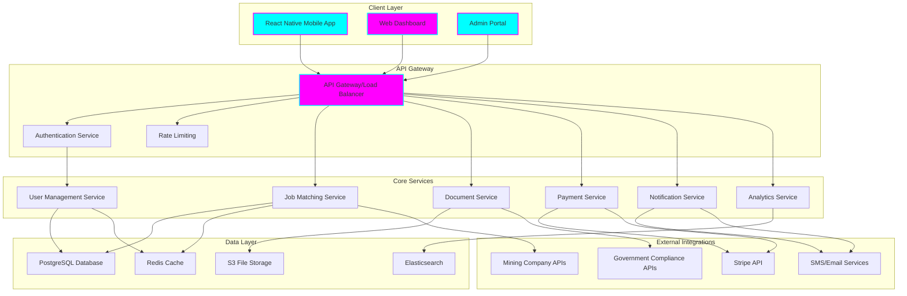
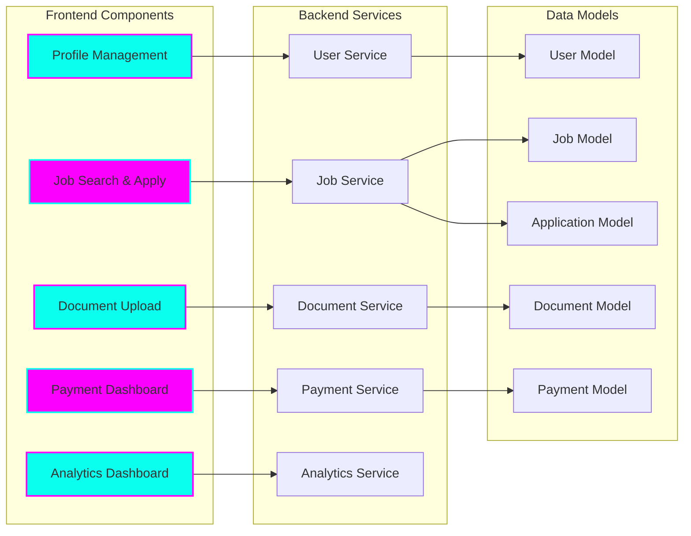
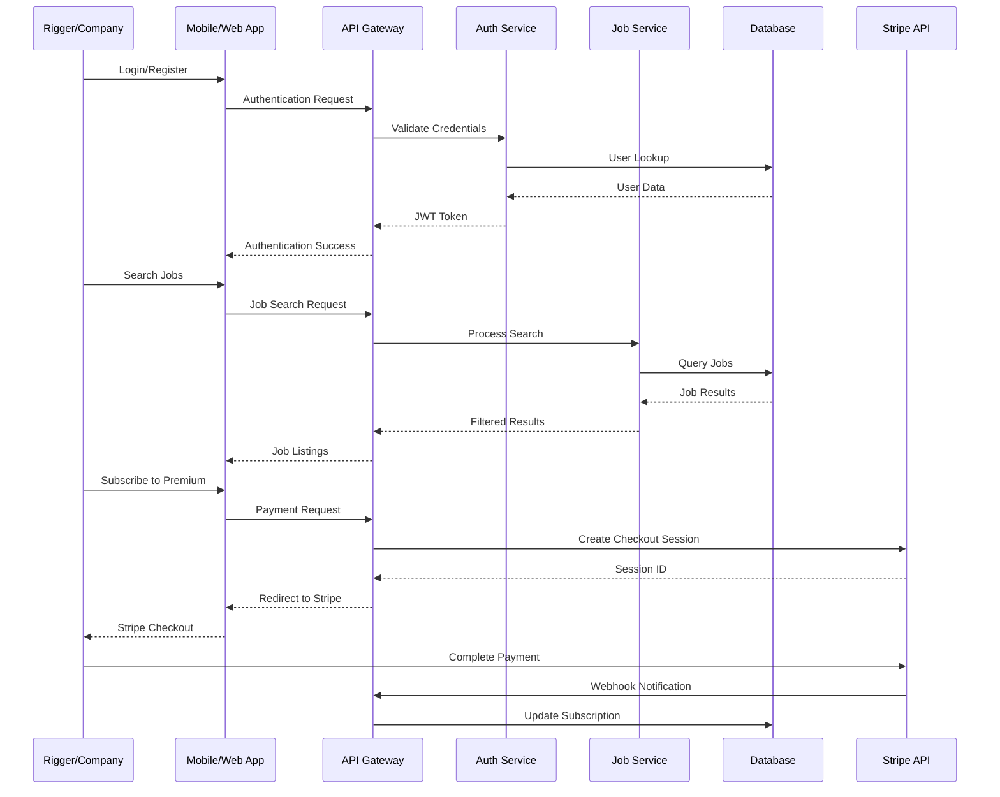
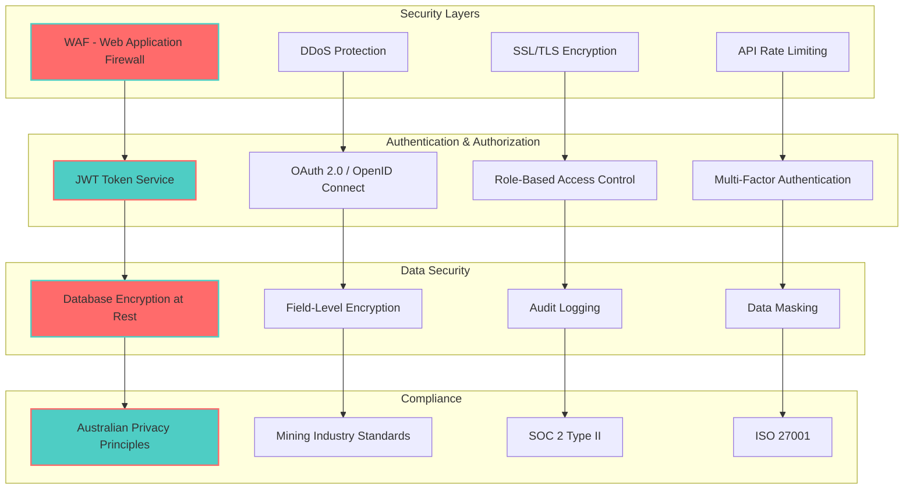
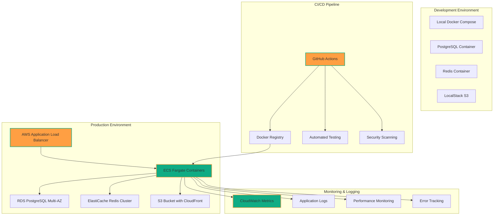
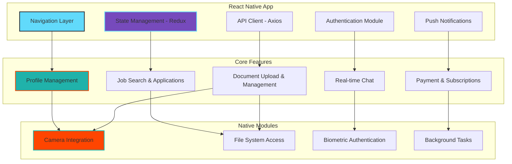

# 🏗️ Tiation Rigger Workspace - System Architecture

## Overview
The Tiation Rigger Workspace is built using a modern, scalable microservices architecture designed for enterprise-grade performance in the mining and construction industry.

## High-Level Architecture

## Component Architecture

## Data Flow Architecture

## Security Architecture

## Infrastructure Architecture

## Mobile App Architecture

## Technology Stack

| Layer | Technology | Purpose |
|-------|------------|---------|
| **Frontend** | React Native, TypeScript | Cross-platform mobile development |
| **Web Dashboard** | React, Next.js, Tailwind CSS | Admin and web interface |
| **Backend API** | Node.js, Express, TypeScript | RESTful API services |
| **Database** | PostgreSQL, Prisma ORM | Primary data storage |
| **Cache** | Redis | Session management, caching |
| **File Storage** | AWS S3, CloudFront | Document and media storage |
| **Search** | Elasticsearch | Advanced job search capabilities |
| **Payments** | Stripe | Subscription and payment processing |
| **Authentication** | JWT, OAuth 2.0 | Secure user authentication |
| **Deployment** | Docker, AWS ECS, GitHub Actions | Container orchestration and CI/CD |
| **Monitoring** | CloudWatch, Sentry | Application monitoring and error tracking |

## Scalability Considerations

### Horizontal Scaling
- Microservices architecture allows independent scaling
- Load balancers distribute traffic across multiple instances
- Database read replicas for improved read performance

### Performance Optimization
- Redis caching for frequently accessed data
- CDN for static assets and document delivery
- Database indexing for optimized queries
- Lazy loading and pagination for large datasets

### High Availability
- Multi-AZ database deployment
- Auto-scaling groups with health checks
- Circuit breaker pattern for external API calls
- Graceful degradation for non-critical features

## Security Best Practices

1. **Zero Trust Architecture** - Never trust, always verify
2. **End-to-End Encryption** - Data encrypted in transit and at rest
3. **Regular Security Audits** - Automated and manual security assessments
4. **Compliance Monitoring** - Continuous compliance with industry standards
5. **Incident Response Plan** - Documented procedures for security incidents
