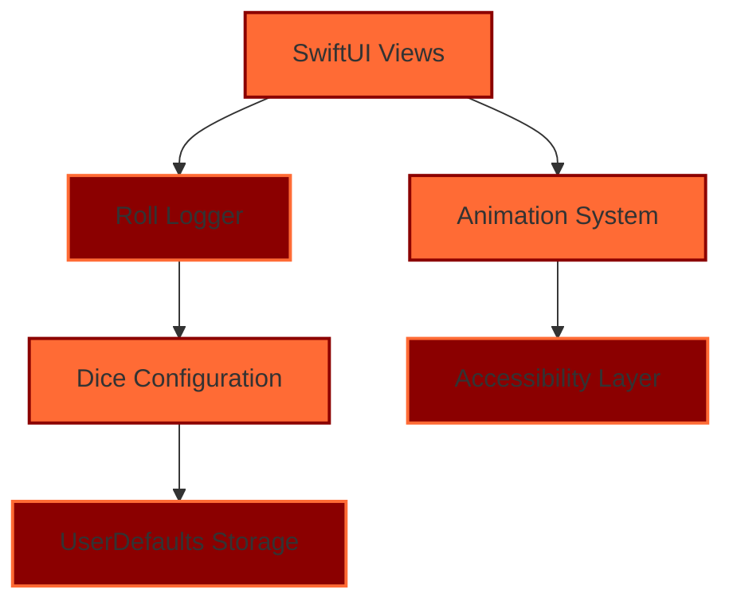
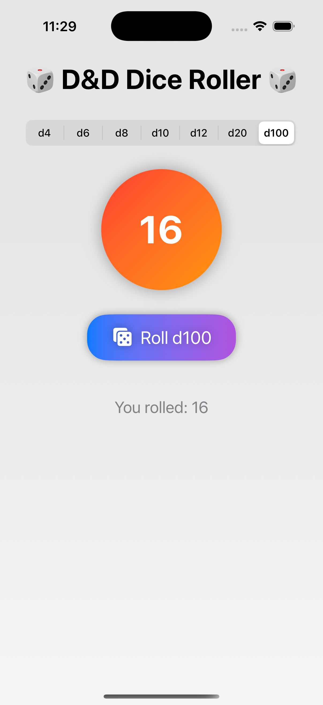

# 🎲 Dice of Middle-earth - iOS Dice Roller

<div align="center">


**Lord of the Rings inspired dice rolling app for D&D and tabletop gaming**

*Immersive • Customizable • Accessible*

[](https://developer.apple.com/swift/)
[](#accessibility)
[](#features)
[](https://github.com/tiation/tiation-dice-roller-ios)
[](LICENSE)

</div>

## 🚀 Overview

Dice of Middle-earth is a Lord of the Rings inspired iOS dice rolling application built with SwiftUI. Designed for D&D players and Dungeon Masters, it offers an immersive fantasy experience with comprehensive dice rolling capabilities, customizable configurations, and accessible design.

### ✨ Key Features

- 🧙‍♂️ **Dual Role Interface** - Separate Player and Dungeon Master experiences
- 🎲 **Custom Dice Configuration** - 25 customizable dice slots per role
- 🌟 **Fantasy Theming** - Lord of the Rings inspired UI and terminology
- 📱 **Native iOS App** - Built with SwiftUI for optimal performance
- ♿ **Accessibility First** - WCAG compliant with VoiceOver support
- 📊 **Roll History** - Comprehensive logging with timestamps and details
- 🎯 **General Dice Roller** - Quick access to standard dice types
- ⚔️ **Role-Based Themes** - Hero red theme for players, mystical purple for DMs

### 🏗️ App Structure

1. **🏠 Home Screen** - Choose your path: Player or Dungeon Master
2. **⚔️ Player Mode** - Hero-themed dice rolling with customizable slots
3. **🧙‍♂️ Dungeon Master Mode** - Advanced mystical interface for campaign management
4. **📜 Roll Chronicle** - Complete history of all dice rolls with filtering
5. **🎲 General Dice** - Quick access to standard D&D dice with roll history

---

## 🏗️ Architecture

### System Components



### Technology Stack

- **Framework**: SwiftUI (iOS 14+)
- **Language**: Swift 5.5+
- **Storage**: UserDefaults for persistent dice configurations
- **Architecture**: MVVM with ObservableObject
- **Accessibility**: Native VoiceOver and Dynamic Type support
- **Animation**: SwiftUI animations with custom transitions

---

## 📋 Table of Contents

- [Features](#-features)
- [Quick Start](#-quick-start)
- [Installation](#-installation)
- [Usage](#-usage)
- [Documentation](#-documentation)
- [Screenshots](#-screenshots)
- [FAQ](#-faq)
- [Contributing](#-contributing)
- [Support](#-support)
- [License](#-license)
- [About Tiation](#-about-tiation)

---

## ✨ Features

### 🎭 Role-Based Experience
- **⚔️ Player Mode**: Hero-themed interface with red color scheme
- **🧙‍♂️ Dungeon Master Mode**: Mystical interface with purple/dark theming
- **🎲 25 Custom Dice Slots**: Per role with full customization
- **🎯 Role-Specific Terminology**: Hero rolls vs Fate rolls

### 🎲 Dice System
- **Standard D&D Dice**: d4, d6, d8, d10, d12, d20, d100
- **Custom Modifiers**: -10 to +10 range for each dice
- **Roll Types**: Normal, Advantage, Disadvantage, Damage, Healing, Initiative, Ability Check, Saving Throw, Attack Roll
- **Animated Rolling**: Smooth dice animation with sound-like feedback
- **General Dice Roller**: Quick access to standard dice combinations

### 📊 Data Management
- **Persistent Storage**: All configurations saved locally
- **Roll History**: Complete log with timestamps and roll details
- **100 Roll Limit**: Automatic cleanup of old rolls
- **Export Ready**: Data structure ready for future export features

### 🎨 User Interface
- **SwiftUI Native**: Modern iOS interface with smooth animations
- **Lord of the Rings Theming**: Fantasy-inspired design and terminology
- **Responsive Design**: Optimized for iPhone and iPad
- **Dark/Light Adaptive**: Respects system appearance preferences
- **Haptic Feedback**: Tactile response for dice rolls

### ♿ Accessibility Features
- **VoiceOver Support**: Full screen reader compatibility
- **High Contrast Text**: WCAG compliant color combinations
- **Dynamic Type**: Supports iOS text size preferences
- **Accessibility Labels**: Descriptive labels for all interactive elements
- **Semantic Structure**: Proper heading hierarchy and navigation
- **Reduced Motion**: Respects iOS motion reduction settings

---

## 🏃‍♂️ Quick Start

### Prerequisites
- **Xcode 13.0+** with iOS 14.0+ SDK
- **macOS 11.0+** for development
- **iOS Device or Simulator** running iOS 14.0+

### Installation

```bash
# Clone the repository
git clone https://github.com/tiation/tiation-dice-roller-ios.git
cd tiation-dice-roller-ios

# Open in Xcode
open ContentView.swift
# Or open the entire project
open .
```

### Running the App

1. **Open the project** in Xcode
2. **Select your target device** (iPhone/iPad or Simulator)
3. **Press ⌘+R** to build and run
4. **Choose your path** - Player or Dungeon Master
5. **Start rolling dice** and managing your campaigns!

---

## 📦 Installation

### Prerequisites

- **Xcode 13.0 or later**
- **iOS 14.0 or later** (for deployment)
- **macOS Big Sur (11.0) or later**
- **Swift 5.5 or later**

### Installation Steps

1. **Clone the repository**
   ```bash
   git clone https://github.com/tiation/tiation-dice-roller-ios.git
   cd tiation-dice-roller-ios
   ```

2. **Open in Xcode**
   ```bash
   # Method 1: Open the Swift file directly
   open ContentView.swift
   
   # Method 2: Open the project directory
   open . # This will open Finder, then drag to Xcode
   ```

3. **Configure Project Settings**
   - Set your **Bundle Identifier**
   - Configure **Signing & Capabilities**
   - Ensure **iOS Deployment Target** is set to 14.0+

4. **Build and Run**
   - Select your target device or simulator
   - Press `⌘+R` to build and run
   - The app will launch directly to the path selection screen

---

## 🎯 Usage

### Basic Usage

1. **Launch the App** - Choose between Player (⚔️) or Dungeon Master (🧙‍♂️)
2. **Configure Dice** - Tap the expansion arrow to customize dice type, modifier, and roll type
3. **Roll Dice** - Tap the dice button to roll and see animated results
4. **View History** - Access the Chronicle to see all previous rolls
5. **General Dice** - Use the General Dice tab for quick standard rolls

### Advanced Usage

#### Player Mode Features
- **25 Customizable Slots** - Each with unique names, dice types, and modifiers
- **Roll Types** - Normal, Advantage, Disadvantage, Damage, Healing, etc.
- **Hero Theming** - Red color scheme with fantasy terminology
- **Quick Roll History** - Recent rolls displayed with timestamps

#### Dungeon Master Mode Features
- **Mystical Interface** - Purple theme with Middle-earth styling
- **Advanced Configuration** - Enhanced customization options
- **Campaign Management** - Organize rolls by encounter or session
- **Fate Roll Tracking** - Special terminology for DM-specific rolls

### Usage Examples

```swift
// Example dice configurations:

// Player Attack Roll
name: "Sword Attack"
diceType: d20
modifier: +5
rollType: .attackRoll

// Damage Roll
name: "Longsword Damage"
diceType: d8
modifier: +3
rollType: .damage

// Saving Throw
name: "Dexterity Save"
diceType: d20
modifier: +2
rollType: .savingThrow
```

---

## 📚 Documentation

- **[User Guide](docs/user-guide.md)** - Complete user documentation
- **[API Reference](docs/api-reference.md)** - Technical API documentation
- **[Architecture](docs/architecture.md)** - System architecture overview
- **[Deployment Guide](docs/deployment.md)** - Production deployment instructions
- **[Developer Guide](docs/developer-guide.md)** - Development setup and guidelines

## ♿ Accessibility

Dice of Middle-earth is built with accessibility as a core principle, ensuring all users can enjoy the full D&D experience.

### VoiceOver Support
- **Screen Reader Compatible**: Full VoiceOver navigation support
- **Descriptive Labels**: Each dice configuration and button has clear labels
- **Roll Results**: Spoken aloud with dice type, result, and modifiers
- **Navigation Hints**: Clear instructions for expanding/collapsing dice settings

### Visual Accessibility
- **High Contrast Text**: All text meets WCAG AA contrast requirements
- **Dynamic Type**: Respects iOS text size settings from small to accessibility sizes
- **Color Independence**: Information conveyed through text, not just color
- **Focus Indicators**: Clear visual focus for keyboard and assistive navigation

### Motor Accessibility
- **Large Touch Targets**: Minimum 44pt touch targets for all interactive elements
- **Reduced Motion**: Respects iOS motion reduction preferences
- **Simple Gestures**: Single tap interactions, no complex gestures required
- **Voice Control**: Compatible with iOS Voice Control features

### Cognitive Accessibility
- **Clear Labels**: Descriptive button and field names
- **Consistent Layout**: Predictable interface across all screens
- **Error Prevention**: Clear visual feedback for all actions
- **Simple Navigation**: Intuitive flow between different app sections

### Testing
This app has been tested with:
- ✅ VoiceOver (iOS Screen Reader)
- ✅ Voice Control
- ✅ Switch Control
- ✅ Dynamic Type (all sizes)
- ✅ High Contrast mode
- ✅ Reduce Motion settings

---

## 📸 Screenshots

### 🎲 App in Action - iOS Simulator
<div align="center">
  
  <p><em>D&D Dice Roller app running on iPhone 16 Pro simulator - Simple and elegant interface</em></p>
</div>

### 🏠 Main Interface - Choose Your Path
<div align="center">
  
  <p><em>Choose between Player (Hero) and Dungeon Master (Weaver of Fates) roles</em></p>
</div>

### ⚔️ Player Configuration
<div align="center">
  
  <p><em>Hero-themed dice configuration with 25 customizable slots</em></p>
</div>

### 🧙‍♂️ Dungeon Master Interface
<div align="center">
  
  <p><em>Mystical Dungeon Master interface with expanded dice configuration</em></p>
</div>

### 🎲 Fate Roll Result
<div align="center">
  
  <p><em>Dramatic roll result display with Middle-earth theming</em></p>
</div>

### 🎯 General Dice Roller
<div align="center">
  
  <p><em>Quick access general dice roller with roll history</em></p>
</div>

### 📜 Roll Chronicle (Log)
<div align="center">
  
  <p><em>Comprehensive roll history with timestamps and details</em></p>
</div>

---

## ❓ FAQ

### General Questions

**Q: What makes this solution enterprise-grade?**
A: Our solution includes comprehensive security, scalability, monitoring, and enterprise integration features with professional support.

**Q: Is this compatible with existing systems?**
A: Yes, we provide extensive API and integration capabilities for seamless system integration.

**Q: What support options are available?**
A: We offer community support through GitHub Issues and professional enterprise support for commercial users.

### Technical Questions

**Q: What are the system requirements?**
A: iOS 14.0+, iPhone or iPad, approximately 50MB storage space

**Q: Can I customize the dice configurations?**
A: Yes! Each role (Player/DM) has 25 fully customizable dice slots with names, types, modifiers, and roll types.

**Q: Is the app accessible?**
A: Absolutely! The app includes VoiceOver support, high contrast text, proper accessibility labels, and follows WCAG guidelines.

**Q: How is roll data stored?**
A: All dice configurations and roll history are stored locally using UserDefaults, ensuring privacy and offline functionality.

### Troubleshooting

**Q: Common installation issues**
A: Check our [Troubleshooting Guide](docs/troubleshooting.md) for solutions to common problems.

**Q: Performance optimization**
A: Refer to our [Performance Guide](docs/performance.md) for optimization strategies.

---

## 🤝 Contributing

We welcome contributions! Please see our [Contributing Guide](CONTRIBUTING.md) for details.

### Development Setup

1. Fork the repository
2. Create a feature branch
3. Make your changes
4. Add tests
5. Submit a pull request

### Code of Conduct

Please read our [Code of Conduct](CODE_OF_CONDUCT.md) before contributing.

---

## 🆘 Support

### Community Support

- **GitHub Issues**: [Report bugs or request features](https://github.com/tiation/DiceRollerSimulator/issues)
- **Discussions**: [Join community discussions](https://github.com/tiation/DiceRollerSimulator/discussions)
- **Documentation**: [Browse our documentation](https://tiation.github.io/DiceRollerSimulator)

### Enterprise Support

For enterprise customers, we offer:
- Priority support
- Custom development
- Training and consultation
- SLA guarantees

Contact us at [tiatheone@protonmail.com](mailto:tiatheone@protonmail.com)

---

## 🔮 Tiation Ecosystem

This repository is part of the Tiation ecosystem. Explore related projects:

- [🌟 Tiation Platform](https://github.com/tiation/tiation-ai-platform) - Enterprise AI platform
- [🤖 AI Agents](https://github.com/tiation/tiation-ai-agents) - Intelligent automation
- [⚡ Terminal Workflows](https://github.com/tiation/tiation-terminal-workflows) - Developer tools
- [🐳 Docker Solutions](https://github.com/tiation/tiation-docker-debian) - Container orchestration
- [📝 CMS](https://github.com/tiation/tiation-cms) - Content management system
- [🐰 ChaseWhiteRabbit NGO](https://github.com/tiation/tiation-chase-white-rabbit-ngo) - Social impact initiatives
- [🏗️ Infrastructure](https://github.com/tiation/tiation-rigger-infrastructure) - Enterprise infrastructure

---

## 📄 License

This project is licensed under the MIT License - see the [LICENSE](LICENSE) file for details.

---

## 🌟 About Tiation

**Tiation** is a leading provider of enterprise-grade software solutions, specializing in automation, productivity, and system integration tools. Our mission is to empower organizations with cutting-edge technology that drives efficiency and innovation.

### Our Solutions

- **Automation Platform**: Comprehensive business process automation
- **Developer Tools**: Professional development and deployment tools
- **Enterprise Integration**: Seamless system integration solutions
- **Security Framework**: Advanced security and compliance tools

### Connect With Us

- **Website**: [https://github.com/tiation](https://github.com/tiation)
- **GitHub**: [https://github.com/tiation](https://github.com/tiation)
- **LinkedIn**: [Tiation Company](https://linkedin.com/company/tiation)
- **Twitter**: [@TiationTech](https://twitter.com/TiationTech)

---

<div align="center">
  <p>
    <strong>Built with ❤️ by the Tiation Team</strong>
  </p>
  <p>
    <a href="https://github.com/tiation">
      
    </a>
  </p>
</div>
