# PosCalls4U Data Flow Documentation

## Key Data Flows Overview

This document outlines the critical data flows within the PosCalls4U system, from player stats collection through projection logic to UI rendering. Understanding these flows is essential for development, debugging, and system optimization.

## 1. User Authentication Flow

### Registration Flow
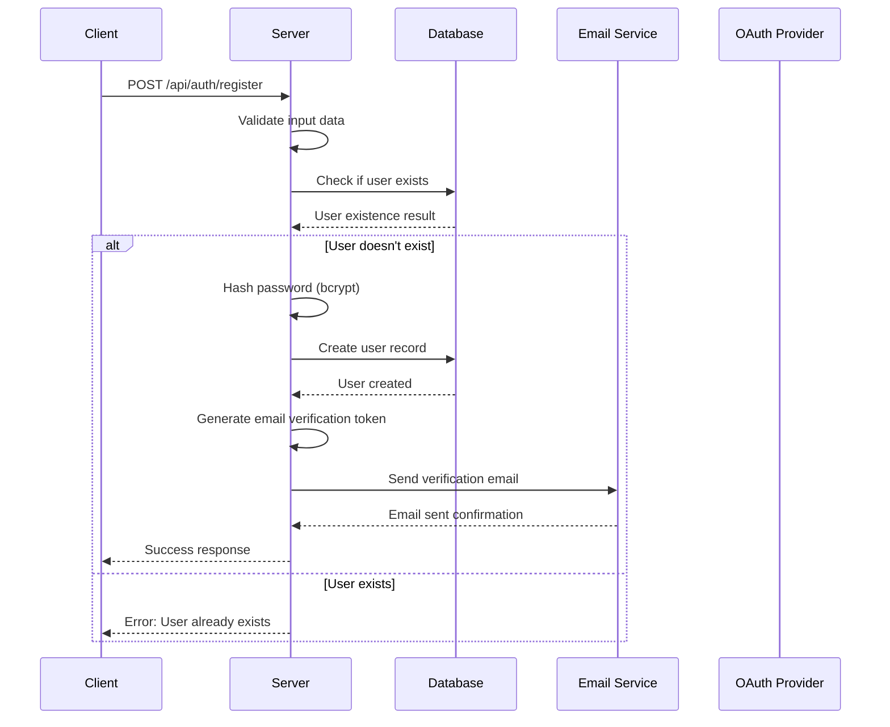
```mermaid
sequenceDiagram
    participant C as Client
    participant S as Server
    participant DB as Database
    participant E as Email Service
    participant O as OAuth Provider

    C->>S: POST /api/auth/register
    S->>S: Validate input data
    S->>DB: Check if user exists
    DB-->>S: User existence result
    
    alt User doesn't exist
        S->>S: Hash password (bcrypt)
        S->>DB: Create user record
        DB-->>S: User created
        S->>S: Generate email verification token
        S->>E: Send verification email
        E-->>S: Email sent confirmation
        S-->>C: Success response
    else User exists
        S-->>C: Error: User already exists
    end
```

### Login Flow
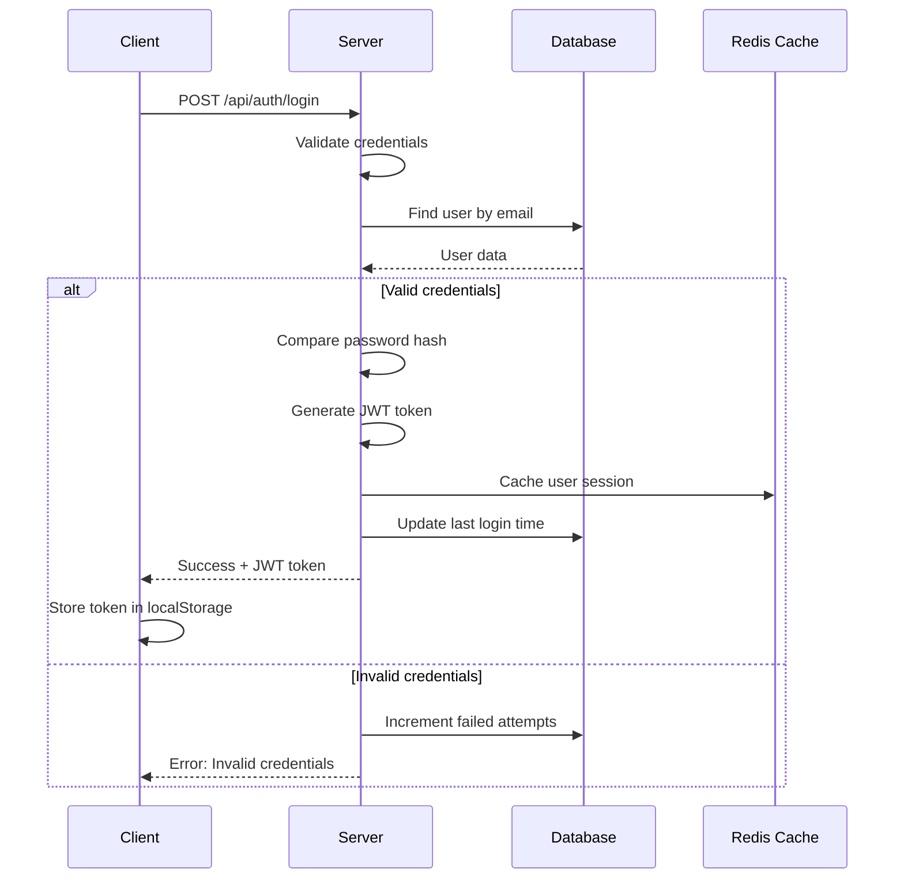
```mermaid
sequenceDiagram
    participant C as Client
    participant S as Server
    participant DB as Database
    participant R as Redis Cache

    C->>S: POST /api/auth/login
    S->>S: Validate credentials
    S->>DB: Find user by email
    DB-->>S: User data
    
    alt Valid credentials
        S->>S: Compare password hash
        S->>S: Generate JWT token
        S->>R: Cache user session
        S->>DB: Update last login time
        S-->>C: Success + JWT token
        C->>C: Store token in localStorage
    else Invalid credentials
        S->>DB: Increment failed attempts
        S-->>C: Error: Invalid credentials
    end
```

### Social OAuth Flow
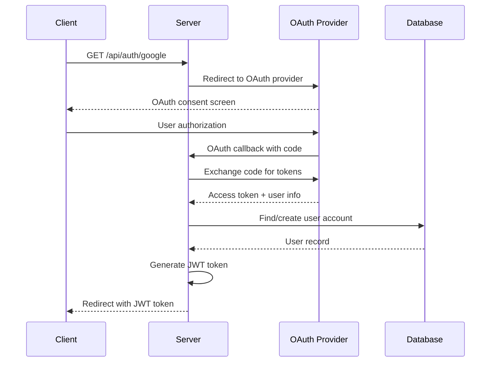
```mermaid
sequenceDiagram
    participant C as Client
    participant S as Server
    participant O as OAuth Provider
    participant DB as Database

    C->>S: GET /api/auth/google
    S->>O: Redirect to OAuth provider
    O-->>C: OAuth consent screen
    C->>O: User authorization
    O->>S: OAuth callback with code
    S->>O: Exchange code for tokens
    O-->>S: Access token + user info
    S->>DB: Find/create user account
    DB-->>S: User record
    S->>S: Generate JWT token
    S-->>C: Redirect with JWT token
```

## 2. Team Management Data Flow

### Team Creation Flow
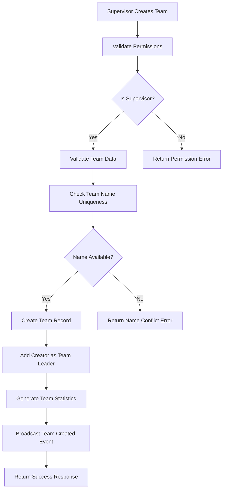
```mermaid
flowchart TD
    A[Supervisor Creates Team] --> B[Validate Permissions]
    B --> C{Is Supervisor?}
    C -->|Yes| D[Validate Team Data]
    C -->|No| E[Return Permission Error]
    D --> F[Check Team Name Uniqueness]
    F --> G{Name Available?}
    G -->|Yes| H[Create Team Record]
    G -->|No| I[Return Name Conflict Error]
    H --> J[Add Creator as Team Leader]
    J --> K[Generate Team Statistics]
    K --> L[Broadcast Team Created Event]
    L --> M[Return Success Response]
```

### Team Member Assignment Flow
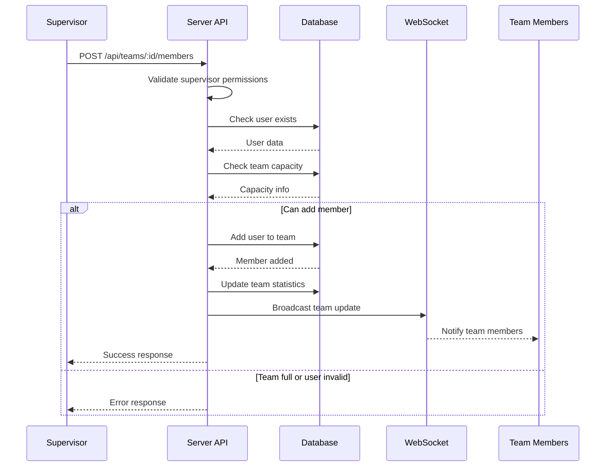
```mermaid
sequenceDiagram
    participant S as Supervisor
    participant API as Server API
    participant DB as Database
    participant WS as WebSocket
    participant U as Team Members

    S->>API: POST /api/teams/:id/members
    API->>API: Validate supervisor permissions
    API->>DB: Check user exists
    DB-->>API: User data
    API->>DB: Check team capacity
    DB-->>API: Capacity info
    
    alt Can add member
        API->>DB: Add user to team
        DB-->>API: Member added
        API->>DB: Update team statistics
        API->>WS: Broadcast team update
        WS-->>U: Notify team members
        API-->>S: Success response
    else Team full or user invalid
        API-->>S: Error response
    end
```

## 3. Call Statistics Data Flow

### Real-time Statistics Collection
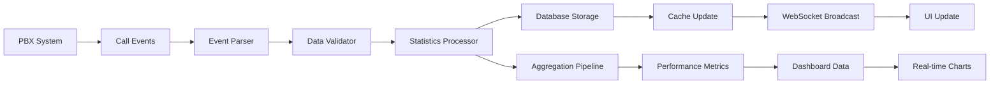
```mermaid
flowchart LR
    A[PBX System] --> B[Call Events]
    B --> C[Event Parser]
    C --> D[Data Validator]
    D --> E[Statistics Processor]
    E --> F[Database Storage]
    F --> G[Cache Update]
    G --> H[WebSocket Broadcast]
    H --> I[UI Update]
    
    E --> J[Aggregation Pipeline]
    J --> K[Performance Metrics]
    K --> L[Dashboard Data]
    L --> M[Real-time Charts]
```

### Call Data Processing Pipeline
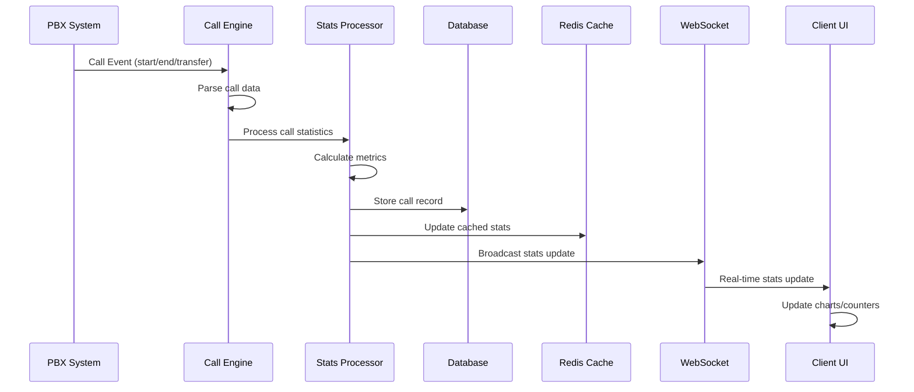
```mermaid
sequenceDiagram
    participant PBX as PBX System
    participant CE as Call Engine
    participant SP as Stats Processor
    participant DB as Database
    participant Cache as Redis Cache
    participant WS as WebSocket
    participant UI as Client UI

    PBX->>CE: Call Event (start/end/transfer)
    CE->>CE: Parse call data
    CE->>SP: Process call statistics
    SP->>SP: Calculate metrics
    SP->>DB: Store call record
    SP->>Cache: Update cached stats
    SP->>WS: Broadcast stats update
    WS->>UI: Real-time stats update
    UI->>UI: Update charts/counters
```

## 4. Performance Metrics Data Flow

### Agent Performance Tracking
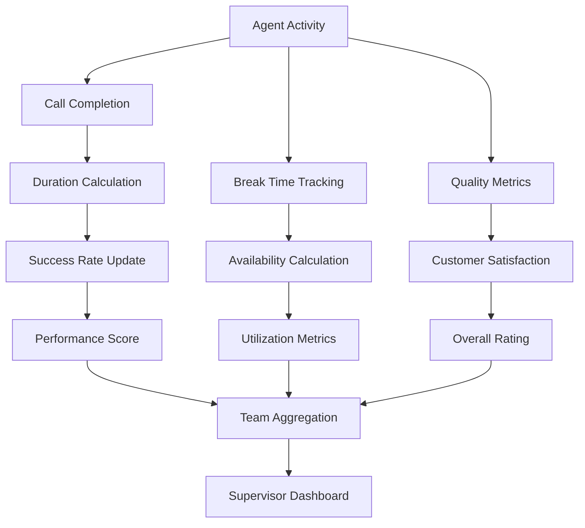
```mermaid
flowchart TD
    A[Agent Activity] --> B[Call Completion]
    B --> C[Duration Calculation]
    C --> D[Success Rate Update]
    D --> E[Performance Score]
    E --> F[Team Aggregation]
    F --> G[Supervisor Dashboard]
    
    A --> H[Break Time Tracking]
    H --> I[Availability Calculation]
    I --> J[Utilization Metrics]
    J --> F
    
    A --> K[Quality Metrics]
    K --> L[Customer Satisfaction]
    L --> M[Overall Rating]
    M --> F
```

### Performance Data Aggregation
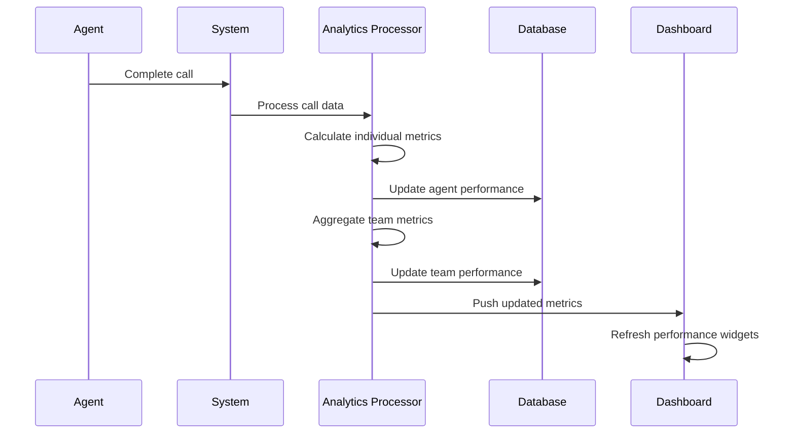
```mermaid
sequenceDiagram
    participant A as Agent
    participant S as System
    participant AP as Analytics Processor
    participant DB as Database
    participant D as Dashboard

    A->>S: Complete call
    S->>AP: Process call data
    AP->>AP: Calculate individual metrics
    AP->>DB: Update agent performance
    AP->>AP: Aggregate team metrics
    AP->>DB: Update team performance
    AP->>D: Push updated metrics
    D->>D: Refresh performance widgets
```

## 5. Dashboard Data Flow

### Dashboard Initialization
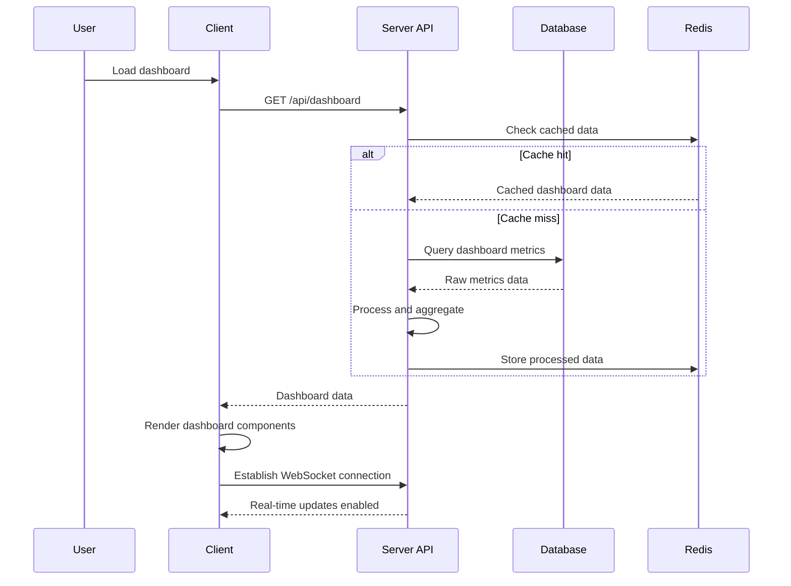
```mermaid
sequenceDiagram
    participant U as User
    participant C as Client
    participant API as Server API
    participant DB as Database
    participant Cache as Redis

    U->>C: Load dashboard
    C->>API: GET /api/dashboard
    API->>Cache: Check cached data
    
    alt Cache hit
        Cache-->>API: Cached dashboard data
    else Cache miss
        API->>DB: Query dashboard metrics
        DB-->>API: Raw metrics data
        API->>API: Process and aggregate
        API->>Cache: Store processed data
    end
    
    API-->>C: Dashboard data
    C->>C: Render dashboard components
    C->>API: Establish WebSocket connection
    API-->>C: Real-time updates enabled
```

### Real-time Dashboard Updates
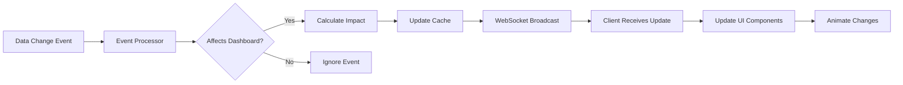
```mermaid
flowchart LR
    A[Data Change Event] --> B[Event Processor]
    B --> C{Affects Dashboard?}
    C -->|Yes| D[Calculate Impact]
    C -->|No| E[Ignore Event]
    D --> F[Update Cache]
    F --> G[WebSocket Broadcast]
    G --> H[Client Receives Update]
    H --> I[Update UI Components]
    I --> J[Animate Changes]
```

## 6. Search and Filter Data Flow

### User Search Flow
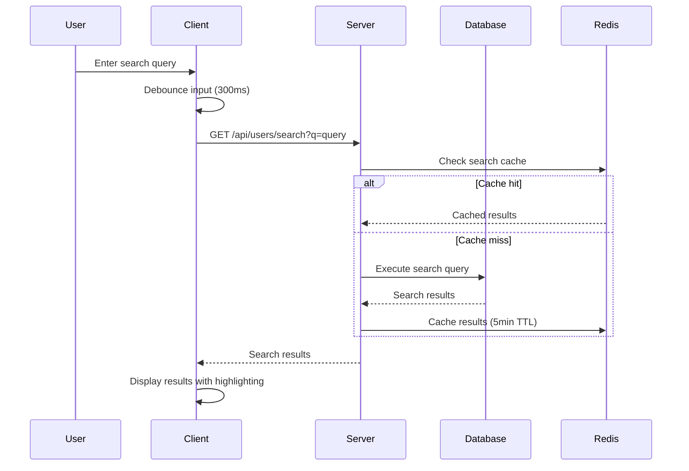
```mermaid
sequenceDiagram
    participant U as User
    participant C as Client
    participant API as Server
    participant DB as Database
    participant Cache as Redis

    U->>C: Enter search query
    C->>C: Debounce input (300ms)
    C->>API: GET /api/users/search?q=query
    API->>Cache: Check search cache
    
    alt Cache hit
        Cache-->>API: Cached results
    else Cache miss
        API->>DB: Execute search query
        DB-->>API: Search results
        API->>Cache: Cache results (5min TTL)
    end
    
    API-->>C: Search results
    C->>C: Display results with highlighting
```

### Advanced Filtering Pipeline
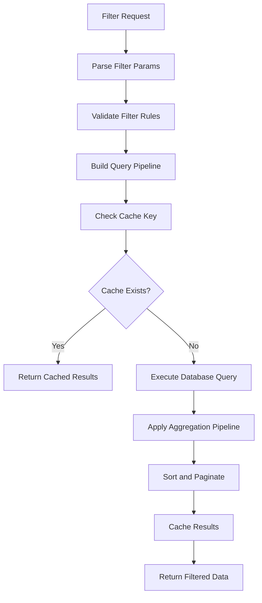
```mermaid
flowchart TD
    A[Filter Request] --> B[Parse Filter Params]
    B --> C[Validate Filter Rules]
    C --> D[Build Query Pipeline]
    D --> E[Check Cache Key]
    E --> F{Cache Exists?}
    F -->|Yes| G[Return Cached Results]
    F -->|No| H[Execute Database Query]
    H --> I[Apply Aggregation Pipeline]
    I --> J[Sort and Paginate]
    J --> K[Cache Results]
    K --> L[Return Filtered Data]
```

## 7. Error Handling Data Flow

### Error Processing Pipeline
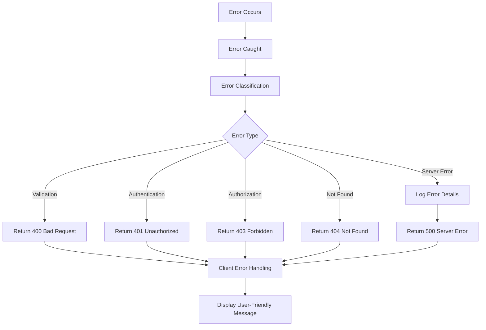
```mermaid
flowchart TD
    A[Error Occurs] --> B[Error Caught]
    B --> C[Error Classification]
    C --> D{Error Type}
    D -->|Validation| E[Return 400 Bad Request]
    D -->|Authentication| F[Return 401 Unauthorized]
    D -->|Authorization| G[Return 403 Forbidden]
    D -->|Not Found| H[Return 404 Not Found]
    D -->|Server Error| I[Log Error Details]
    I --> J[Return 500 Server Error]
    E --> K[Client Error Handling]
    F --> K
    G --> K
    H --> K
    J --> K
    K --> L[Display User-Friendly Message]
```

### Client Error Handling Flow
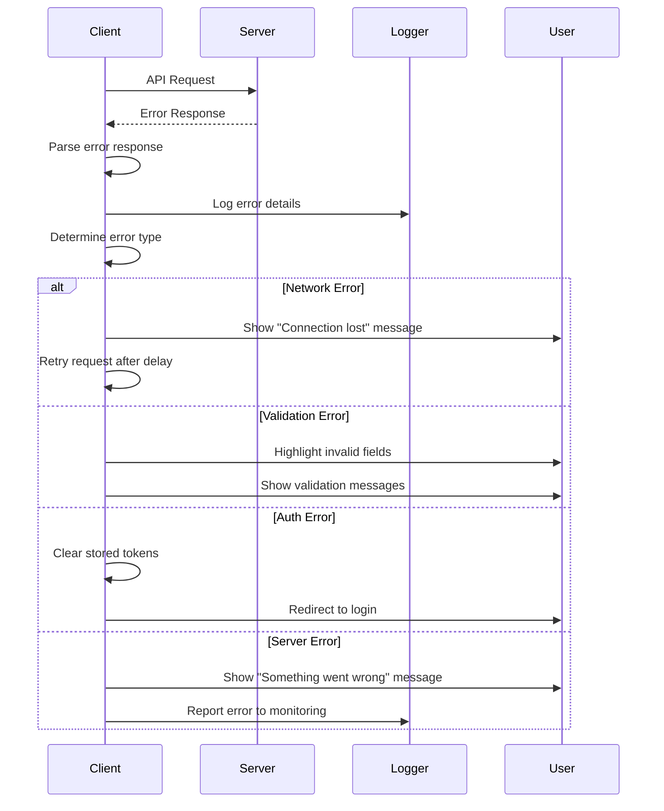
```mermaid
sequenceDiagram
    participant C as Client
    participant API as Server
    participant L as Logger
    participant U as User

    C->>API: API Request
    API-->>C: Error Response
    C->>C: Parse error response
    C->>L: Log error details
    C->>C: Determine error type
    
    alt Network Error
        C->>U: Show "Connection lost" message
        C->>C: Retry request after delay
    else Validation Error
        C->>U: Highlight invalid fields
        C->>U: Show validation messages
    else Auth Error
        C->>C: Clear stored tokens
        C->>U: Redirect to login
    else Server Error
        C->>U: Show "Something went wrong" message
        C->>L: Report error to monitoring
    end
```

## 8. Notification Data Flow

### Real-time Notification System
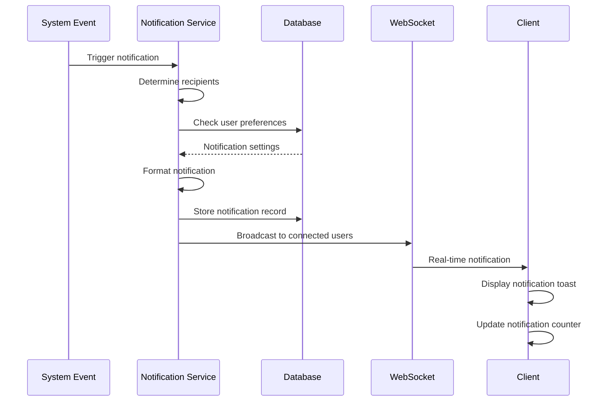
```mermaid
sequenceDiagram
    participant S as System Event
    participant NS as Notification Service
    participant DB as Database
    participant WS as WebSocket
    participant C as Client

    S->>NS: Trigger notification
    NS->>NS: Determine recipients
    NS->>DB: Check user preferences
    DB-->>NS: Notification settings
    NS->>NS: Format notification
    NS->>DB: Store notification record
    NS->>WS: Broadcast to connected users
    WS->>C: Real-time notification
    C->>C: Display notification toast
    C->>C: Update notification counter
```

### Email Notification Flow

```mermaid
flowchart LR
    A[Trigger Event] --> B[Email Service]
    B --> C[Load Email Template]
    C --> D[Populate Template Data]
    D --> E[Validate Recipient]
    E --> F[Queue Email]
    F --> G[SMTP Service]
    G --> H[Send Email]
    H --> I[Log Send Result]
    I --> J[Update Delivery Status]
```

## 9. Data Synchronization Flow

### Multi-tab Synchronization
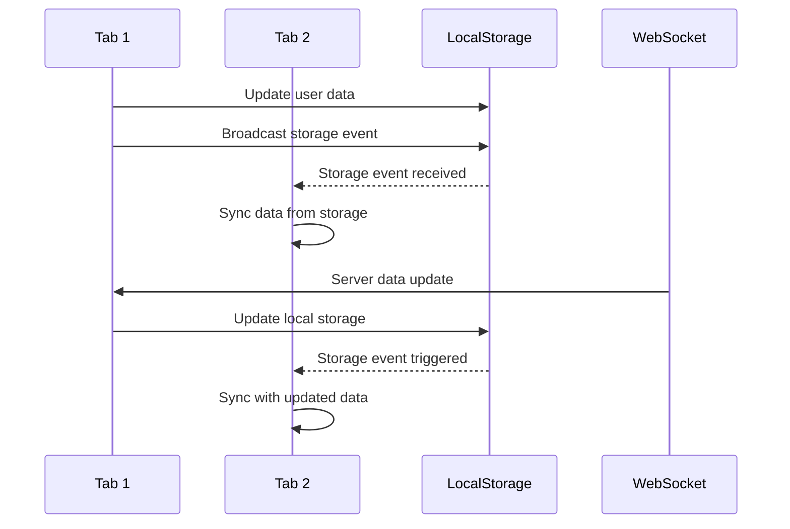
```mermaid
sequenceDiagram
    participant T1 as Tab 1
    participant T2 as Tab 2
    participant LS as LocalStorage
    participant WS as WebSocket

    T1->>LS: Update user data
    T1->>LS: Broadcast storage event
    LS-->>T2: Storage event received
    T2->>T2: Sync data from storage
    
    WS->>T1: Server data update
    T1->>LS: Update local storage
    LS-->>T2: Storage event triggered
    T2->>T2: Sync with updated data
```

### Offline Data Synchronization
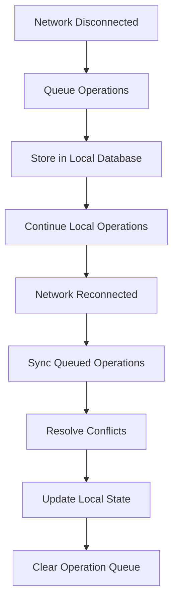
```mermaid
flowchart TD
    A[Network Disconnected] --> B[Queue Operations]
    B --> C[Store in Local Database]
    C --> D[Continue Local Operations]
    D --> E[Network Reconnected]
    E --> F[Sync Queued Operations]
    F --> G[Resolve Conflicts]
    G --> H[Update Local State]
    H --> I[Clear Operation Queue]
```

## 10. Performance Optimization Data Flow

### Caching Strategy Implementation
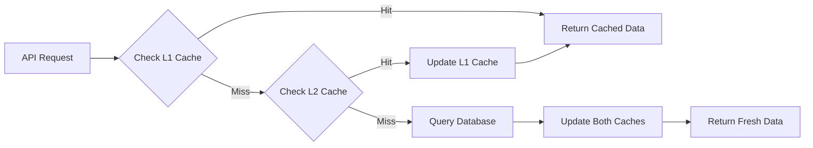
```mermaid
flowchart LR
    A[API Request] --> B{Check L1 Cache}
    B -->|Hit| C[Return Cached Data]
    B -->|Miss| D{Check L2 Cache}
    D -->|Hit| E[Update L1 Cache]
    D -->|Miss| F[Query Database]
    E --> C
    F --> G[Update Both Caches]
    G --> H[Return Fresh Data]
```

### Database Query Optimization
```mermaid
sequenceDiagram
    participant C as Client
    participant API as Server
    participant QO as Query Optimizer
    participant DB as Database
    participant IDX as Indexes

    C->>API: Complex query request
    API->>QO: Analyze query
    QO->>QO: Check available indexes
    QO->>IDX: Verify index usage
    QO->>QO: Optimize query plan
    QO->>DB: Execute optimized query
    DB-->>API: Query results
    API-->>C: Formatted response
```

## Data Flow Performance Metrics

### Key Performance Indicators
- **Authentication Flow**: < 200ms average response time
- **Team Operations**: < 500ms for CRUD operations
- **Real-time Updates**: < 100ms WebSocket latency
- **Dashboard Load**: < 1s initial load, < 50ms updates
- **Search Results**: < 300ms with caching
- **Error Recovery**: < 5s for automatic retry

### Monitoring Points
```mermaid
flowchart TD
    A[Request Entry] --> B[Authentication Check]
    B --> C[Rate Limiting]
    C --> D[Business Logic]
    D --> E[Database Query]
    E --> F[Response Assembly]
    F --> G[Response Delivery]
    
    B --> H[Auth Metrics]
    C --> I[Rate Limit Metrics]
    E --> J[Database Metrics]
    G --> K[Response Time Metrics]
```

## Troubleshooting Data Flows

### Common Flow Issues and Solutions

1. **Slow Authentication**
   - Check database indexes on user email
   - Verify bcrypt rounds configuration
   - Monitor JWT token generation time

2. **Delayed Real-time Updates**
   - Inspect WebSocket connection health
   - Check Redis cache performance
   - Verify event broadcasting logic

3. **Dashboard Loading Issues**
   - Analyze aggregation pipeline performance
   - Check cache hit rates
   - Monitor concurrent user load

4. **Search Performance Problems**
   - Verify search indexes
   - Check cache expiration settings
   - Monitor query complexity

---

This documentation provides a comprehensive view of data flows within PosCalls4U, enabling developers to understand, debug, and optimize the system effectively.
