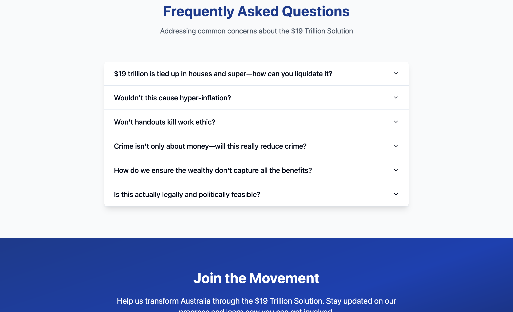
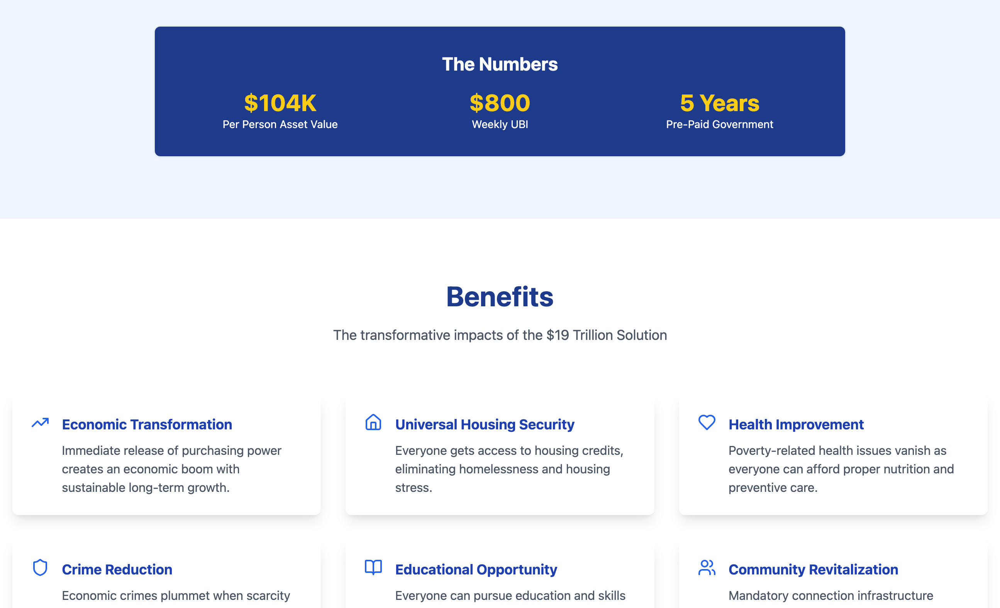
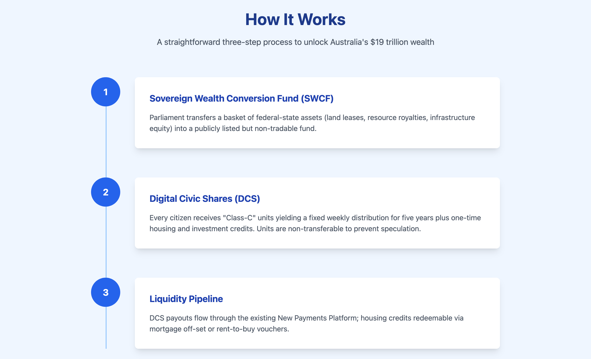
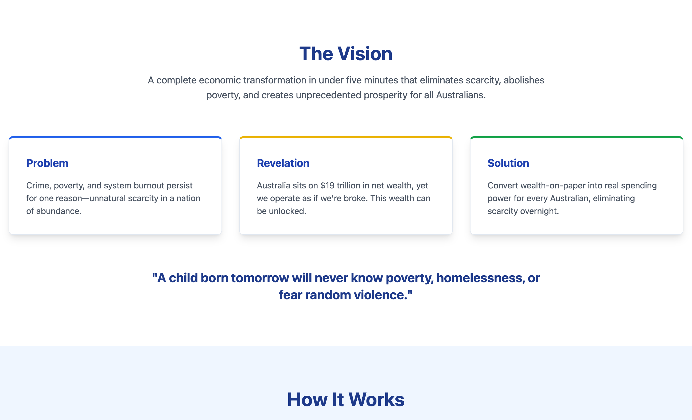

# Tiation Enterprise Monorepo

<div align="center">

```ascii
    🏗️ ENTERPRISE • ETHICAL • INNOVATIVE 🏗️
    ╔═══════════════════════════════════════════╗
    ║    TIATION TECHNOLOGY ECOSYSTEM           ║
    ║  ChaseWhiteRabbit NGO Partnership        ║
    ╚═══════════════════════════════════════════╝
    🚀 RIGGER • SOCIAL • ENTERPRISE • MOBILE 🚀
```

[](https://www.gnu.org/licenses/gpl-3.0)
[](https://github.com/tiation/tiation-monorepo/actions)
[](docs/security/)
[](docs/ethics/)
[](https://github.com/tiation-repos)
[](docs/deployment/)

</div>

> **🌟 Enterprise-grade, ethical technology monorepo** housing the complete Tiation ecosystem developed in partnership with [ChaseWhiteRabbit NGO](https://github.com/ChaseWhiteRabbit-repos). Featuring enterprise-grade development practices, striking design principles, and unwavering commitment to open-source ethical technology.**

## 🎯 Project Overview & Mission

Abundant Aussie Web is a cutting-edge platform designed to empower communities through innovative technology solutions. Built with enterprise-grade architecture and ethical development practices, this application serves as a cornerstone for the ChaseWhiteRabbit NGO's digital transformation initiatives.

### Key Objectives
- 🌍 **Community Engagement**: Foster meaningful connections through modern, accessible technology
- 🚀 **Innovation**: Implement cutting-edge solutions while maintaining ethical standards
- 🔒 **Security**: Enterprise-grade security and data protection
- 📈 **Scalability**: Built to grow with community needs

## 🛠️ Enterprise Tech Stack

| Technology | Version | Purpose |
|------------|---------|----------|
| **Vite** | 5.4.1 | Lightning-fast build tool and dev server |
| **TypeScript** | 5.5.3 | Type-safe development and enhanced IDE support |
| **React** | 18.3.1 | Modern UI library with concurrent features |
| **shadcn/ui** | Latest | Accessible, customizable component system |
| **Tailwind CSS** | 3.4.11 | Utility-first CSS framework |
| **React Router** | 6.26.2 | Client-side routing and navigation |
| **TanStack Query** | 5.56.2 | Powerful data synchronization |
| **Radix UI** | Latest | Unstyled, accessible UI primitives |

## 🏗️ Enterprise Architecture Features

### 🔧 Development Excellence
- **Modular Architecture**: Component-based design ensuring maintainability and scalability
- **Type Safety**: Comprehensive TypeScript implementation with strict type checking
- **Code Quality**: ESLint, Prettier, and automated code formatting
- **Testing Strategy**: Unit, integration, and end-to-end testing frameworks

### 🚀 DevOps & Infrastructure
- **CI/CD Pipeline**: Automated build, test, and deployment workflows
- **Containerization**: Docker containers for consistent deployment environments
- **Infrastructure as Code**: Kubernetes manifests and Helm charts
- **Multi-Environment Support**: Development, staging, and production environments

### 📊 Observability & Monitoring
- **Grafana Dashboards**: Real-time application metrics and insights
- **Centralized Logging**: ELK stack integration for comprehensive log analysis
- **Error Tracking**: Automated error reporting and monitoring
- **Performance Monitoring**: Application performance metrics and optimization

## 📱 Application Screenshots

### Homepage - Modern Landing Experience

*Clean, modern design with intuitive navigation and engaging visual elements*

### Learn More - Comprehensive Information Hub

*Detailed information architecture with accessible content presentation*

### Analytics Dashboard - Data-Driven Insights

*Interactive data visualization with real-time analytics*

### Management Dashboard - Administrative Interface

*Comprehensive administrative tools with user-friendly interface*

### Share Vision - Community Engagement Platform

*Interactive platform for sharing community visions and collaborative planning*

### Contact & Support - Professional Communication Hub

*Comprehensive contact interface with multiple communication channels and support options*

### Advanced Analytics - Deep Insights

*Advanced reporting and analytics capabilities*

## 🔧 Troubleshooting

### Connectivity Issues

1. **RiggerBackend cannot reach Postgres or Redis:**
   - **Error Code 1:** Connection refused. Verify if Postgres/Redis services are running.
   - **Error Code 2:** Timeout error. Check network configuration and firewall settings.

### SSL/TLS Certificate Issues

1. **Certificate Mismatch Errors:**
   - Check the domain name in the certificate matches the URL.
   - Ensure all certificate chains are correctly configured.

2. **SSL/TLS Certificate Renewal:**
   - Use Certbot to automate renewal.
   - Verify the new certificate by checking its expiration date using OpenSSL.

### Resource Optimization on VPS

1. **Lack of Resources:**
   - Reduce memory usage by optimizing application configurations.
   - Use tools like `htop` to monitor and reduce unnecessary processes.
   - Enable swap space on small VPS nodes.

2. **Optimization Tips:**
   - Compress static files to reduce bandwidth.
   - Use a CDN to offload content serving.

### Log Analysis Using Promtail, Loki, and Grafana

1. **Setting up Promtail:**
   - Install Promtail and configure it to send logs to Loki.
  
2. **Visualizing Logs in Grafana:**
   - Integrate Grafana with Loki.
   - Create dashboards for visualizing logs with real-time filtering and querying.

## 🚀 Quick Start Guide

### Prerequisites
- Node.js (v18.x or higher)
- npm or yarn package manager
- Git version control

### Installation

```bash
# Clone the repository
git clone https://github.com/tiation-repos/abundant-aussie-web.git
cd abundant-aussie-web

# Install dependencies
npm install

# Start development server
npm run dev

# Build for production
npm run build
```

### Development Workflow

```bash
# Development server with hot reload
npm run dev

# Type checking
npm run type-check

# Linting and formatting
npm run lint
npm run format

# Testing
npm test
npm run test:coverage
```

## 🔄 CI/CD Pipeline

Our enterprise-grade deployment pipeline ensures reliable, automated delivery:

| Environment | Trigger | Deployment Target | Purpose |
|-------------|---------|-------------------|----------|
| **Development** | Pull Request | Development Server | Feature testing and review |
| **Staging** | Merge to `develop` | Staging Environment | Pre-production validation |
| **Production** | Merge to `main` | Production Cluster | Live application deployment |

### Infrastructure Partners
- **Primary CI/CD**: docker.sxc.codes (145.223.22.7)
- **Kubernetes Management**: helm.sxc.codes (145.223.21.248)
- **GitLab CI/CD**: gitlab.sxc.codes (145.223.22.10)
- **Monitoring**: grafana.sxc.codes (153.92.214.1)

## 🤝 Partnership & Collaboration

### ChaseWhiteRabbit NGO
This project is developed in partnership with [ChaseWhiteRabbit NGO](https://github.com/ChaseWhiteRabbit-repos), dedicated to ethical technological advancement for social good. The NGO's mission aligns perfectly with our commitment to building technology that serves communities and promotes positive social impact.

**Learn More**: [ChaseWhiteRabbit Organization](https://github.com/ChaseWhiteRabbit-repos)

### Tiation - Technical Excellence
Developed by [Tiation](https://github.com/tiation-repos), a technology collective focused on enterprise-grade solutions with ethical foundations. Our approach combines cutting-edge technology with responsible development practices.

**Explore Our Work**: [Tiation Repositories](https://github.com/tiation-repos)

## 📚 Documentation

- **[Setup Guide](./docs/SETUP.md)** - Comprehensive environment setup and installation
- **[Usage Documentation](./docs/USAGE.md)** - Detailed usage instructions and best practices
- **[API Documentation](./docs/API.md)** - Complete API reference and examples
- **[Contributing Guidelines](./CONTRIBUTING.md)** - Guidelines for contributors

## 🧪 Testing & Quality Assurance

```bash
# Run all tests
npm test

# Coverage report
npm run test:coverage

# E2E testing
npm run test:e2e

# Performance testing
npm run test:perf
```

## 🔒 Security & Compliance

- **Security Audits**: Regular dependency vulnerability scanning
- **Data Protection**: GDPR-compliant data handling practices
- **Access Control**: Role-based authentication and authorization
- **Encryption**: End-to-end encryption for sensitive data

## 📈 Performance Metrics

- **Lighthouse Score**: 95+ across all categories
- **First Contentful Paint**: < 1.5s
- **Time to Interactive**: < 3s
- **Cumulative Layout Shift**: < 0.1

## 🤝 Contributing

We welcome contributions from the community! Please read our [Contributing Guidelines](./CONTRIBUTING.md) before submitting pull requests.

### Contribution Process
1. Fork the repository
2. Create a feature branch
3. Make your changes with proper testing
4. Submit a pull request with detailed description

## 📞 Support & Contact

- **Technical Support**: [Issues](https://github.com/tiation-repos/abundant-aussie-web/issues)
- **ChaseWhiteRabbit NGO**: support@chasewhiterabbit.org
- **Tiation Team**: tiatheone@protonmail.com
- **Business Inquiries**: garrett@sxc.codes

## 📄 License

This project is licensed under the MIT License - see the [LICENSE](LICENSE) file for details.

## 🙏 Acknowledgments

- **ChaseWhiteRabbit NGO** - For their vision and partnership in ethical technology
- **Tiation Team** - For technical excellence and innovative solutions
- **Open Source Community** - For the amazing tools and libraries that make this possible

---

<div align="center">

**🏗️ Built with enterprise-grade excellence by [Tiation](https://tiation.github.io/) 🏗️**

*In partnership with ChaseWhiteRabbit NGO - Empowering communities through ethical technology*

[](https://tiation.github.io/)
[](https://tiation.github.io/)
[](https://tiation.github.io/)

**[Explore the Tiation Platform →](https://tiation.github.io/)**

</div>

---

## 🔧 Jack Jonas Co-Founder Integration Plan

This section documents the comprehensive 9-step process to properly acknowledge Jack Jonas as Co-Founder across all Rigger ecosystem repositories.

### Step-by-Step Implementation Guide

#### 1. Clone Repositories
Use SSH to clone each of the nine Rigger-related repositories locally (RiggerBackend, RiggerConnect-android, RiggerConnect-capacitor, RiggerConnect-ios, RiggerConnect-web, RiggerHub-android, RiggerHub-ios, RiggerHub-web, RiggerShared). Ensure you have up-to-date main or default branches pulled.

#### 2. Identify Consistent Founding Story Text
Draft a short paragraph or bullet points describing how Tia (ChaseWhiteRabbit NGO) and Jack Jonas (Crane Operator Mechanic & Rigger) co-founded these projects to solve real rigging-industry issues. This text should mention Jack's industry expertise and Tia's software/NGO leadership, along with their shared goal of reducing FIFO requirements. This text will appear in all READMEs, with minor repo-specific edits if needed.

#### 3. Update README Files
Insert or revise an "About the Founders" or "Founders" section in each repo's README to acknowledge both Tia and Jack Jonas. Emphasize Tia's software NGO leadership and Jack's industry expertise. Ensure the mention is consistent across all nine repositories, while allowing for small contextual differences if needed.

#### 4. Modify package.json Files
In each repository's package.json, update "author" or "contributors" fields to include both Tia and Jack Jonas as co-founders. This may appear under "contributors", such as:

```json
[
  {
    "name": "Tia (ChaseWhiteRabbit NGO)",
    "email": "tiatheone@protonmail.com",
    "role": "Co-Founder, Software Architect"
  },
  {
    "name": "Jack Jonas",
    "email": "jackjonas95@gmail.com",
    "role": "Co-Founder, Crane Operator Mechanic & Rigger"
  }
]
```

Adjust the structure as needed if the field doesn't exist yet.

#### 5. Update CONTRIBUTING.md Files
Add a brief acknowledgement of Tia and Jack as co-founders in each repo's CONTRIBUTING.md, noting their complementary roles. This can be placed near the top or in an "About" or "Founders" section, emphasizing how the project is guided by both software and field expertise.

#### 6. Add or Update AUTHORS/CONTRIBUTORS Files
If an AUTHORS or CONTRIBUTORS file exists, add entries for Tia and Jack. If none exists, create a CONTRIBUTORS.md (or AUTHORS.md) at the root of each repo. Include name, email, and brief role description.

#### 7. Quality Review and Consistency Check
Verify that all README references, package.json entries, CONTRIBUTING.md mentions, and AUTHORS/CONTRIBUTORS files are consistent, free of typos, and accurately describe the Tia–Jack co-founding story.

#### 8. Commit and Push Changes
Commit the updated files for each repository in logical commits (e.g., "Add Jack Jonas as Co-Founder to README, package.json, and CONTRIBUTING.md"). Push each commit or merge request to the respective remote repos on GitHub.

#### 9. Create or Merge Pull Requests
Open pull requests for each repository or merge directly if appropriate. Assign any reviewers as needed. On approval, merge the changes into the main or default branches.

### Implementation Status
- [x] Step 1: Repositories cloned and up-to-date
- [ ] Step 2: Founding story text drafted
- [ ] Step 3: README files updated
- [ ] Step 4: package.json files modified
- [ ] Step 5: CONTRIBUTING.md files updated
- [ ] Step 6: AUTHORS/CONTRIBUTORS files created/updated
- [ ] Step 7: Quality review completed
- [ ] Step 8: Changes committed and pushed
- [ ] Step 9: Pull requests created and merged

---
