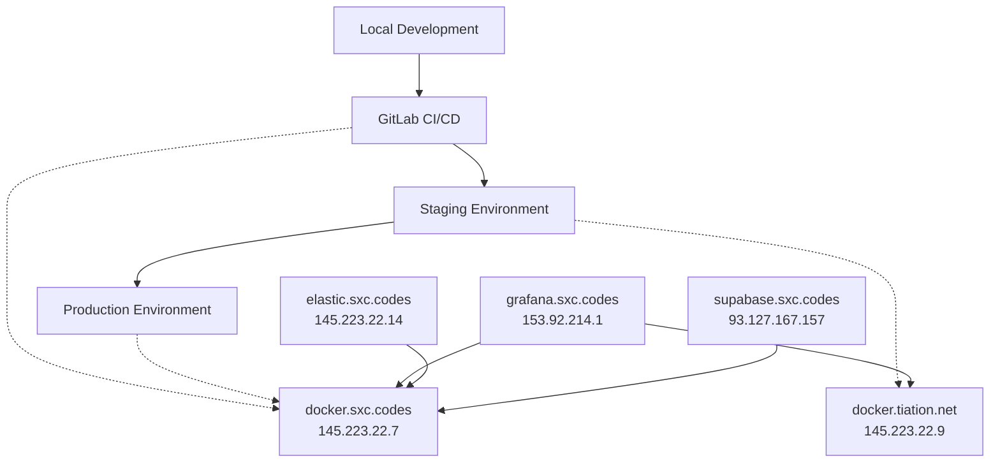

# Environment Setup Guides

> **Enterprise-grade, ethical, DevOps best practices with striking design!** 🚀

This repository contains comprehensive step-by-step guides for setting up local development, staging, and production environments using your Hostinger VPS infrastructure.

## 📋 Quick Reference

| Environment | Purpose | VPS Host | Key Services |
|-------------|---------|----------|--------------|
| **Local** | Development & Testing | Your Mac | Docker, Node.js, Python |
| **Staging** | Pre-production Testing | docker.tiation.net (145.223.22.9) | Docker, Nginx, SSL |
| **Production** | Live Applications | docker.sxc.codes (145.223.22.7) | Docker, Nginx, SSL, Monitoring |

## 🏗️ Available Guides

### 📖 Environment Guides
- **[Local Development Setup](./local/README.md)** - Complete local environment setup
- **[Staging Environment Setup](./staging/README.md)** - Staging server configuration  
- **[Production Environment Setup](./production/README.md)** - Production-ready deployment

### 🛠️ Infrastructure Guides
- **[VPS Provisioning Guide](./docs/vps-provisioning.md)** - New Hostinger VPS setup
- **[Database Setup Guide](./docs/database-setup.md)** - PostgreSQL, MongoDB, Redis
- **[SSL Certificate Guide](./docs/ssl-certificates.md)** - Let's Encrypt automation
- **[Monitoring Setup Guide](./docs/monitoring-setup.md)** - Grafana & observability

### 🚀 Automation Scripts
- **[Quick Setup Scripts](./scripts/)** - Copy-paste automation scripts
- **[Environment Variables](./scripts/env-templates/)** - Template configurations
- **[Deployment Scripts](./scripts/deployment/)** - CI/CD automation

## 🌐 Your VPS Infrastructure



## 🔧 Prerequisites

Before starting any environment setup:

1. **SSH Access Configured**
   ```bash
   # Verify SSH access to your VPS servers
   ssh -i ~/.ssh/hostinger_key.pub root@145.223.22.7  # docker.sxc.codes
   ssh -i ~/.ssh/hostinger_key.pub root@145.223.22.9  # docker.tiation.net
   ```

2. **Local Tools Installed**
   - Docker & Docker Compose
   - Node.js (22.15.0+)
   - Python (3.13.3+)
   - Git with SSH configured

3. **Email Alerts Configured**
   - tiatheone@protonmail.com
   - garrett@sxc.codes  
   - garrett.dillman@gmail.com

## 🚦 Getting Started

1. **Choose Your Path:**
   - 🏠 **Local Development**: Start with [Local Setup Guide](./local/README.md)
   - 🧪 **Testing Environment**: Go to [Staging Setup Guide](./staging/README.md)
   - 🚀 **Production Deployment**: Follow [Production Setup Guide](./production/README.md)

2. **Run Quick Setup:**
   ```bash
   # Clone and navigate
   git clone <your-repo-url>
   cd environment-setup-guides
   
   # Make scripts executable
   chmod +x scripts/*.sh
   
   # Run environment-specific setup
   ./scripts/setup-local.sh    # For local development
   ./scripts/setup-staging.sh  # For staging environment
   ./scripts/setup-production.sh # For production environment
   ```

## 📞 Support & Monitoring

- **Issues**: Create GitHub issues for setup problems
- **Monitoring**: Check [grafana.sxc.codes](http://grafana.sxc.codes) for system health
- **Logs**: Access via [elastic.sxc.codes](http://elastic.sxc.codes) ELK stack
- **Email Alerts**: Configured for critical issues

---

> **ChaseWhiteRabbit NGO** - Following modular, CI/CD-ready development practices
